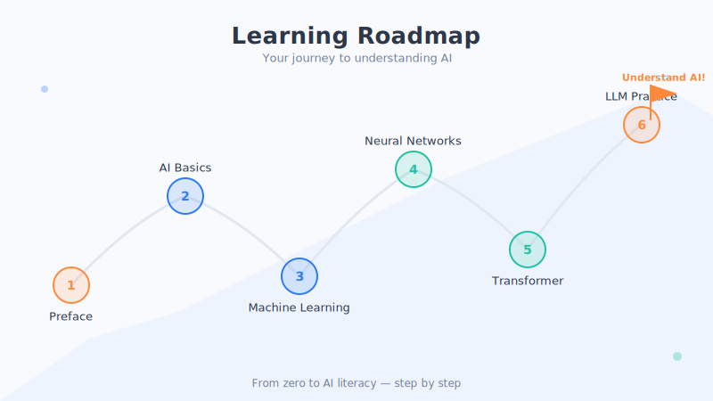

# The Learning Roadmap and How to Use This Book

> Glancing at a map before a trip puts your mind at ease. This section is this book's "map" and "user manual."

## 1. The Whole-Book Map: The "Mountain of AI" We're About to Climb

This book has six parts—like six legs of a trail from the foot of the mountain to the summit. You don't have to hike it all in one go; stopping to rest and doubling back anytime is perfectly fine.

| Part | Theme | In One Sentence |
| --- | --- | --- |
| Preface | Before we begin | Get to know this book—and yourself (you are here 📍) |
| Part One | A worldview of AI basics | What AI is, where it came from, and where it lives around you |
| Part Two | Foundations of machine learning | How AI actually "learns" |
| Part Three | Neural networks and deep learning | The "smart structure" that mimics the brain |
| Part Four | From word embeddings to the Transformer | The core engine behind large models |
| Part Five | Large language models in practice | How to use tools like ChatGPT—and where their limits lie |
| Appendix | Glossary · Resources · Tools · Timeline | A "toolbox" to consult anytime |

**It gets deeper as you go, but we've done our best to make each part understandable on its own.** You're now standing at the foot of the mountain (the preface), about to step onto the first leg (a worldview of AI basics).

## 2. Two Ways to Read—Take Your Pick

### Way One: Cover to Cover (Recommended for Beginners)

If you're a complete beginner, we suggest **honestly reading in order**. Later concepts often build on earlier ones, just like a building needs its foundation first. Reading straight through, you'll feel the knowledge stack up layer by layer, getting smoother as you go.

### Way Two: Jump Around by Interest (Recommended if You Have Some Background)

If you already know a bit, or you're only interested in one topic, feel free to **flip straight to that chapter**. For example:

- Just want to understand why ChatGPT is such a big deal → go straight to Parts Four and Five.
- Only care about AI's real-life applications → go straight to Chapter 3 of Part One.
- Run into a word you don't know → flip to the **glossary** in the appendix anytime to look it up.

When you hit something you don't understand, "flipping back" to shore up the basics is also an efficient way to learn.

## 3. How to Read Most Efficiently

- **Every chapter follows a fixed pattern.** Nearly every chapter has this structure, and once you're used to it, reading becomes effortless:
  1. A one-line opener (a question or a scenario)
  2. An everyday metaphor (to give you a "feel" for it first)
  3. A breakdown of the principles (in subsections, step by step)
  4. Illustrations (to turn the abstract into something visual)
  5. A chapter summary (3–5 points to help you review)
  6. Thought questions (to connect it to your own life)
- **Starting with the summary is fine too.** If you're short on time, skim the "Chapter Summary" first to grab the key points, then decide whether to read in detail.
- **Do the thought questions.** Don't skip the thought questions at the end of each chapter—they help you "weld" the knowledge into your brain.

## 4. Two Notes on the Book's Illustrations and Terms

**About the illustrations**: every chapter has one or two **illustration placeholders**. Below each image you'll see a quoted passage beginning with "🎨 Image prompt"—that's a description of the visual, left there for an "image-generating AI." If you have a drawing tool on hand, you can follow the prompt to generate the illustration and drop it into the matching spot; if not, simply reading the text won't affect your understanding at all.

**About terms**: when you run into a bolded technical term (such as **machine learning** or **neural network**), don't panic. Most of them have already been explained in plain language in the main text, and you can always flip to the **glossary** at the back of the book for a cross-reference. Our principle is always the same—**understand the meaning first, memorize the name later.**

## 5. One Little Piece of Advice

The best way to learn AI is to **learn by using**. When you read about a concept, go ahead and immediately open an AI tool (any chatbot, for instance) and try it out yourself. Theory plus hands-on practice makes your understanding far more solid.

All right—map read, gear packed. Turn the page, and we officially enter **Part One: A Worldview of AI Basics**.

## Chapter Summary

- The book has six parts, going from shallow to deep like climbing a mountain; you're at the foot right now.
- Two ways to read: beginners should read straight through in order; those with some background can jump around by interest.
- Each chapter has a fixed structure: opener → metaphor → principles → illustrations → summary → thought questions.
- The "🎨 Image prompt" below each illustration is for an image-generating AI; whether or not you view the images won't affect your reading, and new words can be looked up in the glossary.

## Something to Think About

1. Based on your own situation, will you "read in order" or "jump around"? Which chapter will you turn to first?
2. Do you have an AI tool nearby that you can open and try anytime? Get it ready—we'll be "learning while playing" often in the chapters ahead.
