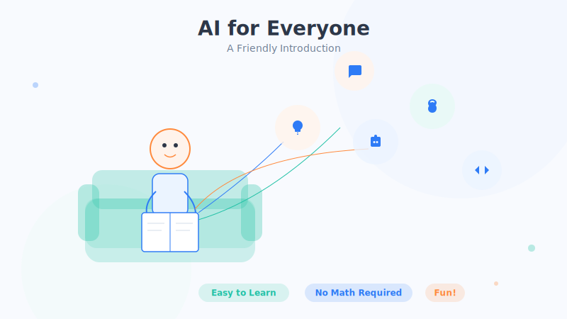

# Preface: Before We Begin

> Have you ever had one of those moments—scrolling on your phone when a thought suddenly hits you: "What *is* AI, anyway? How did it get so powerful so fast? And do I, an ordinary person, really need to understand it?"

If you've ever wondered any of this, then congratulations—opening this book was exactly the right move.

## 1. A Book That Speaks Plainly About AI

The books and articles out there about AI mostly fall into two camps.

One camp is written for experts: screen after screen of formulas, code, and acronyms you've never heard of—two pages in and you're ready for a nap. The other camp, chasing clicks, makes AI sound like magic—one minute it's "replacing humanity," the next it's "the end of the world"—and you close the tab more confused than before.

**This book aims to be a third kind: like a friend sitting across from you, sipping tea and walking you through AI until it finally clicks.**

Here's our promise to you:

- **Plain talk first, terminology second.** For every concept, we start with a familiar scene from daily life. Once you go "oh, so *that's* what it is," then we tell you the technical name for it.
- **A metaphor over a formula, every time.** You'll find almost no math in this book. We use everyday things—cooking, teaching a child, guessing a riddle—to explain principles that sound intimidating.
- **Readability above all.** You need no programming or math background. As long as you can read and you're curious, you'll be able to follow along the whole way.

## 2. Why Ordinary People Should Understand a Bit of AI

You might ask: I'm not in tech—what good does understanding AI do me?

Here's an analogy: **a few decades ago, "knowing how to drive" was a specialized skill; today, it's closer to a basic life skill.** AI is heading down the same road. It has quietly slipped into your phone, your work, the malls you visit, the short videos you watch. In the next few years, "knowing how to use AI" may well become an everyday ability, just like "knowing how to use a smartphone."

Understanding a little AI helps you in at least three ways:

1. **You won't get fooled.** When someone brags that a product "uses cutting-edge AI," you'll be able to roughly tell whether it's the real deal or just marketing spin.
2. **You'll use it better.** Once you understand AI's temperament—its strengths and weaknesses—you can get it to help you write copy, make plans, and look things up far more effectively.
3. **You'll feel less anxious.** Once you understand how it works and where its limits lie, you'll find AI is neither as magical as the legends say nor as terrifying as you imagined.

## 3. What This Book Covers

The whole book is like climbing a small hill—one step at a time, from "what is AI" all the way up to "what large models are really about":

- **Part One · A Worldview of AI Basics**: First, we build the big picture—what AI actually is, where it came from, and where it already lives around us.
- **The parts that follow**: Then we go layer by layer, covering machine learning and neural networks, all the way to the story behind today's hottest large models like ChatGPT.

What you're reading right now is the starting point of that journey.

## 4. Three Whispered Words of Advice

- **Don't fear "not getting it."** When you hit something you don't understand right away, it's perfectly fine to skip ahead and keep reading—many concepts recur later and grow clearer each time.
- **Metaphors are just crutches.** Every metaphor in this book is here to help you understand; the real AI is often more complex and more subtle. Once you're walking steadily, you can toss the crutches and pick up more specialized material.
- **Read with a question in mind.** Each chapter ends with a thought question or two—not to test you, but to help you connect the knowledge to your own life.

Ready? Let's set off. In the next section, we'll talk about—**who this book is really for.**

## Chapter Summary

- This is an AI primer for ordinary beginners, built on "plain talk, good metaphors, and no piles of formulas."
- Understanding a bit of AI helps you avoid being fooled, use it better, and feel less anxious.
- The book goes from shallow to deep, from "what is AI" to "large models"—you can read it in order or pick the parts that interest you.
- The metaphors in this book are crutches for understanding; reality is usually more complex.

## Something to Think About

1. Think back over your day, from morning to night—at what unnoticed moments might you have "used" AI?
2. What's the one thing about AI you most want to figure out? Hold onto it, and see if you can find the answer by the end of this book.
