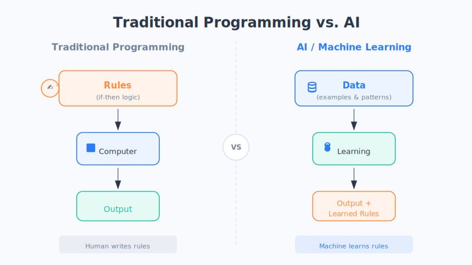
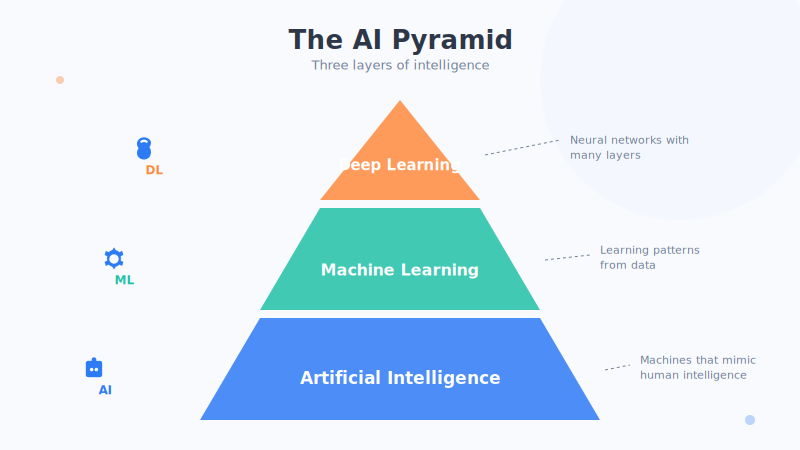

# Chapter 1: What AI Actually Is

> We toss the word "AI" around every day, but if someone suddenly asked you, "So tell me—what *is* AI, really?"—could you explain it in one sentence?

Don't worry. In this chapter, we'll fully talk through this most basic question—the one that so often gets glossed over.

## 1. First, in Plain Words

If we had to sum it up in a single sentence, it's this:

> **AI is a computer that can "learn."**

Notice that word—**learn**. This is the biggest difference between AI and the ordinary computer programs we're familiar with.

Computers of the past were very "rigid": you ask it to compute 1+1, it gives you 2; anything you didn't teach it, it simply can't do. So what makes AI impressive? **It can figure out patterns on its own from a huge number of examples, and then handle brand-new situations it has never seen before.** It's like a student who can draw inferences, not a parrot that only recites the textbook answer.

Its full name is **Artificial Intelligence** (AI for short). Break it down: "artificial" means human-made, and "intelligence" means smartness. Put together—**something human-made that possesses a certain kind of smartness.**

## 2. A Metaphor: Cooking From a Recipe vs. a Master Chef Who's Tasted a Thousand Dishes

To get a feel for the difference between AI and traditional software, let's look at two people in the kitchen.

**Traditional software is like a novice who cooks strictly by the recipe.**
The recipe says, "when the oil is 70% hot, add the scallions, stir-fry for 30 seconds, add 3 grams of salt," and they follow it to the letter. Anything the recipe doesn't cover, they're completely lost on. Hand them an unfamiliar fish, and they freeze on the spot—because the recipe has no instructions for this fish. **All of its abilities are "hard-coded," rule by rule, by a human.**

**AI is like a seasoned master chef who's tasted a thousand dishes.**
They haven't memorized any recipe; instead, over the years they've **personally tasted and cooked tens of thousands of dishes.** So toss them any unfamiliar fish and, from experience, they just know: whether this flesh is best steamed or braised, roughly what heat to use, what seasonings to add. **Their skill was "figured out on their own" from a mountain of experience, not taught to them one rule at a time.**

That's the core difference:

- **Traditional software**: humans set the rules, the machine follows them. ("I'll tell you how to do it.")
- **AI**: humans provide a pile of examples, the machine finds the rules itself. ("I'll show you lots of examples—you figure it out.")

(This is just an analogy to aid understanding; reality is more complex—many real systems actually mix "traditional rules" and "AI learning" together.)

## 3. So How Does AI "Learn"?

You might ask: a machine doesn't have a brain, so how does it "learn" at all?

It's actually a lot like how a small child learns to recognize things. Imagine teaching a two- or three-year-old to recognize a "cat":

1. You point at a cat and say, "This is a cat."
2. Then you point at another, and another… After seeing enough, the child gradually figures out: oh, the things with **pointy ears, whiskers, a "meow," and fur** are probably cats.
3. One day, out on the street, they see a cat they've **never seen before**, and they blurt out, "Cat!"

AI learns in almost exactly the same way: **feed it tens of thousands of pictures labeled "this is a cat / this is a dog," and it figures out on its own the difference between cats and dogs, so it can then recognize a cat in a new picture.** This process of "finding patterns on its own from a mass of data" is technically called **machine learning**—it's the main method for making AI smart, and we'll devote an entire part to it later.

**Remember this in one line: AI isn't "programmed" into existence—it's "trained on data" into existence.**

## 4. The "Three-Layer Pyramid" of AI

The word "AI" is actually very broad; it doesn't refer to a single thing. We can picture it as a **three-layer pyramid**, from bottom to top:

| Layer | Name | In Plain Words | Everyday Metaphor |
| --- | --- | --- | --- |
| Top | **Applications** | The products you directly see and use | The dish served at the table |
| Middle | **Algorithms** | The methods and "approaches" that let the machine learn | The chef's skill and thinking |
| Bottom | **Compute** | The hardware (chips, etc.) that powers the calculations | The stove and its firepower |

- **The bottom layer is compute**: essentially the computer's "stamina." Training an AI requires an enormous amount of calculation, which needs powerful chips (especially a kind called a **GPU**) to hold it up. Without a stove with enough firepower, even the best chef can't cook a grand banquet.
- **The middle is algorithms**: essentially the methods for "how the machine learns." Given the same pile of data, a clever method produces a smarter AI. This is the chef's real craft.
- **The top layer is applications**: the things we ordinary people actually touch—the voice assistant on your phone, the chatty ChatGPT, the photo-editing software. This is the finished dish served to the table, the one you get to eat.

Most of us deal only with **that top layer (applications)** in daily life. This book will gradually take you down to look at the middle and bottom layers, so you understand how this "dish" gets served to the table.

## 5. Clearing Up Two Common Misconceptions

While we're here, let's clear up two misunderstandings you often hear:

- **Misconception 1: AI has its own consciousness and thinks for itself.**
  Today's AI has no real "thoughts" or "emotions." It looks smart, but at its core it's **making probabilistic predictions based on the patterns it has learned**—for example, guessing "what's the most likely next word in this sentence." It's like an extraordinarily refined mirror, reflecting the patterns in a mass of data, but the mirror itself has no sense of "self."

- **Misconception 2: AI is all-powerful.**
  AI can surpass humans on specific tasks (playing Go, recognizing images), but it also makes rookie mistakes and will "confidently talk nonsense." It has clear weaknesses and limits—all of which we'll get into, one by one, in later chapters.

## Chapter Summary

- **AI is a computer that can "learn"**: it finds patterns on its own from a mass of examples and handles new situations it hasn't seen before.
- Its fundamental difference from traditional software: traditional software is "humans hard-coding rules," while AI is "the machine learning rules from data on its own" (cooking from a recipe vs. a master chef who's tasted a thousand dishes).
- AI mainly gets smart through **machine learning**—the process is like a child recognizing cats after seeing enough of them: not programmed, but trained on data.
- AI can be seen as a **three-layer pyramid**: compute at the bottom (the stove's firepower), algorithms in the middle (cooking skill), and applications on top (the dish served to the table).
- AI currently has no real consciousness, nor is it all-powerful; it has weaknesses and limits.

## Something to Think About

1. Think of an app you use often on your phone (short video, navigation, or an input method, say). Do you think it's more like "cooking from a recipe" or "a master chef who's tasted a thousand dishes"? Why?
2. If you had to teach an AI to recognize "your family pet / your own face," following the approach described in this chapter, roughly what would you need to prepare for it?
