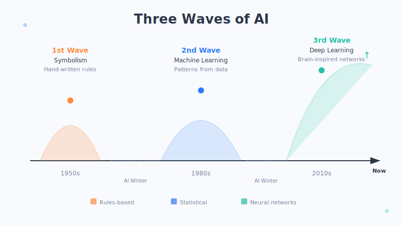
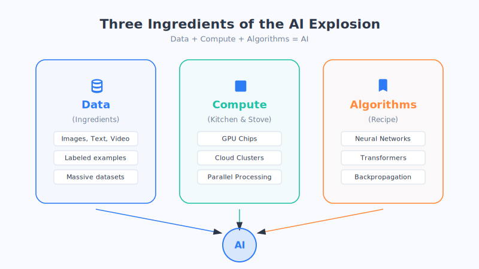

# Chapter 2: A Brief History of AI—Why It's Exploding Now

> Many people assume AI is a "new gadget" that only popped up in the last few years. But the truth is—it's already been quietly at this for nearly 70 years. So here's the question: why did it suddenly "go into overdrive" in just these recent years?

In this chapter, we'll flip through the old photo album, so to speak, and look at the three waves AI has ridden along the way—and the secret behind this latest explosion.

## 1. First, a Story of "Three Ups and Two Downs"

AI's history hasn't been a steady march of triumph, but rather **dramatic ups and downs, rising and falling several times over.** It caught fire three times and went cold twice.

Way back in 1956, a group of scientists at a gathering in the United States called the **Dartmouth Conference** formally coined the term "artificial intelligence" for the first time. Ever since, expectations for it have ridden like a roller coaster: one moment people felt "machines are about to come alive," the next they were disappointed to find "this thing is way too dumb."

Let's condense this history into three waves.

## 2. Three Waves: AI's Three Approaches to "Getting Smart"

### The First Wave: Hand-Teaching the Rules (the Symbolists)

**The idea**: since humans think using logic and rules, why not just write the rules out for the computer, one by one—wouldn't that make it smart?

This camp was called **symbolism**, which in plain terms means—**humans set the rules, the machine reasons by following them.** It's like writing the machine an incredibly detailed manual of "if… then…" statements.

**The result**: it worked okay on simple, closed problems, but the moment it hit the real world, it was stumped. The world is too complex; the rules can never be finished. Want to teach it to recognize a cat? Are you going to write "if it has pointy ears, if it has whiskers, if…"? Just the cat's various poses, lighting, and breeds alone would exhaust you—and you still couldn't cover them all. So the craze faded, and AI entered its first "winter."

### The Second Wave: Letting the Machine Learn From Data Itself (Machine Learning)

**The idea**: since the rules can never be finished, why not **stop writing rules altogether—hand the machine a pile of examples and let it find the patterns itself.**

This is exactly the **machine learning** we discussed in the last chapter. Instead of a human teaching what a cat looks like, you toss the machine a few thousand cat photos and let it draw its own conclusions.

**The result**: this approach was far more on the mark, and AI's range of abilities clearly grew—filtering spam email, simple image recognition, and so on. But limited by the amount of data and computing power at the time, it still wasn't quite "dazzling," and the enthusiasm cooled once more.

### The Third Wave: Brain-Mimicking Deep Learning (Where We Are Right Now)

**The idea**: scientists built a structure that mimics the way neurons in the brain connect, called a **neural network**. When you stack this kind of network many layers deep, it becomes **deep learning**—it can refine extraordinarily complex patterns from a mass of data, one layer at a time.

**The result**: this time, AI really did "go into overdrive." It can understand human speech, recognize faces, draw pictures, and write essays. **Nearly all the AI marvels we're amazed by today belong to this third wave.**

(This is just an analogy that greatly simplifies a complex history to help you grasp the main thread; the real course of events was more twisting, with many more schools of thought.)

## 3. The Soul-Searching Question: Why Is It Exploding "Now" of All Times?

The idea of neural networks actually existed decades ago. So why did it stay lukewarm for so long, only to suddenly "ignite" in the last decade or so?

The answer can be put with a metaphor we all know well—**cooking a grand feast requires three things to come together at once: the ingredients, the kitchen, and the recipe.** Miss any one, and the meal can't be made. AI's latest explosion happened precisely because these three, in a rare alignment, all **came together in the last decade or two.**

### 1. Ingredients = Big Data (the Internet)

Deep learning is a "big eater"—it needs a mass of data to learn well. **The spread of the internet and smartphones** means humanity now produces astronomical amounts of images, text, and video every day. **These are the inexhaustible "ingredients."** Decades ago, there simply wasn't this much data to feed it.

### 2. Kitchen = Compute (GPU Chips)

Processing a mass of data demands a staggering amount of calculation, which requires enormous "firepower." People discovered that a kind of chip originally used for gaming and rendering graphics—the **GPU (graphics processing unit)**—was especially good at this kind of massive, parallel computation. **The GPU is that modern kitchen with the burners cranked up full**, turning tasks that once took months into ones done in days or even hours.

### 3. Recipe = Algorithmic Breakthroughs

With the ingredients and the kitchen in place, you still need a good "recipe"—that is, smarter **algorithms**. Scientists kept improving the design of neural networks, making them learn faster, more accurately, and more deeply.

There are two landmark "highlight moments" here:

- **2012, the ImageNet image-recognition competition**: a deep learning model left every rival far behind at recognizing images, stunning the academic world. **That year is widely recognized as deep learning's "ignition point."**
- **In recent years, the arrival of large models like GPT**: **large language models**, epitomized by ChatGPT, burst onto the scene, able to converse and write like a human—bringing AI, for the first time, truly into the daily lives of ordinary people.

| The Three Things | The Corresponding AI Element | In Plain Words |
| --- | --- | --- |
| Ingredients | Big data | The internet brings a mass of images and text to learn from |
| Kitchen | Compute (GPU) | Powerful chips provide lightning-fast computing firepower |
| Recipe | Algorithmic breakthroughs | Smarter neural network designs (deep learning, the Transformer, etc.) |

**All three are indispensable.** This also explains why an "old idea" like neural networks could only bear fruit today—not because the idea changed, but because **the conditions for cooking the meal were finally all in place.**

## 4. What Understanding This History Does for Us

- **Don't deify it, don't dismiss it either.** AI wasn't a god descending overnight; it's the "steady buildup, sudden payoff" of decades of accumulation plus three conditions ripening.
- **Understand its "appetite."** Knowing that AI grows by "being fed data," you'll understand why every company is scrambling to grab data and compute.
- **Have a sense of what's ahead.** As long as data, compute, and algorithms keep improving, AI will most likely keep getting stronger—which is both an opportunity and a reminder to adapt early.

## Chapter Summary

- AI has nearly 70 years of history; the term "artificial intelligence" was born at the 1956 Dartmouth Conference, and it's ridden "three ups and two downs" ever since.
- The three waves represent three approaches: **symbolism** (humans write rules) → **machine learning** (finding patterns from data) → **deep learning** (brain-mimicking neural networks, where we are right now).
- The reason it's exploding "now" is that **ingredients (big data), the kitchen (GPU compute), and the recipe (algorithmic breakthroughs)** came together in a rare alignment all at once.
- Two landmark milestones: the 2012 ImageNet competition (deep learning's ignition point) and, in recent years, GPT/ChatGPT (AI entering the public's daily life).

## Something to Think About

1. Using the "ingredients, kitchen, recipe" metaphor, explain to a family member or friend why "AI is only exploding now," and see if you can make it clear.
2. Suppose that one day in the future, one of the three—data, compute, or algorithms—hit a bottleneck. What impact do you think that would have on AI's development?
