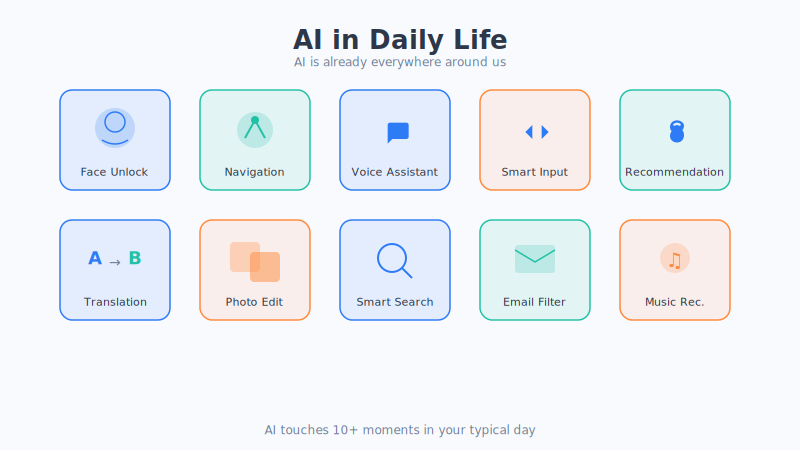
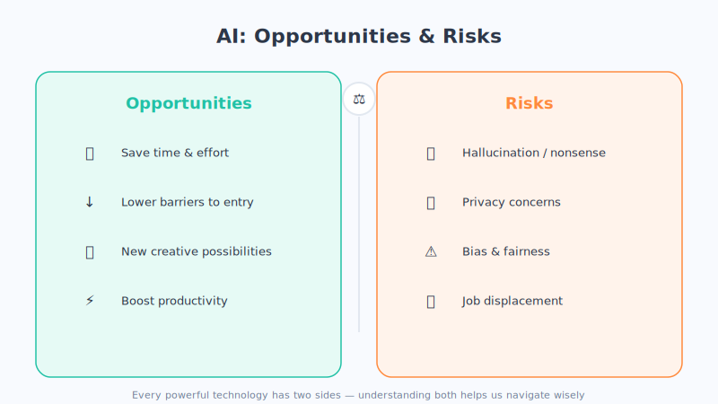

# Chapter 3: The AI Around You—It's Already Everywhere

> You might feel AI is far removed from you—high tech that lives in labs and news headlines. But the truth is—**from the alarm that wakes you in the morning to the videos you scroll before falling asleep at night, AI has already been quietly part of your entire day.**

In this chapter, let's play a round of "AI treasure hunt" and pull it out, one instance at a time, from the corners of daily life where it hides.

## 1. First, Walk Through Your "Day With AI"

Don't believe it? Let's reconstruct an ordinary person's ordinary day:

- **Morning**: you lift your phone and **unlock it with your face**—that's AI recognizing your face.
- **Commute**: you open navigation, and it helps you **predict which route is faster and steer clear of traffic**—that's AI calculating your route.
- **At work**: your input method **auto-suggests** the word you're about to type, and translation software turns a foreign-language email into your own language in a second—all AI.
- **Lunch break**: you scroll short videos and browse a shopping app, and "recommended for you" keeps hitting the mark—that's AI making recommendations.
- **Say a word**: you call out "Hey Siri / Alexa," and it answers—that's AI **understanding human speech**.
- **Evening**: you chat a bit with **ChatGPT**, asking it to help you write an email or brainstorm an idea—that's the latest generation of AI.

See? **AI isn't the future—it's your present.**

## 2. Sorting the Everyday AI Around You Into Categories

Let's group these applications into a few broad categories, and you'll see it all more clearly. (This is just a plain-language grouping to aid understanding; real products often mix several technologies.)

### 1. Recommendation Systems: The "Mind-Reading" That Knows You Best

Not being able to stop scrolling short videos, "wanting to buy more the longer you browse" while shopping, a music app always serving up songs that suit your taste—it's all powered by **recommendation systems**.

The principle is like an extraordinarily attentive old shop clerk: **quietly remembering what you looked at, how long you lingered, what you liked, then comparing you against tens of thousands of people with similar tastes to guess what you might like next.** It doesn't read minds—it just studies your behavioral data inside out.

### 2. Computer Vision: Letting Machines "See and Understand"

**Face-unlock, face-pay, a photo album automatically grouping pictures of the same person, auto-beautifying your photos**—these all belong to **computer vision**, that is, teaching AI to "see and identify objects."

The principle is exactly what Chapter 1 described: show it a mass of labeled images, and it figures out on its own "the features of this face," so next time it can recognize you.

### 3. Speech and Language: Letting Machines "Understand, Speak, and Write"

This category deals with "language" and is the hottest direction lately:

- **Voice assistants** (Siri, Alexa, Google Assistant): first **turn your voice into text**, then understand your intent, and finally give a response.
- **Machine translation**: snap and tap a foreign-language menu or webpage and it turns into your own language—no panic even abroad.
- **Chatbots (like ChatGPT)**: they can converse, write essays, write code, and offer ideas—the flagship of **large language models**, and the star player for the second half of this book.

### 4. Intelligent Decision-Making and Driving: Letting Machines "Make Judgments"

- **Navigation software**: predicts traffic in real time and plans the optimal route.
- **Self-driving**: a car fitted with a bunch of "eyes" (cameras, radar), where the AI judges the road, pedestrians, and traffic lights in real time and decides whether to brake or turn. This is one of the hardest AI applications today, and it's still being developed and refined.

| Category | In Plain Words | Examples You Use Every Day |
| --- | --- | --- |
| Recommendation systems | Guessing what you like | Short videos, shopping, music apps |
| Computer vision | Letting machines see and understand | Face-unlock, photo-album face grouping, beautification |
| Speech and language | Understanding, speaking, writing | Voice assistants, translation, ChatGPT |
| Intelligent decision-making | Helping you make judgments | Navigation planning, self-driving |

## 3. Opportunities and Risks: Two Sides of the Same Coin

AI is everywhere—bringing convenience, but also hiding things we need to keep an eye on. Seeing both sides is what lets you use it wisely.

### The Opportunities It Brings ✅

- **Saving time and effort**: translation, writing, looking things up, making spreadsheets—it handles many tedious chores in seconds, freeing you up for more important things.
- **Lowering the barrier**: you can produce images without knowing how to draw, and communicate without knowing a foreign language. AI puts many "professional skills" within easy reach.
- **Creating new opportunities**: it spawns plenty of new professions and industries, and people who know how to use AI will be more competitive.

### The Risks It Brings ⚠️

- **It will "confidently talk nonsense"**: AI sometimes fabricates content that looks credible but is actually wrong (technically called "hallucination"). **Always double-check important information yourself.**
- **Privacy issues**: it runs on data, so how our personal information is collected and used is worth being vigilant about.
- **Bias and unfairness**: if the data fed to it is itself biased, what it learns will be biased too.
- **Impact on employment**: some repetitive jobs may be replaced, so we need to proactively learn and build up skills that are harder to replace.

**The conclusion isn't "whether to use AI," but "how to use it wisely and responsibly."** We'll devote a dedicated discussion to risk and ethics at the end of this book.

## 4. One Small Reminder

Recognizing the AI around you is only the first step. What truly matters is: **use it with understanding.** Know what it's good at, and use it boldly; know where it goes off the rails, and keep a backup plan to verify. This is the practical point of studying this book.

## Chapter Summary

- AI has long seeped into daily life: face-unlock, navigation, input methods, recommendations, voice assistants, translation, ChatGPT… it's your present.
- The AI around you falls roughly into four categories: **recommendation systems** (guessing what you like), **computer vision** (letting machines see and understand), **speech and language** (understanding, speaking, writing), and **intelligent decision-making** (helping you make judgments).
- AI is two sides of one coin: it brings time savings, lower barriers, and new opportunities, but it also comes with risks like talking nonsense, privacy, bias, and employment impact.
- The key isn't whether to use AI, but **using it wisely and responsibly**—always verify important information yourself.

## Something to Think About

1. Look back over one real day of your own and try to find at least 3 moments when "AI was quietly helping you." Which of this chapter's categories does each belong to?
2. Have you ever encountered AI "confidently talking nonsense," or recommending things "so accurately it was a little creepy"? How did you handle it at the time?
