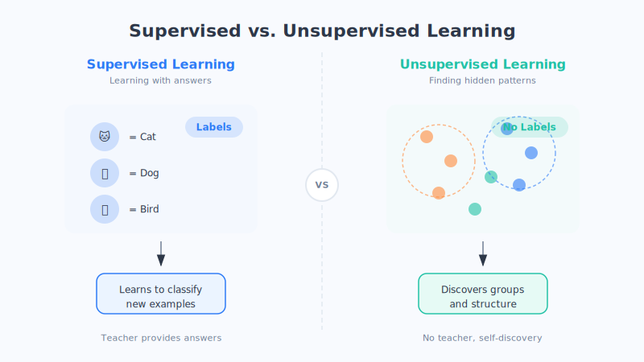

# Chapter 5: The Story of Data — Garbage In, Garbage Out

> There's a plain truth that circulates in machine learning circles: "**Garbage In, Garbage Out**." It means: whatever kind of data you feed a machine, that's what it learns to be. If the data is bad, even the most powerful model is useless.

## A tale of two chefs

Imagine two chefs with exactly the same cooking skills.

The first uses fresh vegetables and premium meat; the second uses wilted greens and stale meat. Even if their techniques are identical, the dishes they serve up will taste worlds apart.

In machine learning, **data is that batch of ingredients**. No matter how advanced the model, if what goes in is "bad ingredients," the result won't be good either. So in this chapter, we'll seriously discuss what counts as "good ingredients" (this is just an analogy—reality is more complex).

## 1. Quality matters more than quantity

Many people have a misconception: isn't more data always better?

The answer is: **more is certainly good, but "clean and accurate" matters more than "large in quantity."**

Here's an analogy: giving you 10,000 practice problems with wrong answers is worse than giving you 100 problems with correct answers. Because the former will **teach you the wrong things**, leaving you more confused the more you practice. The same goes for machines—if the data is full of errors, the machine learns nothing but wrong patterns, growing more and more off-track.

A set of "good data" usually needs to meet a few criteria:

- **Accurate**: the information is correct, not wrong or outdated.
- **Clean**: without too many gaps, duplicates, or messy junk.
- **Relevant**: genuinely related to the problem you're trying to solve.
- **Representative**: able to cover all kinds of real situations, not just a small subset.

The last point is especially important, and we'll cover it separately below.

## 2. Data labeling: the "answer key" for the machine

As mentioned earlier, the most common form of machine learning is "supervised learning"—having the machine do a workbook with an answer key. So here's the question: **where do these "answer keys" come from?**

The answer is: **most of them have to be marked out by people, one entry at a time**, a process called **data labeling**.

A few examples:

- To teach a machine to recognize cats, someone has to label thousands upon thousands of photos with "this is a cat" or "this isn't a cat."
- To teach a machine to understand speech, someone has to type out the text corresponding to segment after segment of recordings, sentence by sentence.
- To teach a machine to tell whether a review is positive or negative, someone first has to label a large number of reviews as "positive/negative."

These labels are like the **answer key** of an exam. The more accurately the answers are labeled, the better the machine learns; if the answers are labeled wrong, the machine learns them wrong too. So behind many AI companies, there are large numbers of "data annotators" working quietly—you could say **they are the "teachers" of AI**.

## 3. Data bias: machines can "wear tinted glasses" too

This is the most important point of the whole chapter, and also the most easily overlooked—please take it to heart.

**If the data fed to a machine is itself "biased," the results the machine learns will be "biased" too.** This is called **Data Bias**.

Here are a few real-world examples that have actually happened and should serve as warnings (these are simplified explanations—the real situations are more complex):

- **Facial recognition that only recognizes certain people**: if the training photos were almost entirely of faces of one skin tone, then when the system tries to recognize people of other skin tones, it will be noticeably inaccurate, even failing repeatedly. It's not that the machine "deliberately discriminates"—it's that it simply **never saw enough of the other examples**.
- **Hiring AI biased toward one gender**: if the historical hiring data used for training shows that a certain type of position mostly hired men in the past, the machine may "learn" this bias and quietly give lower scores to female applicants.
- **Self-driving trained only in sunny weather**: if a self-driving car was only trained on sunny-day data, it may be "stumped" the moment it hits rain or snow, because it never saw those scenarios.

The key lesson here is: **a machine has no values; it merely faithfully "recites" the biases hidden in the data you gave it.** To make a machine fair, the first step is to make the data **as comprehensive and representative as possible**, covering all kinds of people and situations.

## 4. Privacy and ethics: data isn't yours to use just because you want to

Data is so useful—so can we just take everyone's information and use it? **Of course not.**

Behind data, there are often **real, individual people**—your photos, chat records, shopping habits, medical records... these all count as personal privacy. To use such data, you must hold to some bottom lines:

- **Informed consent**: in principle, whoever's data you use should know about it and agree, rather than have it collected secretly.
- **Minimal and sufficient**: only collect the information you truly need; don't be greedy.
- **Secure storage**: protect the collected data well—don't leak it, don't let it be misused.
- **Lawful and compliant**: many countries and regions have laws (such as personal-information-protection regulations), and using data must comply with the law.

In one sentence: **technology can be very powerful, but when it comes to using data, you must always be responsible to people.** This is not just a legal matter—it's the conscience that people who build AI ought to have.

## Chapter summary

- "**Garbage In, Garbage Out**": data quality directly determines how good a model is, and **quality often matters more than quantity**.
- **Data labeling** is about preparing the "answer key" for a machine—only when labeled accurately can the machine learn well.
- **Data bias** is dangerous: if the data is biased, the machine will "put on tinted glasses," and it takes comprehensive, representative data to correct it.
- Using data must respect **privacy and ethics**: informed consent, minimal and sufficient, secure storage, lawful and compliant.

## Questions to ponder

1. Suppose you want to train a speech AI to "recognize the various dialects of China," but you only collect accent data from one province. What problems might arise?
2. Which of your own data would you be willing to hand over to AI, and which would you absolutely refuse to give up? Think about the reasons behind it.

---

We've prepared the "ingredients" that are the data. Next, it's time to look at the "cooking method"—in the next chapter, we'll lift the mysterious veil off the "model."
