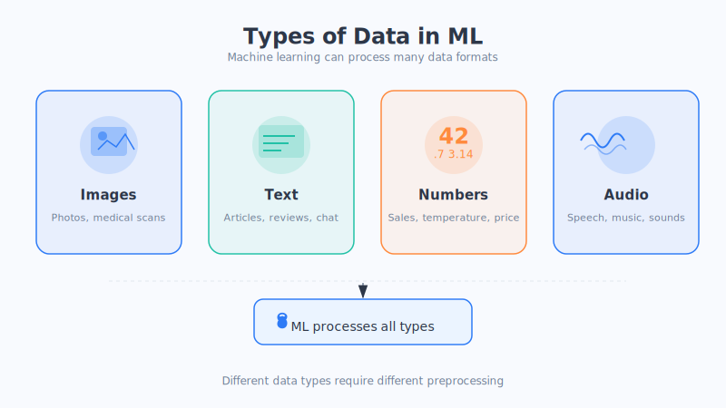

# Chapter 6: What Is a Model

> The word "model" is something you've probably heard countless times in the news—"large model," "training a model," "the model went live." But what exactly is it? In this chapter, we'll explain it thoroughly.

## Let's start with the simplest definition

Don't let the word "model" intimidate you. You can understand a model in a single sentence:

**A model is a set of "whatever you put in, this is what comes out" patterns.**

- You **input** a photo, and it **outputs** "this is a cat";
- You **input** today's weather data, and it **outputs** "it might rain tomorrow";
- You **input** a Chinese sentence, and it **outputs** the corresponding English sentence.

That pattern in the middle, turning "input" into "output," is the model. Mathematicians like to write it as `y = f(x)`—don't panic; translated into plain language, this expression just says: "**give me an x (input), and I'll use the pattern f to compute a y (output)**." Throughout this book we try to avoid formulas; you only need to remember those seven words, "the pattern from input to output," and that's enough.

## A little "guess the price" game

Let's use buying a house to get a feel for it.

Suppose you want to estimate how much a house is worth. Intuitively, you might think: "The bigger the house, the pricier." This sentence is actually a **simplest model**:

> Input: house size → Output: house price (the bigger the size, the higher the price)

This pattern can be drawn as a **straight line**: the horizontal axis is size, the vertical axis is price, and the bigger the size, the higher the point climbs. This is the legendary "**Linear Regression**," one of the most basic models in machine learning.

Of course, in reality house prices don't depend only on size—they also depend on location, floor level, age, school district... At that point, that simple straight line is no longer enough, and we need a more complex model. This leads to the next topic (this is just an analogy—reality is more complex).

## The "evolution" of models: from simple to complex

There isn't just one kind of model—they're like tools in a toolbox, some simple and handy, others complex and powerful. Let's pick three representative ones and get a feel for them, from simple to complex:

### 1. The straight line: the plainest pattern

This is exactly the "bigger means pricier" we just mentioned. It's simple, easy to understand, and fast to compute, but it can only express very straightforward patterns. It falls short when facing complex problems.

### 2. The decision tree: like a string of "yes-or-no questions"

The idea behind a decision tree is very much like how we make judgments in everyday life—**asking questions one after another**.

For example, to decide "whether to bring an umbrella":

> Is it raining? → Yes → Bring an umbrella
> └ No → Is it heavily overcast? → Yes → Bring an umbrella
> 　　　　　　　　　└ No → Don't bring one

Asking layer by layer, it finally arrives at an answer. This is a decision tree—intuitive, easy to explain, and used in many real-world scenarios.

### 3. The neural network: complex enough to "recognize faces and talk"

When a problem is so complex that "you can't spell out the pattern"—like recognizing faces, understanding speech, or writing articles—it's time to call in the **neural network**. Internally it has thousands, or even hundreds of billions, of tunable "little knobs," enabling it to express extremely complex patterns. Today's large models are, in essence, enormous neural networks.

Just how powerful they are, we'll cover specifically in **Part Three**. For now, you only need to know: **the neural network is currently the most powerful class of models, at the cost of being both complex and hard to explain.**

## Is more complex always better? — Occam's Razor

Reading this far, you might think: so why don't I just go straight for the most complex model?

**Actually, no.** There's a piece of wisdom that has circulated for centuries, called **Occam's Razor**, which in plain language means:

> **If a simple approach can solve the problem, don't use a complex one.**

Why? Because an overly complex model has a flaw called **Overfitting**—it "memorizes by rote" every single example it saw during training, including meaningless noise, and as a result it gets stumped the moment it encounters a new situation.

Here's an analogy: if a student memorizes the workbook's answers word for word (even the printing errors), they ace the quizzes as usual, but when the real exam brings new questions, they're completely lost. This is overfitting—**looks smart, but doesn't truly understand** (this is just an analogy—reality is more complex).

So choosing a model is an art of balance: **as long as it can solve the problem, pick the simplest one possible.** As for overfitting, we'll explain it more thoroughly in the next chapter with "rote memorization vs. true understanding."

## Chapter summary

- A model, put simply, is a set of **"input → output" patterns** (mathematically written as `y = f(x)`, but just remembering the plain-language version is enough).
- Models range from simple to complex: the **straight line** is the plainest, the **decision tree** is like a string of yes-or-no questions, and the **neural network** is the most powerful and also the most complex.
- Complex doesn't mean better. **Occam's Razor** tells us: if a simple approach can solve it, don't use a complex one.
- Overly complex models are prone to **overfitting**—like a student who memorizes answers by rote, acing familiar questions but stumped by new ones.

## Questions to ponder

1. Think of a decision you make daily (like "what to wear today"). Could you draw it as a "decision tree"? Which question would you ask yourself first?
2. The idea that "more complex is always better"—what other counterexamples are there in life? (Hint: think of times when "overthinking made things worse.")

---

We now have the ingredients (data) and the cooking method (model), but how do the two work together, and how exactly does the machine "get more and more accurate as it learns"? In the next chapter, we enter the most exciting part—**training**.
