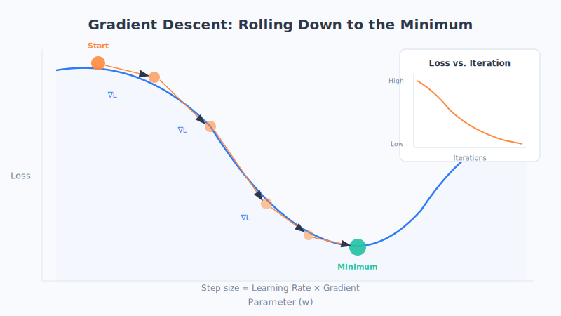

# Chapter 7: The Training Process — Correcting Mistakes with Gradient Descent

> A machine isn't smart from birth. The process of getting smart boils down to three words: **correcting mistakes, continuously**. In this chapter, we'll see how a machine goes step by step from "wildly off" to "very accurate."

## A lesson from learning to ride a bike

Think back to learning to ride a bike as a kid.

The first time, the handlebars tilted, and you fell; you made a mental note, "I just leaned left," so next time you steadied a bit to the right; you fell again, but this time it was a little better; try again... fall after fall, your body slowly found its balance. **No one gave you a *Bicycle Formula Manual*—you learned it by correcting mistakes, one at a time.**

Machine training is almost exactly this process (this is just an analogy—reality is more complex): guess first, see where it went wrong, adjust a little toward the right direction, guess again... round and round, until it gets more and more accurate. Below, let's bring out the key players in this process.

## 1. The loss function: putting a "deduction" on the error

To correct a mistake, the first step is to know "**how far off am I**."

In machine learning, we use something called a **Loss Function** to do this. You can think of it as an **error score** (or "points deducted"):

- The more absurd the guess, the **higher** the loss score;
- The closer the guess is to the correct answer, the **lower** the loss score;
- A perfectly correct guess brings the loss close to **zero**.

For example: the true house price is 1 million, and the machine guesses 3 million—wildly off, so a lot of points are deducted; next time it guesses 1.1 million, much closer, so fewer points are deducted.

So the goal of the entire training, summed up in one sentence, is: **do everything possible to drive this "error score" to its lowest.** But how do we drive it down? That's where the main character comes in.

## 2. Gradient descent: a story of a blind person walking down a mountain

This is the most central and classic analogy of the chapter—please savor it slowly.

Imagine you are a **blindfolded person, standing on a mountain, trying to reach the lowest point in the valley** (because the lowest point represents "the fewest errors"). You can't see the whole picture—so what do you do?

You can use your feet to **feel out which direction around you is the steepest downhill**, then take a step in that direction. Once at the new spot, you feel around again, and take another step toward the steepest downhill direction... Step by step like this, you can always slowly make your way to the valley bottom.

This, right here, is **Gradient Descent**:

- **The mountain**: represents all possible "error scores"—the higher the mountain, the more errors; the valley bottom has the fewest.
- **Each step going in the steepest downhill direction**: this is the machine, each time it adjusts the model, moving in the direction that "reduces error the fastest."
- **Reaching the valley bottom**: this is finding the set of settings that makes the model's error smallest.

The machine relies on this "feeling its way toward the low ground" plodding method to bring the error down step by step. Not so mysterious now, is it?

## 3. The learning rate: how big should each step be?

When walking down the mountain, there's another crucial question: **how big should each step be?** This "step size" is called the **Learning Rate** in machine learning.

- **Steps too big**: you might leap in one stride from this slope straight onto the opposite slope, bouncing back and forth across the valley and never reaching the lowest point.
- **Steps too small**: the direction is right, but you walk too slowly—you might not reach the valley bottom even by nightfall (training takes forever).
- **Steps just right**: you reach the valley bottom both steadily and quickly.

So tuning the "learning rate" is a craft within training—**you can't be too hasty, nor too sluggish**. This is also why training a model requires experience and repeated trial and error.

## 4. Overfitting vs. underfitting: rote memorization vs. never learning

Training also runs into two common "crash" situations, best explained with an exam analogy (this is just an analogy—reality is more complex):

### Overfitting: the student who memorizes by rote

Some students memorize the workbook's answers word for word, right down to the typos in the questions. They ace the original problems as usual, but **the moment an exam brings new questions, they're stumped**. This is called **Overfitting**—the machine has memorized the training data too rigidly, including the meaningless noise, and as a result can't handle new situations.

### Underfitting: the student who never really learned

There's another kind of student who didn't study properly at all, never laid a solid foundation, and **does poorly on both practice and exams**. This is called **Underfitting**—the machine learned too crudely and failed to grasp even the basic patterns in the training data.

### What we want: the student who truly understands

What we really want is the student who **understands the knowledge and can apply it flexibly**—not only can they do the problems they've seen, they can also handle new ones. Applied to a machine, that means **neither rote memorization nor half-hearted effort, but grasping the real pattern**.

| Type | Like which student | Seen questions | Unseen new questions |
| --- | --- | --- | --- |
| Underfitting | Didn't study properly | Does poorly | Does poorly |
| Just right | Truly understands | Does well | Does well |
| Overfitting | Memorizes by rote | Does well | Does poorly |

How do we tell whether a machine "truly understands" or is "memorizing by rote"? That calls for arranging an **exam** for it—which we'll cover specifically in the next chapter.

## Chapter summary

- The essence of training is **correcting mistakes continuously**: guess first, see how far off it is, adjust toward the right direction, guess again, round and round.
- The **loss function** is the "error score," the lower the better; the goal of training is to drive it to its lowest.
- **Gradient descent** is like a blind person walking down a mountain: each step goes in the steepest downhill direction, gradually approaching the valley bottom with "the fewest errors."
- The **learning rate** is the "step size": too big and you bounce back and forth, too small and you walk too slowly—it has to be just right.
- **Overfitting** is rote memorization (stumped by new questions), **underfitting** is never learning (can't do anything), and what we want is true understanding with the ability to apply knowledge flexibly.

## Questions to ponder

1. Using the "blind person walking down a mountain" analogy, can you explain why "steps too big" might actually mean never reaching the valley bottom?
2. Recall the two styles of learning around you—"rote memorization" and "true understanding." How do they differ when facing new problems? How is this similar to overfitting?

---

The machine has finished training—but how well did it actually learn? We can't just take its word for it. In the next chapter, we'll play the role of "examiner" and see how to scientifically judge whether a model is good or bad.
