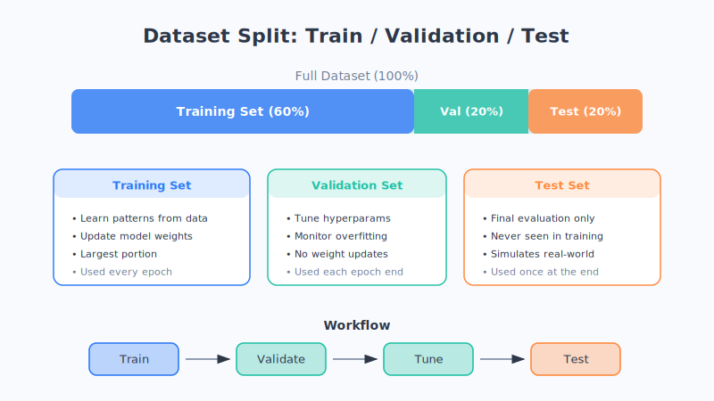

# Chapter 8: How to Judge Whether a Model Is Good

> The machine has finished training and claims it "learned really well." But talk is cheap—whether it's actually good has to be settled by **taking an exam**. In this chapter, we'll learn to be a fair "examiner."

## Practice alone doesn't count—you have to take a real exam

In the last chapter, we said the thing we fear most is a machine "memorizing by rote." So how do we see through it—whether it truly understands or just memorized the answers?

The method is simple, exactly like in school: **practice regularly, then take a formal exam at the end, and the exam must use questions it has never seen.**

In machine learning, we split the data we have **into two parts**:

- **Training set**: the questions the machine "practices" with regularly (with an answer key, for it to learn from).
- **Test set**: the hidden "exam questions" that the machine **absolutely cannot peek at** during training, saved specifically to check it at the end.

The reasoning is easy to grasp: if the exam only tests problems it has already done, anyone can score high, and you can't tell real skill. **Only by testing with unseen new questions can you know whether it truly learned.** This is also the key means of judging "overfitting"—if it aces practice but bombs the exam, it's almost certainly memorizing by rote.

## The most intuitive score: accuracy

After the exam, the easiest scoring method to think of is **Accuracy**:

> Accuracy = number of questions answered correctly ÷ total number of questions

For example, getting 90 out of 100 questions right gives an accuracy of 90%. Simple, intuitive, and quite useful most of the time.

**But accuracy has one huge trap**, and many people get caught by it.

## Accuracy's big trap: a "lazy" example

Suppose we want to build an AI to detect a certain rare disease, and only 1 in 1,000 people has it.

Now there's a particularly "lazy" model that learns nothing at all and **says "healthy" no matter who comes**. Guess what its accuracy is?—**99.9%!** Because out of 1,000 people, 999 really are healthy, and it got them all right.

The accuracy is frighteningly high, yet this model is **utterly useless**—the one person who is truly sick and most needs to be identified is completely missed by it!

This example tells us: **when the numbers of good and bad samples are wildly imbalanced, looking only at accuracy is seriously misleading.** We need a more refined ruler.

## Two more refined rulers: precision and recall

Medical diagnosis is a great scenario for understanding these two concepts. Let's bring out two terms: **Precision** and **Recall** (this is just an analogy—the actual definitions are more rigorous).

- **Precision (better to under-diagnose than to misdiagnose) — "no false alarms"**
  It cares about: **among the people the machine says "have the disease," how many truly do?** High precision means it rarely "wrongs" healthy people. It corresponds to the real-world demand: don't make healthy people worry for nothing and undergo a bunch of unnecessary tests.

- **Recall (better to over-check than to let one slip) — "no missed cases"**
  It cares about: **among all the people who truly have the disease, how many did the machine successfully catch?** High recall means it rarely "lets a patient slip through." It corresponds to the real-world demand: never miss a genuine patient and delay treatment.

Back to that "lazy" model: it says everyone is healthy, so its recall is **0** (it caught not a single patient), and it's exposed in an instant. This is exactly why we can't look at accuracy alone.

**You often can't have your cake and eat it too.** If you want to miss no one (high recall), it's easy to wrong a few more (precision drops); if you want to wrong no one (high precision), you may let a few more slip (recall drops). Which side to lean toward depends on the actual scenario:

- Screening for a deadly disease like cancer: **better to over-check than to miss a case**, so prioritize recall.
- Filtering spam email: **better to miss a few than to wrongly delete important mail**, so prioritize precision.

## The confusion matrix: one table shows all the rights and wrongs

Arrange all the "right and wrong situations" above neatly into a 2×2 table, and you get the **Confusion Matrix**—the name sounds intimidating, but it's really just a "checklist of rights and wrongs."

Take "detecting illness" as an example. Each judgment the machine makes falls into one of four cells:

| | Machine says "sick" | Machine says "healthy" |
| --- | --- | --- |
| **Actually sick** | ✅ Correct catch (truly sick, caught it) | ❌ Missed case (sick but said healthy) |
| **Actually healthy** | ❌ Misdiagnosis (healthy but said sick) | ✅ Correct call (healthy, not wronged) |

Looking at this table:

- The top-left and bottom-right (the two ✅) are **correct judgments**;
- The top-right "missed case" is what **recall** keeps a close eye on (don't let a patient slip through);
- The bottom-left "misdiagnosis" is what **precision** keeps a close eye on (don't wrong an innocent person).

One little table makes it crystal clear "where the machine is good and where it went wrong." This is why it's one of the most commonly used tools when evaluating models.

## Chapter summary

- To judge whether a model is good, split the data into a **training set (regular practice)** and a **test set (formal exam)**, and the exam must use **unseen new questions**.
- **Accuracy** (the proportion of correct answers) is intuitive but has a trap: when the numbers of good and bad samples are wildly imbalanced, it can be seriously misleading.
- **Precision** pursues "no misdiagnosis" (don't wrong the innocent), **recall** pursues "no missed cases" (don't let patients slip through), and the two often require a trade-off.
- The **confusion matrix** is a "checklist of rights and wrongs" that lets you see at a glance where a model is good and where it went wrong.

## Questions to ponder

1. If you had to evaluate an "earthquake early-warning AI," would you value precision (no false alarms) or recall (no missed alarms) more? Why?
2. A model scored 99 on the training set but only 60 on the test set. What do you think happened? What should be done about it?

---

At this point, the foundation of machine learning is solidly laid—you now understand the complete main thread of **data, model, training, and evaluation**. In the next part, **Part Three**, we'll step into that most powerful and most mysterious family of models: **neural networks and deep learning**.
