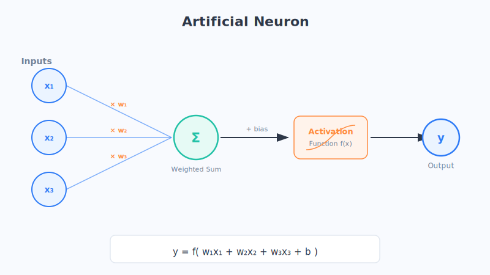
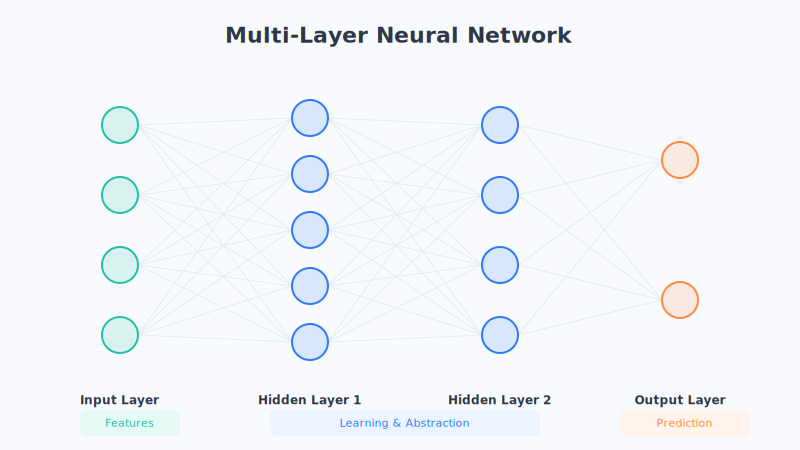

# Chapter 9 · Neural Networks: Inspiration from the Brain

Have you ever wondered why a pile of cold, lifeless code can recognize the cat in a photo or understand what you're saying? The answer starts with a bold idea: **since the human brain is so smart, could we build an "artificial brain" modeled after it?**

## Let's Start with an Everyday Scene

Our brains contain roughly 86 billion neurons. Each one looks a bit like a tiny tree: on one end there's a dense tangle of "branches" (called dendrites) that receive signals, in the middle there's a "trunk" (the cell body) that makes decisions, and on the other end there's a long "root" (the axon) that passes the signal on to the next neuron.

A single neuron is pretty dumb. It does just one thing: **it collects the signals coming in from others, and once it has gathered enough, it gets "excited" and passes the signal onward; if it hasn't gathered enough, it plays dead and does nothing.**

Here's the magical part: a single neuron is dumb, but wire 86 billion dumb neurons into one giant web that passes signals back and forth, and you get thought, memory, and emotion. Inspired by this, scientists thought—**why don't I also use software to simulate a bunch of "little dummies" and wire them into a web?** That's where the name "neural network" comes from.

(Of course, this is just an analogy. The real brain is far more complex; an artificial neuron merely borrows its most basic idea of "many inputs, make a decision, then produce an output.")

## Breaking Down the Core Ideas

### 1. A single artificial neuron = a tiny "telephone switchboard"

Picture an old-fashioned telephone operator. Several calls come in at once, and each one has a different level of "importance": the boss's call matters most, while a telemarketer's call can be ignored. The operator mentally assigns each call a score (a weight), adds up all these "scored signals," and then decides: should this call be put through or not?

An artificial neuron does exactly this:

- **Inputs (x):** several incoming signals—say, a handful of pixels from an image.
- **Weights (w):** the "importance" of each signal. This is what the network needs to learn. Important signals get large weights; unimportant ones get small weights.
- **Weighted sum:** add up all the "signal × weight" products to get a total score.
- **Activation function:** use this total score to make the final call—is it worthy of getting "excited"? If yes, output a large value; if not, output something close to zero.

To sum up this "switchboard" in one line: **inputs × weights, all added together, then the activation function makes the final call, producing an output.**

### 2. The activation function: why it's so crucial

Without an activation function, a neuron could only do straight-line arithmetic like "add, subtract, multiply." But the patterns of the real world are often "twisty and curvy"—for example, "water that's too cold is uncomfortable, and too hot is also uncomfortable; only the middle is just right." That can't be described by a single straight line.

The job of the activation function is to add a little "non-linearity" to the network, letting it bend around corners and express complex relationships. You can think of it as the neuron's "temperament" or "personality": it doesn't mindlessly amplify any signal it receives; instead, "only past a certain point do I truly get excited."

(This is just an analogy. Activation functions come in many specific forms, and the actual math is more nuanced, but their core role of "teaching the network to turn corners" is the key idea.)

### 3. From one to many: the power of multiple layers

A single neuron can only do so much. What's truly powerful is **arranging them in layers, advancing step by step**. This is a lot like a company's chain of command:

- **Input layer**—the frontline staff, who deal directly with raw information (like each pixel of an image).
- **Hidden layers**—the middle-management directors, who consolidate the staff's scattered reports and distill them into more meaningful conclusions (like "there's an edge here" or "this looks like a wheel").
- **Output layer**—the CEO, who weighs all the directors' opinions and makes the final decision (like "this image is a car").

Information flows like an assembly line, passing from the input layer on the left, layer by layer, to the right. The further along it goes, the more "high-level" the understanding becomes. There can be many hidden layers—**the more layers, the more abstract and complex the things the network can understand**. This is exactly the origin of the "depth" we'll discuss in the next chapter.

## Chapter Summary

- Neural networks are inspired by the human brain: wire many "dumb neurons" into a web, and they can do smart things.
- A single artificial neuron is like a telephone switchboard: **inputs × weights → sum → activation function → output**.
- Weights represent "how important each signal is" and are the core of what the network learns; training is the constant adjustment of these weights.
- The activation function brings "non-linearity," letting the network express twisty, complex patterns.
- Neurons are arranged in layers (input → hidden → output), consolidating and distilling layer by layer; the more layers, the more abstract the understanding.

## Questions to Ponder

1. Using the "telephone switchboard" analogy, try explaining to a family member what a "weight" is. Why is it so important to assign different scores to different signals?
2. If you removed the activation function, the network could only do straight-line arithmetic. Can you think of patterns in everyday life that "can't be explained by a single straight line" (for example, the comfort level of taste, temperature, or lighting)?
