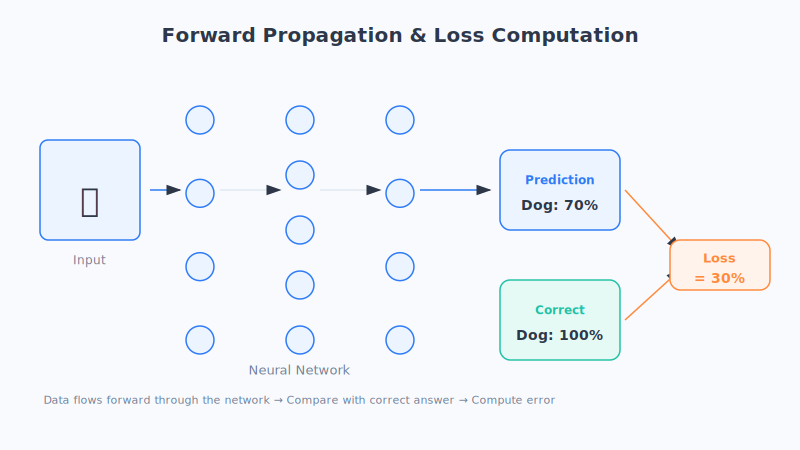
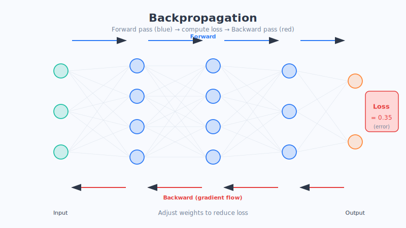

# Chapter 10 · How Neural Networks Learn: Backpropagation

In the last chapter we built a neural network, but when it's freshly "born," it knows nothing—all the weights inside are set at random, like a total beginner who's never studied a day. So here's the question: **how does it go from "knowing nothing" to getting smarter and smarter?**

In this chapter, we'll unveil that most central secret: **backpropagation**. The name sounds intimidating, but the idea is exactly like "reviewing a test to figure out where you went wrong."

## Let's Start with an Everyday Scene

Imagine you're in the kitchen learning to make tomato and scrambled eggs. Your first attempt: you toss in salt, add some sugar, and control the heat by feel. You bring it to the table, take a bite—way too salty!

What do you do? You don't throw out the whole dish and start over. Instead, you **think back**: did I add too much salt? Did the sugar also throw it off a bit? Should I adjust the heat? Then you mentally "assign blame" to each factor: the salt is most at fault, the sugar next, and the heat was basically fine. Next time, you focus on using less salt, tweak the sugar slightly, and leave the heat almost untouched.

After a few dozen tries, you've become a pro.

A neural network's learning is almost exactly this process: **make a prediction → taste it and find out how far off it was → work backward to assign each factor its share of the blame → adjust accordingly.** This "working backward to assign blame" process is backpropagation.

(This is just an analogy. The actual blame-assignment relies on math that calculates how much each weight contributed to the error—far more precise than "going by feel"—but intuitively that's exactly what's going on.)

## Breaking Down the Core Ideas

### 1. Forward propagation: make a prediction first

The first step of learning is to send the data through the network from left to right. The input (say, an image) enters at the input layer, passes through layer after layer of neurons doing their "weighted sum + activation," and finally the output layer spits out an answer—like "I think this is a dog, 70% confident."

This process of "data flowing from left to right, computed all the way through to produce a prediction" is called **forward propagation**. It's the step where you "cook the dish and bring it to the table."

### 2. Computing the loss: taste it, how far off were you?

Once the dish is on the table, you have to taste it to know whether it's any good. The network is the same—it compares its prediction against the "correct answer" and calculates how big the gap is. This gap has a special name: the **loss**.

- Large loss: the prediction is way off, badly wrong.
- Small loss: the prediction is spot-on, close to a perfect score.

**The one and only goal of the entire learning process is to drive this "loss" as low as possible.** Loss is like the points deducted on a test—the fewer, the better.

### 3. Backpropagation: work backward like a detective to assign blame

Now for the crucial part. The network knows it "lost 30 points," but it has thousands upon thousands of weights—which ones caused the error? How much blame should each one carry?

This is when the network turns into a **detective**. A detective doesn't solve a case by tracing forward from the beginning; instead, **they work backward from the "crime scene" of the outcome**: this error in the last layer—which neurons in the previous layer caused it? And who in the layer before that influenced those? Working backward layer by layer like this, it distributes the "blame" from the output layer back onto every single weight.

This process of "working backward from the outcome and assigning blame layer by layer" is **backpropagation**. Its direction is exactly opposite to forward propagation: forward goes left to right to make a prediction; backward goes right to left to assign responsibility.

Remember it in one line: **forward propagation produces the answer, backpropagation finds who's responsible.**

### 4. Updating the weights: targeted improvement

Once responsibility is sorted out, the final step is simple: **whoever is most to blame gets adjusted the most.**

- A weight that "caused big trouble" (contributed heavily to the error) gets adjusted a lot.
- A weight that's basically fine barely moves.

The direction of adjustment is clear too: nudge a small step toward "making the loss smaller." Note that it's a *small* step—don't over-adjust in one go, or you'll easily overshoot (the art of this step is exactly the "gradient descent" and "learning rate" we discussed in the previous part).

Then the network takes its updated weights and goes another round: forward prediction → compute loss → backward blame assignment → update weights… repeating this cycle thousands upon thousands of times. Each round it's wrong by a little less, until it finally becomes a "master chef."

## Chapter Summary

- When a neural network is first born, its weights are random; "learning" is the process of continually tuning those weights.
- **Forward propagation:** data runs through the network from left to right to produce a prediction (cook the dish first).
- **Loss:** the gap between the prediction and the correct answer; the goal of learning is to minimize the loss (taste it, how far off were you).
- **Backpropagation:** work backward from the outcome, like a detective, distributing the error's "blame" layer by layer onto each weight (review and assign blame).
- **Weight update:** adjust the highly-blamed weights a lot and the barely-blamed ones a little, nudging a small step toward reducing the loss.
- These four steps repeat thousands upon thousands of times, and the network keeps getting more accurate.

## Questions to Ponder

1. Using the "reviewing your cooking" analogy, explain to a friend which step "forward propagation" and "backpropagation" each correspond to.
2. If every weight adjustment were "too forceful" (steps that are too big), what might happen? How does this relate to the "learning rate" we discussed in the previous part?
