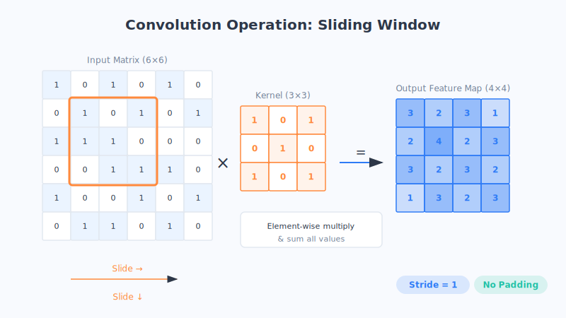
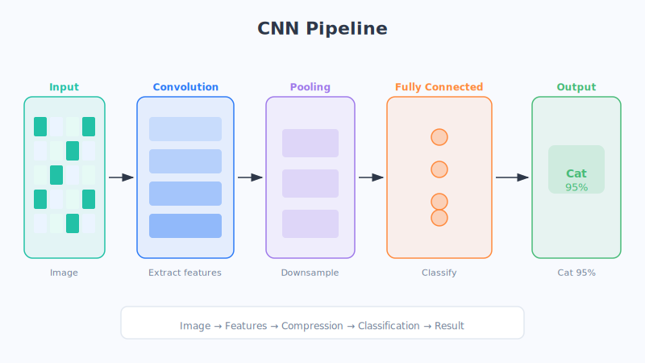

# Chapter 12 · Convolutional Neural Networks (CNNs): Teaching Machines to See Images

Face-scan payments, your phone's automatic photo sorting, doctors using AI to read scans… behind almost all of these "machines that understand images" stands the same hero: the **convolutional neural network**, or CNN for short.

The word "convolution" alone can make your head spin, but don't worry. Jay promises that with one little story about "scanning with a magnifying glass," you'll immediately get what it's doing.

## Let's Start with an Everyday Scene

Suppose I hand you a giant newspaper and ask you to find every "face" on it. How would you do it?

You wouldn't take in the whole newspaper at a glance. Instead, you'd grab a **magnifying glass, start from the top-left corner, and scan across one small patch at a time**: does this patch have something that looks like an eye? Does that patch have something like a mouth? Wherever the magnifying glass slides, that's the small patch you examine closely. Once you've scanned the whole newspaper, you know where all the faces are hiding.

CNNs look at pictures using exactly this idea: **take a tiny "magnifying glass" (or "stamp") and slide it across the entire image, one cell at a time, specifically hunting for one kind of feature.** This sliding-and-scanning motion is called "convolution."

(This is just an analogy. The actual convolution is doing numerical computation, but the picture of "a sliding little window extracting features patch by patch" is accurate.)

## Breaking Down the Core Ideas

### 1. Convolution: a sliding "feature stamp"

Inside a CNN there are many tiny "magnifying glasses," technically called **convolution kernels** (also known as filters). Each kernel is responsible for finding just **one specific pattern**:

- some hunt specifically for **vertical lines**,
- some for **horizontal lines**,
- some for **a color patch of a certain hue**,
- some for **curved edges**…

They're like a set of stamps, sliding across the image from left to right and top to bottom, and each time they land somewhere they "press down": is the pattern I'm looking for here? If yes, mark a "high score" on the result; if not, mark a "low score." After scanning a whole image, you get a **"feature map"** that clearly marks "where all the vertical lines are, where all the curves are."

With multiple kernels working at once, all kinds of basic patterns in the image get found.

### 2. Two thrifty and clever tricks: local connections + parameter sharing

The reason CNNs are both fast and accurate comes down to two very plain, clever ideas:

- **Local connections:** you don't have to stare at the whole image at once. Just as a magnifying glass only looks at one small patch at a time, each kernel focuses on only a small region of the image. This dramatically reduces the amount of information to process.
- **Parameter sharing:** the same "find vertical lines" stamp can be used at **any position** in the image—a vertical line in the top-left corner and one in the bottom-right corner can be recognized by the very same stamp. There's no need to prepare a separate set of tools for each position.

It's like this: once you've learned the skill of "reading characters," you can recognize a character no matter which page or corner of the book it appears on—you don't have to relearn it every time it moves. It saves time, saves effort, and is less prone to going astray.

### 3. A complete pipeline: convolution → pooling → fully connected

When an image enters a CNN, it usually goes down this pipeline:

1. **Convolutional layer—extract features.** Use a batch of kernels to scan and find basic patterns like edges, textures, and color blocks. Stack a few convolutional layers, and, just like in the last chapter, you can gradually piece "edges" into "eyes, noses," and even "a whole face."

2. **Pooling layer—grab the highlights, make a "thumbnail."** Feature maps are often big and verbose. Pooling **compresses them into a thumbnail**: each small patch keeps only its most prominent information (like "the brightest point in this patch"). This shrinks the data while preserving key features, and it makes the network less sensitive to "the object shifting position by a little bit."

3. **Fully connected layer—tally up, vote, deliver the verdict.** At the very end, all the refined high-level features are handed to the fully connected layer, which weighs everything like a committee vote: "eyes, whiskers, pointy ears—all present. This is a cat, 95% confident!"

To string it together in one line: **convolution finds features, pooling grabs the highlights, and the fully connected layer does the classification.**

### 4. Where it's used

CNNs are the backbone of "machine vision," and you'll see them everywhere around you:

- **Facial recognition:** unlocking your phone by face, entering doors by face, paying by face.
- **Object detection:** self-driving cars recognizing vehicles and pedestrians on the road; photo albums automatically circling the people in your photos.
- **Medical imaging:** helping doctors spot lesions in X-rays and CT scans.
- **Image classification and retrieval:** reverse image search, garbage sorting recognition, crop disease identification, and more.

## Chapter Summary

- CNNs are the core technology for teaching machines to "understand images," widely used in facial recognition, object detection, and more.
- **Convolution:** use a set of sliding "feature stamps" (kernels) to scan an image and extract features patch by patch.
- **Local connections + parameter sharing:** looking at only a small patch at a time and using the same stamp across the whole image make it both effortless and efficient.
- The complete pipeline is **convolution (find features) → pooling (grab highlights, make a thumbnail) → fully connected (vote to classify)**.
- Multiple convolutional layers can, as in the last chapter, piece details step by step into more and more complete objects.

## Questions to Ponder

1. Using the analogy of "finding faces on a newspaper with a magnifying glass," explain to a friend what "convolution" and "parameter sharing" each mean.
2. Pooling compresses the feature map into a "thumbnail," discarding some details. Why do you think this is often a good thing (hint: think about what happens when an object shifts position slightly)?
