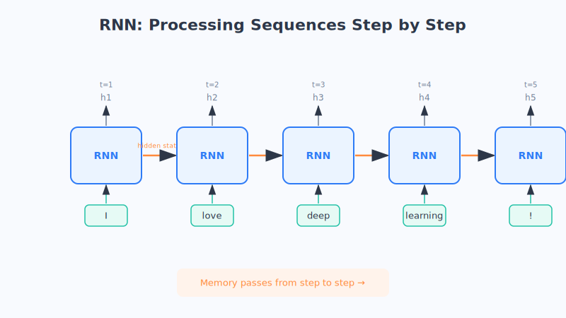

# Chapter 13 · Recurrent Neural Networks (RNNs): Understanding Sequence and Memory

The CNN from the last chapter is especially good at looking at images, but it has a "built-in weakness": it doesn't much care about order. Yet a huge category of information in everyday life lives or dies by order—**a sentence, a clip of speech, a string of stock prices**—scramble the order, and the meaning changes entirely.

To handle this kind of "ordered" information, a new player has to step onstage: the **recurrent neural network**, or RNN for short. Its greatest talent is having a little bit of "memory."

## Let's Start with an Everyday Scene

Imagine you're reading a novel. When you reach a sentence on page 100 and understand it, you're relying not just on that one sentence but on **the impression the previous 99 pages left in your mind**. If someone pulled that sentence out on its own and showed it to you, you'd most likely be baffled.

Now think about the sentence "I'm not feeling great ____ today." Your brain can fill in "well" almost without a second thought. Why? Because you're **reading it in sequence**—every word before it sets the stage for the words that follow.

RNNs do exactly this: **they read one word at a time, and with each word, they carry "everything remembered so far" over to the next word.** They don't look at each word in isolation; they read on while carrying their memory.

(This is just an analogy. An RNN's "memory" is a string of continuously updated numbers, but the intuition of "remembering as you read, carrying earlier context into what comes later" is accurate.)

## Breaking Down the Core Ideas

### 1. Why it's indispensable: sequential data

First, let's be clear about who RNNs are made for. What this kind of data has in common is—**change the order, and the meaning changes**:

- **Text:** "dog bites man" and "man bites dog" use the exact same words, but swap the order and the meaning is worlds apart.
- **Speech:** a sound signal is one syllable following another, flowing along in time.
- **Time series:** temperature, stock prices, or an ECG over consecutive days—one point after another.

The CNN's way of "sliding around everywhere with no regard for order" just doesn't work here. We need a model that **reads in sequence, one step at a time**.

### 2. The memory mechanism: passing the "notes" along

The core cleverness of an RNN can be captured in one word: "**recurrence**." When it processes a string of information, here's what happens:

- It reads the 1st word, produces a set of "little notes" (jotting down its current understanding), and passes them to the next step;
- When it reads the 2nd word, it **looks at two things at once**: this new word + the "little notes" handed over from the previous step, then updates the notes and passes them along again;
- It reads the 3rd word and repeats the same action…

In this way, a set of "notes" (technically called the **hidden state**) is passed like a baton from the very beginning to the very end. Each time a new word is read, the notes get updated once. It's precisely because of these continuously passed, continuously updated notes that an RNN can "remember" earlier text and understand context.

Remember it in one line: **take notes as you read, and pass the notes along to the next step.**

### 3. The trouble with old RNNs: they can't remember things from too far back

Plain RNNs have a flaw: **their memory isn't long enough**. It's like reading a very long article—by the time you reach the end, what was said at the beginning may already be fuzzy. When a sentence gets long, the earlier information gets slowly diluted with each hand-off, and by the time it reaches the end, the early key information is nearly all lost.

This causes big problems in long sentences. For example: "I grew up in **France** since childhood, so I speak fluent ____"—to correctly fill in "French," the model must remember that "France" from way back. A plain RNN often just forgets it.

### 4. The upgrades: LSTM and GRU, fitting memory with "switches"

To fix the "can't remember for long" problem, researchers upgraded the RNN, producing two smarter players: **LSTM** and **GRU**. Their core improvement is fitting memory with a few smart "**switches**" (technically called gates):

- **Firmly lock in the key points worth keeping**, never to be forgotten no matter how long (like that "France" from earlier);
- **Promptly clear out useless chatter**, so it doesn't take up space;
- **Pull it back out when it's needed**, and use it.

It's like a top student who knows how to take notes: instead of writing down every word the teacher says, they **circle only the key points and underline the keywords, skipping the irrelevant stuff**. That's why LSTM/GRU can remember longer, older information and perform much better on long sentences and long paragraphs.

(This is just an analogy. The "gates" are a set of intricate mathematical mechanisms, but the intuition of "using switches to decide what to remember, what to forget, and what to use" is accurate.)

### 5. Where it's used

Before the Transformer (the star of the next part) became popular, the RNN family was long the workhorse for handling "sequential information":

- **Machine translation:** read a Chinese sentence through in order, then generate an English sentence in order.
- **Speech recognition:** transcribe a stretch of continuous sound into text.
- **Text generation:** continue writing one word at a time; early input-method suggestions and chatbots all used it.
- **Prediction tasks:** forecast the next move based on historical stock prices, temperatures, and so on.

> A quick tip: today, the throne for many tasks has been taken over by the **Transformer** (which we'll cover in detail in the next part). But the RNN idea of "remembering as you read" is an unavoidable lesson in understanding "how machines process language"—its place is like that of the internal combustion engine in the history of the automobile.

## Chapter Summary

- RNNs specialize in **sequential data**: text, speech, time series—change the order and the meaning changes.
- Their core is the **memory mechanism**: they take "notes" (the hidden state) as they read and pass them along like a baton, so they can understand context.
- The weakness of plain RNNs is that they **can't remember things from too far back**; in long sentences, earlier context is easily diluted and forgotten.
- **LSTM / GRU** fit memory with "switches" that can lock in key points and discard chatter, remembering longer and more accurately.
- Typical applications: machine translation, speech recognition, text generation, trend forecasting, and more.

## Questions to Ponder

1. Using the "reading a novel" example, or filling in "I'm not feeling great ____ today," explain to a family member why an RNN needs "memory."
2. An LSTM is like a "top student who records only the key points." Thinking back on your own experience taking notes or memorizing material, how did you decide "what to firmly remember and what to let go"? How is this similar to fitting memory with "switches"?
