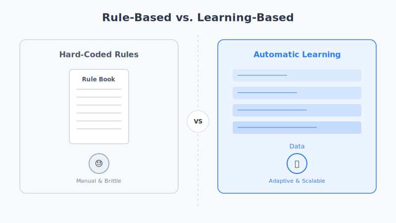

# Chapter 15: NLP Basics

> The language we speak so effortlessly every day looks, to a computer, like a pile of incomprehensible squiggles. In this chapter, we'll talk about how computers first began to "read human language."

## 1. Picture a Scenario First

Suppose you have a foreign friend who doesn't recognize a single Chinese character—someone who can't even tell what the words for "hello" look like. Now you want to teach them to read a Chinese newspaper. How would you do it?

You'd probably start by teaching them to split sentences into individual words, then explain what each word means, and finally teach them to grasp the meaning that emerges when words are strung together.

A computer learning a language goes through almost exactly the same process as teaching that foreign friend—except the computer is one step "dumber": **it can't even perceive the shape of a character. In its world, there are only numbers.**

This discipline of "teaching computers to understand and use human language" is called **Natural Language Processing**, or **NLP** for short. The predictive text on your phone, machine translation, voice assistants, spam filters, and ChatGPT—all of them are powered by NLP behind the scenes.

## 2. The Core Truth: Computers Understand Numbers, Not Text

This is the **first cornerstone** for understanding the entire world of large models, so please lock it in:

> **In a computer's world, there are no "words," only numbers.**

At the lowest level, a computer converts everything—a piece of text, an image, a song—into numbers made of 0s and 1s. To a computer, text carries no inherent "meaning"; it's just a string of codes.

Here's an analogy: **it's like books in a library.** Every book has a call number (say, "I247.5"), and the librarian uses those numbers to find books, shelve them, and put them back—very efficiently. But the call number itself has no idea whether the book is about love or war—it's just a label.

A computer treats text the same way: it can store the code that corresponds to the word "apple," but it has no clue that an apple is edible, is red, or belongs to the same category as "banana."

**So the core challenge NLP has to solve is: how do we turn "text" into numbers that a computer can compute with—numbers that still preserve "meaning"?** We'll spend two whole chapters (15 and 16) chipping away at this question.

## 3. Step One: Tokenization—Slicing a Sentence into Pieces

Before we can turn text into numbers, there's an even more basic problem to solve: **where do we make the cuts?**

When people read, they instinctively break a sentence into meaningful words. For example, when you see:

> I like eating apples

your brain automatically splits it into "I / like / eating / apples." This act of "cutting a continuous sentence into individual words" is called **tokenization**.

Tokenization is the **first step** in NLP—just like chopping ingredients before cooking. Each little piece you cut out (which might be a word, a single character, or half a word) is technically called a **Token**. You'll hear the word "Token" a lot from now on—for instance, when large models charge by the Token, this is exactly what they mean.

### The Little Headache of Chinese Tokenization

English is naturally easy to cut, because there are spaces between words: `I like eating apples`—just split on the spaces and you're done.

Chinese is a real headache. There are no spaces between characters, and there's often **ambiguity**. A classic example is:

> 南京市长江大桥

Does this sentence mean—
- "南京市 / 长江大桥" (the Yangtze River Bridge in Nanjing City)?
- or "南京 / 市长 / 江大桥" (a Nanjing mayor named Jiang Daqiao)?

The same string of characters, cut differently, can mean completely different things. That's why Chinese tokenization is a discipline in its own right. (This is just an analogy; real tokenization algorithms are more complex.)

## 4. Two Approaches: Hard-Coding Rules vs. Letting the Machine Learn

So how does a computer actually accomplish tasks like tokenizing, translating, and understanding? Historically, there have been two starkly different routes.

### Approach One: Traditional NLP—Humans Hard-Code the Rules One by One

The early approach was: **have language experts write the rules into the program one by one.**

For machine translation, for example, engineers had to hand-write tens of thousands of rules: "when you see *apple*, translate it as 苹果"; "when you see a *be* verb plus *-ing*, it indicates the progressive tense"…

This is like **compiling a super-thick rulebook**, spelling out in exhaustive detail "when situation X arises, do Y."

- ✅ **Pros:** The rules are crystal clear, and when something goes wrong, you can trace it back to exactly which rule caused the problem.
- ❌ **Cons:** Language is far too flexible—the rules can never be finished. In "I can't do this problem" and "I can't cook this dish," the word "do" means different things; then there's slang, puns, newly coined words… Humans simply can't enumerate every rule. The rulebook grows thicker and thicker, and it's still full of holes.

### Approach Two: Neural Networks—Give It Tons of Examples and Let It Learn on Its Own

Today's approach is exactly the opposite: **we don't write rules; we just show the computer a massive number of examples and let it discover the patterns for itself.**

This is precisely the philosophy of machine learning and neural networks we covered in earlier parts. You don't have to tell it that "apple" and "banana" belong to the same category—you just feed it hundreds of millions of sentences containing these words, and from clues like "both apple and banana often appear after the word 'eat,'" it gradually works out the relationships between words on its own.

It's like **teaching a child to talk**: you don't sit a two-year-old down with a grammar book and lecture them on subjects, predicates, and objects. You just keep talking to them, and after hearing enough, they naturally learn to speak. (This is just an analogy; how neural networks actually learn is more complex.)

The table below helps you see the difference between the two approaches at a glance:

| Comparison | Traditional NLP (Hard-Coded Rules) | Neural Networks (Automatic Learning) |
| :--- | :--- | :--- |
| Source of rules | Hand-written by human experts | Discovered from massive data |
| Flexibility | Poor—stumped by new situations | Strong—well-read and good at generalizing |
| Data needed | Little | Enormous amounts |
| Effectiveness | Has a ceiling | The more data and the bigger the model, the better |
| Representative era | From last century up to around 2010 | Today's era of large models |

It was precisely this "let the machine learn on its own" path that ultimately brought us into the era of large models.

## 5. Chapter Summary

- **Computers understand numbers, not text**—this is the starting point for understanding everything. The core task of NLP is turning text into "meaningful numbers."
- **Tokenization** is the first step in NLP, cutting a sentence into individual **Tokens**; Chinese is more challenging because it has no spaces and is often ambiguous.
- There are two routes for processing language: **traditional NLP relies on humans hard-coding rules** (never finished, inflexible), while **neural networks let the machine learn on its own from massive examples** (flexible, and the bigger the better).
- It was precisely the "let the machine learn on its own" path that paved the way for the word embeddings, attention, and Transformer that follow.

In the next chapter, we'll take on that core challenge head-on: **how exactly do we turn a word into a string of numbers that can be computed with *and* preserves meaning?** The answer is the famous "word embedding."

## 6. Questions to Ponder

1. Try to find at least two different ways to tokenize the sentence "乒乓球拍卖完了," and see how the meaning changes.
2. Why is "letting the machine learn on its own from massive data" better suited to processing language than "humans hard-coding rules"? Can you think of a language phenomenon that would be hard to cover with rules (like internet slang or puns)?
3. What other NLP products have you used in daily life? Try to imagine what kinds of "turning text into numbers" work might be happening behind the scenes.
