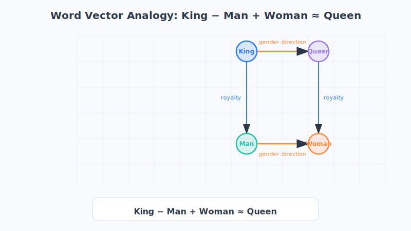
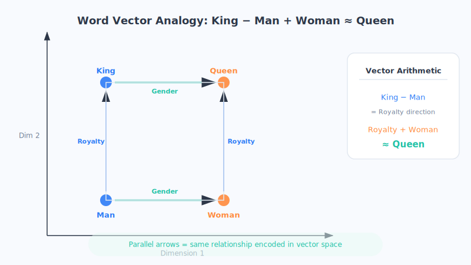

# Chapter 16: Word Embeddings: Turning Words into Numbers

> In the last chapter we left a big question hanging: how do we turn a word into "meaningful numbers"? The star of this chapter—**word embeddings**—is the brilliant answer humans came up with. Personally, I think it's the most elegant and most "clever" idea in the entire world of large models.

## 1. Let's Start with a Clumsy Approach

We already know that computers only recognize numbers. So what's the simplest, crudest thing we could do?

**Just assign each word a number!** For example:

> apple = 1, banana = 2, king = 3, queen = 4, car = 5…

Looks fine? Actually, it's a big problem. Because numbers have a size relationship, the computer would mistakenly think: banana (2) is "twice as big" as apple (1); king (3) plus banana (2) equals queen (4) plus apple (1)… These calculations are pure nonsense. The numbers are just labels—they were never meant to be added or subtracted.

So people came up with an improvement called **One-Hot Encoding**.

## 2. One-Hot Encoding: A Bunch of Unrelated Flags

The idea behind One-Hot is: **suppose the dictionary has 10,000 words in total; then give each word a "number string" of length 10,000, where only its own position is a 1 and everything else is a 0.**

Imagine a **giant switch panel with 10,000 switches** on it. Each word is only responsible for flipping the one switch that belongs to it, leaving all the rest off:

| Word | Its One-Hot Representation (illustrative) |
| :--- | :--- |
| apple | [1, 0, 0, 0, 0, ……] |
| banana | [0, 1, 0, 0, 0, ……] |
| king | [0, 0, 1, 0, 0, ……] |
| queen | [0, 0, 0, 1, 0, ……] |

This way, the computer won't mistakenly think there's a size relationship between words. Each word is an **independent flag**, none of them next to any other.

But—**this approach has two fatal flaws:**

1. **Too wasteful.** However many words the dictionary has, that's how long each word's number string is. Tens of thousands of words means tens of thousands of numbers, 9,999 of which are 0s—an enormous waste of space.
2. **No relationship between words whatsoever.** This is the truly deadly one. In One-Hot's eyes, the distance between "apple" and "banana" is **exactly the same** as the distance between "apple" and "tank." But we humans all know that apple and banana are clearly close cousins (both fruits), while apple and tank have nothing to do with each other!

One-Hot is like a crowd of **strangers who don't know one another**, each holding up their own flag, recognizing no one—completely failing to capture the precious meaning that "apple and banana belong to the same category."

## 3. Enter Word Embeddings: Turning Words into "Coordinate Points"

So scientists wondered: could we make "words with similar meanings" also sit "close together" numerically?

**This is the core idea of word embeddings: turn every word into a "coordinate point" in a multi-dimensional space. The closer two words are in meaning, the closer their points sit.**

Don't let "multi-dimensional space" scare you—let's start with the simplest **two-dimensional coordinate system** (the X-Y plane you learned about in middle school).

Suppose we describe words using just two dimensions—say, the horizontal axis represents "how much it's a food" and the vertical axis represents "how much it's a vehicle." Then:

- "apple" and "banana" would cluster in the **lower-right corner** (very food-like, not vehicle-like);
- "car" and "airplane" would end up in the **upper-left corner** (very vehicle-like, not food-like);
- the points for apple and banana naturally sit **close together**; apple and car sit **far apart**.

**And here's where the magic happens:** the "meaning similarity" between words turns into the "closeness of distance" between coordinate points. All the computer has to do is calculate how close two points are, and it can judge how similar the two words' meanings are!

Of course, two dimensions are far from enough in the real world. Actual word embeddings often have **hundreds or even thousands of dimensions**, able to simultaneously describe a word's features across countless aspects: "food, emotion, gender, size, positive/negative connotation…" Too many dimensions for our brains to picture, but computers crunch through them without breaking a sweat. (This is just an analogy; the meaning of the actual dimensions isn't as clear-cut as "food-ness." They're abstract features the model learns on its own, which humans may not be able to interpret.)

## 4. Witness the Miracle: King − Man + Woman ≈ Queen

Here comes the most jaw-dropping part of word embeddings. Since every word has become a coordinate point (that is, a string of numbers), we can **do arithmetic on them**. And the results actually match up with meaning!

The most famous example is:

> **King − Man + Woman ≈ Queen**

What is this equation saying? Let's translate it into plain language:

- "King" minus "Man" leaves behind an abstract sense of "royalty, a person in power";
- add "Woman," and you get "a female royal in power";
- and the word closest to this result is precisely—**Queen**!

Doesn't that give you goosebumps? The computer doesn't "understand" what a king or queen is, yet through the addition and subtraction of word embeddings, it somehow "computed" a semantic relationship that only humans grasp. There are similar examples:

> **Beijing − China + France ≈ Paris** (the relationship between capital and country)
> **walk − present + past ≈ walked** (the relationship of tense, illustrative)

This shows that **word embeddings not only remember words, but quietly remember the "relationships" between words—and these relationships can be operated on like math.** The subtle patterns in language (gender, capitals, tense…) are cleverly "hidden" in the direction of the coordinates. (This is just an analogy; the actual result is the "closest" word, not an exact equality.)

## 5. Where Do These Word Embeddings Come From?—The Pre-training Idea

You might ask: who marks out these magical coordinates one by one? Surely we can't manually score tens of thousands of words by hand?

**Of course not. These coordinates are learned by the computer "reading books" on its own.** And here we arrive at an extremely important idea—**pre-training**.

The core of the method is an ancient linguistic intuition:

> **"Judge a word by the company it keeps"—to figure out what a word means, just look at which words it commonly appears alongside.**

For example, you may never have seen the character "雺" before, but if you repeatedly read "there was a heavy 雺 this morning, visibility was very low" and "the 雺 lifted and the sun came out," you'd immediately guess it's something like "fog."

The computer uses the same method: **it reads through the massive amounts of text on the internet (news, novels, Wikipedia…), tallies which words each word tends to be neighbors with**, and then continually fine-tunes each word's coordinates so that "words that are often neighbors" move closer together and "unrelated words" move farther apart. Read enough books, and each word's coordinates naturally settle into a reasonable position.

This process of "reading through massive text in advance to learn the word embeddings well" is called **pre-training**. It has several remarkable benefits:

- **Learn once, use repeatedly.** Once the word embeddings are learned, you can take them off to do translation, question answering, sentiment analysis… all sorts of tasks can use them, without starting from scratch each time.
- **Saves time and effort.** It's like a widely-read person: whatever line of work you put them in, they have a foundation and get up to speed quickly.

**Remember the word "pre-training."** The **P** in GPT's name later on stands for exactly this—Pre-training. The whole "read the entire internet first, then learn specific tasks" playbook that all large models follow today traces its roots right here.

## 6. Chapter Summary

- Both numbering words and One-Hot encoding have serious flaws: **they either mislead the computer, or leave words with no relationship to one another.** One-Hot is like a crowd of strangers who don't know one another, each holding up their own flag.
- **Word embeddings** turn each word into a **coordinate point** in a multi-dimensional space, so that "words with similar meanings have coordinates close together." The similarity problem becomes a distance problem.
- Word embeddings can do arithmetic, and the results match meaning—like the classic **"King − Man + Woman ≈ Queen"**—showing that they quietly learned the relationships between words.
- These coordinates aren't marked by hand; they're learned through **pre-training**—letting the model "read through massive text and judge a word by the company it keeps" to learn on its own. **Pre-training** is a key idea on the path to large models.

We can now turn words into beautiful coordinate points. But isolated words alone aren't enough—in a sentence, which word matters more? How do words influence one another? The next chapter's **attention mechanism** is here to solve exactly this problem.

## 7. Questions to Ponder

1. In your own words, explain: why does One-Hot encoding "fail to capture the relationships between words," while word embeddings can?
2. In the example "King − Man + Woman ≈ Queen," which part of a word's meaning do you think is being "subtracted and then added back"? Try to make up a similar analogy equation of your own.
3. Why does "pre-training" save time and effort? If you compared it to a person's life journey, how would you describe it?
