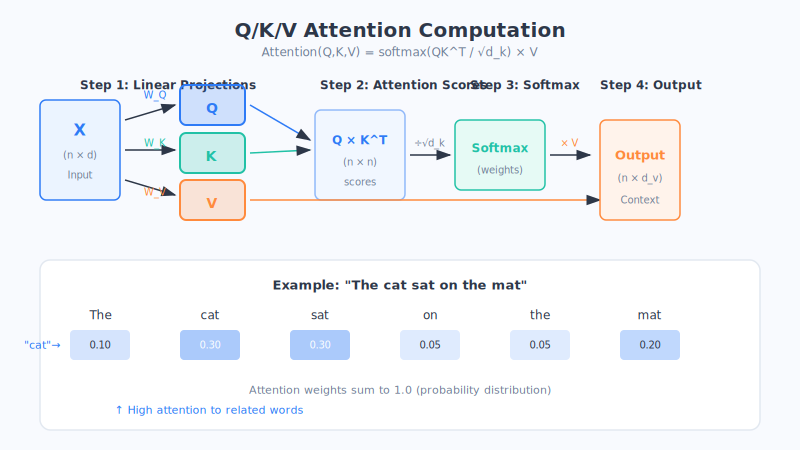

# Chapter 17: Attention Mechanism: Learning to Focus

> As you read this sentence, you're not actually giving equal effort to every word—your brain automatically puts its attention on the key words. This most natural of instincts is precisely the key that transformed AI: the **attention mechanism**.

## 1. First, Let's See Where the "Old Way" Got Stuck

Before the attention mechanism came along, the mainstream tool for processing sequential information like sentences was the **RNN (Recurrent Neural Network)**, which we met in Chapter 13.

An RNN works a lot like a person **reading a sentence one word at a time, jotting things down as they go**: read "I," make a note; read "like," update the memory; read "eating," update again… It condenses everything it has read so far into a small ball of "memory" and passes it along.

This approach is fine for short sentences, but the moment it hits a long one, it exposes a big flaw—**it "forgets."**

Think of the "telephone game" you've played: ten people line up in a row, the first person whispers a long sentence, and it's passed down one by one; by the time it reaches the last person, it's usually unrecognizable. That's exactly how an RNN handles long sentences: **by the time it reaches the end, the information from the beginning has long since faded and been forgotten.**

Here's an example:

> "I was born in a scenic little town in southern China, where I spent a happy childhood; later I traveled to many places, but my all-time favorite food has always been that authentic hometown bowl of… **(rice noodles? noodles?)**"

To correctly finish this sentence, the model has to remember the "China" and "southern" from the beginning. But for an RNN, the beginning is too far from the end—that faint memory has long since blurred. This problem of "not being able to remember distant information" is technically called the **long-distance dependency problem**.

**So scientists wondered: why don't humans forget when reading long sentences?** Because we "look back"—when we read "that authentic hometown bowl of," we automatically glance back at the key detail "little southern town," rather than rote-memorizing the whole passage.

**Could we teach AI this same knack of "looking back and grabbing the key points"?** That's the starting point of the attention mechanism.

## 2. Attention Is Just "Dynamically Allocating Your Focus"

Let's first be clear about what the word "attention" is actually pointing to.

Think back to reading a long research paper. You don't read every word with equal effort—you **linger on the key paragraphs and reread them, while skimming right past the irrelevant pleasantries**. Your "focus" is allocated dynamically: wherever it matters, you put a little more there.

**The attention mechanism does exactly this: as the model processes each word, it automatically judges "how much focus should I allocate to which other words in the sentence."**

Take that rice-noodle example again. When the model is about to predict the final word, the attention mechanism has it allocate most of its focus to key words like "southern" and "hometown," rather than spreading it evenly across every word. This way, even if the key information sits far away at the beginning, the model can grab it in one shot—**because it "looks back directly," rather than "passing the message layer by layer."**

This solves the RNN's forgetting problem at its root. To put it as an analogy:

> An RNN is like a **closed-book exam**, relying entirely on memory carried the whole way through, forgetting the beginning by the time it reaches the end;
> attention is like an **open-book exam**, where for each question you can flip back to the few most relevant pages in the book. (This is just an analogy; the actual mechanism is more complex.)

## 3. Query, Key, Value: The Three Brothers of Attention

Inside the attention mechanism, there are three core roles. Their names sound intimidating, but they're actually very easy to understand. They're called **Query, Key, and Value**, and we'll break each one down with an everyday scenario.

### An Overall Analogy: Looking Something Up at the Library

Imagine you walk into a library looking for material on "Tang Dynasty history":

- **Query = what you have in mind, the thing you want.** In other words, your need: "I want to find Tang Dynasty history."
- **Key = the spine label on each book.** You scan a shelf of labels: "Song Dynasty Economy," "Tang Dynasty History," "Ming Dynasty Geography"… You take your need (Query) and compare it against each label (Key) to see which matches best.
- **Value = the actual content inside the book.** You find the best match ("Tang Dynasty History"), open it up, and pull out the genuinely useful content inside.

To sum up this process in one sentence:

> **You carry a need (Q), look at what labels exist (K), and based on how well they match, pull out the corresponding content (V).**

### A More Everyday Analogy: Looking Up a Dictionary

- You want to know what "踌躇" means—this **word you want to look up** is the **Query**;
- the **headword** on each page of the dictionary is the **Key**, which you compare "踌躇" against page by page;
- once you find that page, the **entry's definition** is the **Value**, which you read out.

### Yet Another Analogy: A Buffet

- You're hungry and craving something sour and spicy—this **flavor need** is the **Query**;
- the **name card** on each dish at the counter is the **Key**, which you scan to see which suits your taste;
- the **dish** you actually put on your plate is the **Value**.

See the pattern? No matter the analogy, the playbook is the same:

| Role | Meaning | Library | Dictionary | Buffet |
| :--- | :--- | :--- | :--- | :--- |
| **Query (Q)** | What I want | My need | The word to look up | The flavor I crave |
| **Key (K)** | What candidates exist, and what each is | Spine labels | Dictionary headwords | Dish name cards |
| **Value (V)** | The real thing pulled out after matching | The book's content | The entry's definition | The dish you took |

**The complete flow of the attention mechanism is:** use the Query to compare against every Key, computing a "degree of match" (that is, the focus weight); the higher the match, the more content is pulled from that Value; finally, all this content is summed up according to the weights.

If we absolutely had to write a bare-bones "formula," it would be:

> **Final result = a weighted sum of every Value, weighted by "how well its Key matches the Query."**

Translated into plain language: **the more relevant the content, the more of it gets absorbed.** It's that simple.

## 4. Self-Attention: Letting Every Word in a Sentence "Look at" One Another

In the analogies above, the Query was "you," an outsider. But the most commonly used variant in the Transformer is a special one called **self-attention**—the "self" meaning "itself, on itself."

Its core idea is: **let every word in a sentence look at all the other words in that sentence, in order to better understand itself.** In other words, each word is simultaneously the Query doing the asking, the Key being queried, and the Value being drawn from—**everyone sizes up and consults everyone else.**

Why is this necessary? Because **the same word can mean completely different things in different sentences, and only context can pin it down.** Look at these two sentences:

> 1. The **interest** rate at this bank is very high.
> 2. The **bank** by the river was washed away.

The word "bank" carries both the sense of a financial institution and the sense of a riverside. Here's an even more direct example:

> 1. I rode my **bike** to work today.
> 2. I drove my **car** to work today.

Take the Chinese character "车": only the preceding word—"骑" (ride) or "开" (drive)—tells us whether it's a bicycle or a car. **Self-attention lets the word "车" actively glance back at "骑" or "开," and thereby figure out what it actually refers to at that moment.**

Here's an even more powerful example—pronoun reference:

> "**Xiao Ming** handed the book to **Xiao Hong**, because **he** had finished reading it."

Who does "he" refer to here? We know at a glance it's Xiao Ming. Self-attention lets the word "he" allocate most of its focus to "Xiao Ming," and thereby correctly understand the reference. **Every word in the sentence, through this "mutual looking," absorbs contextual information into its own understanding.**

**This is the soul of the Transformer.** That era-defining paper titled *Attention Is All You Need* is saying exactly this: push attention to its extreme, and you can do away with all the other fancy structures. In the next chapter, we'll see how researchers used attention to build the Transformer "engine."

## 5. Chapter Summary

- An RNN is like the "telephone game" and a "closed-book exam"—processing long sentences, it **forgets distant information**, which is called the **long-distance dependency problem**.
- The **attention mechanism** lets the model, as it processes each word, **dynamically allocate focus to the most relevant words**—like an "open-book exam," it can look back at the key points directly, solving the forgetting problem at its root.
- Attention's three brothers—**Query (what I want), Key (what candidates exist), Value (the real content pulled out)**—follow the playbook of "carry the need Q, look at the labels K, pull out the content V, and sum it up weighted by match."
- **Self-attention** lets every word in a sentence size up the others, thereby understanding its own precise meaning in context (like whether "车" is a bike or a car, or who "he" refers to). It's the soul of the Transformer.

## 6. Questions to Ponder

1. Using the "open-book exam vs. closed-book exam" analogy, explain to a friend where the attention mechanism beats the RNN.
2. In the sentence "I gave the apple to my little brother, because it was ripe," what does "it" refer to? If self-attention were processing this, which word do you think "it" should allocate most of its focus to?
3. Try using the scenario of "ordering food delivery" to make up your own set of Query / Key / Value correspondences.
