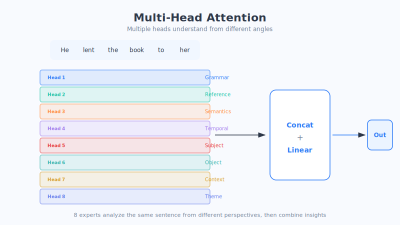

# Chapter 18: The Transformer Architecture (Key Chapter)

> This is the book's signature chapter. If there's just one thing you want to truly understand, it's this—the **Transformer**. Every large model you've heard of, GPT, Ernie, Tongyi, DeepSeek… is, at its core, this. In this chapter we'll go a bit slower and a bit deeper, taking this "engine" apart from its outer shell to its inner workings. I recommend reading it twice: the first time for the big picture, the second for the details.

## 1. A One-Sentence Intro: A Revolution That "Ditches Memory and Relies Entirely on Looking Back"

In the last chapter we said an RNN processes a sentence like the "telephone game," forgetting the beginning by the time it reaches the end. In 2017, that Google paper *Attention Is All You Need* did something very bold:

> **It threw out the RNN's old "pass it down one word at a time" approach entirely, and switched to—laying the whole sentence out at once, and letting each word use attention to look directly at all the other words.**

That's the Transformer. Don't fuss over the Chinese translation of its name ("变换器"); just remember that it's **the engine of large models**, and that's enough.

## 2. An Everyday Analogy: From an "Assembly-Line Relay" to a "Round-Table Meeting"

Let's first build an overall mental picture.

**An RNN is like a relay on an assembly line:** workers stand in a row, the first finishes their work and hands the result to the second, the second to the third… one after another, strictly **in order**, no rushing. And by the time it's passed to the end, the original information is long since distorted.

**A Transformer is like a round-table meeting:** all the words in a sentence sit around one round table at the same time. At the host's signal, **everyone speaks at once and listens to everyone else's remarks at once**, then each updates their own understanding. No order, everyone jumps in together, and the communication is done in a single round.

This analogy hides the Transformer's two biggest advantages—please remember them first:

1. **It can run in parallel (everyone meets at once, no queuing)**—so training is **much faster**, and it can devour massive amounts of data.
2. **Any two words can talk directly (at a round table, anyone can speak directly to anyone)**—so even the most distant words never "lose touch," completely curing the RNN's amnesia.

(This is just an analogy; the actual computation is more complex.)

## 3. Breaking Down the Core Principles: Tackling the Six Key Components One by One

This Transformer engine is assembled from six key parts. Don't worry—we'll take them one at a time, each with an everyday analogy. You'll find that, taken apart, none of them is hard.

### Component ① Word Embedding Encoding: First, Translate Words into "Coordinate Points"

Everything has a beginning. When a sentence comes in, the first step is to turn each word into a string of numbers—**this is exactly the word embedding from Chapter 16.**

> Analogy: **swap for chips before you enter.** Just like entering a casino (sorry, let's make it healthier: entering an amusement park), you first exchange your cash for park-specific tokens; the Transformer likewise first swaps "text" for the only "numeric chips" (word embeddings) it recognizes internally, so all the subsequent computation can work.

The output of this step is one vector (coordinate point) for each word in the sentence.

### Component ② Positional Encoding: Give Each Word a "Seat Number"

Here's a big problem. We just said the Transformer is a "round-table meeting where all words are processed at once," but that means—**it doesn't know the order of the words!**

And order matters enormously to language:

> "**Dog bites man**" and "**man bites dog**" use exactly the same words, but the meanings are worlds apart.

An RNN inherently knows the order (because it reads one at a time, in sequence), but the Transformer spreads all the words out at once, so the order information is lost. What do we do?

**The solution is clever: attach an extra "position tag" to each word, telling the model where it ranks in line.** This is **positional encoding**.

> Analogy: **seat numbers at a movie theater.** The audience (the words) can enter and be seated all at once, but every ticket is printed with "Row 3, Seat 5." So even as everyone streams in together, the usher knows clearly who's in front and who's behind. Positional encoding is this "seat number" handed to each word, adding the order information back in. (This is just an analogy; actual positional encoding is a set of numbers generated by a rule and added to the word embedding, not a simple sequence number.)

### Component ③ Multi-Head Attention: 8 People Understanding One Sentence from Different Angles

This is the **heart** of the Transformer—please pay close attention.

In the last chapter we covered self-attention: every word looks back at all the other words in the sentence. The Transformer upgrades this into **multi-head attention**.

What does "multi-head" mean? It means **using not just one set of attention, but several sets at once (the original paper used 8), letting them understand the same sentence from different angles, and then combining everyone's understanding at the end.**

> Analogy: **a consultation by 8 experts.** A sentence is placed in front of them, and 8 experts with different perspectives analyze it simultaneously:
> - Expert A focuses on **grammar** (who's the subject, who's the object);
> - Expert B focuses on **reference** (who exactly does "he" refer to);
> - Expert C focuses on **emotion** (is this sentence praise or a jab);
> - Expert D focuses on **time and place**…
>
> Each expert gives their own version of the understanding, and finally the host **combines the 8 reports into one complete, three-dimensional understanding**. The insight obtained this way is far more comprehensive than what a single person would see. (This is just an analogy; what each "head" actually focuses on is learned by the model itself, and may not correspond to such a clear-cut division of labor.)

Why bother with so many "heads"? Because language is so rich—a single sentence simultaneously hides many layers of information: grammar, semantics, emotion, reference, and more. **One set of attention can't cover everything at once; only several sets working together can fully chew through a sentence.**

We can also draw the focus of each "head" as an **attention heatmap**—the darker the color, the higher the focus between two words. Very intuitive.

### Component ④ Feed-Forward Network: Let Each Word "Digest and Absorb" on Its Own

After multi-head attention, each word has "heard" a round of information from the other words. Next, we need a stage where it can **independently process and digest all this information properly**. This stage is the **feed-forward network**, which is essentially the ordinary neural network we discussed in earlier chapters.

> Analogy: **going back to your desk to think after a meeting.** After everyone has chattered and exchanged views at the round-table meeting (multi-head attention), each person returns to their own desk and quietly organizes and processes what they just heard into their own conclusions (the feed-forward network). One is in charge of "communicating," the other of "digesting"—one dynamic, one still, working in perfect harmony.

### Component ⑤ Residual Connection: Leaving a "Shortcut" Staircase While Climbing Floors

The Transformer stacks the components above into **many layers** (say, 12 layers, 96 layers), one nested inside another, making the model deeper and deeper and its understanding more and more thorough.

But depth brings a new headache: **after being processed through too many layers, information can easily get "altered beyond recognition," and even the originally useful content can be lost.** It's like a sentence retold a dozen times—by the end, its whole flavor has changed.

The **residual connection** is here to save the day. Its approach is remarkably simple: **at every layer, besides having the information dutifully go through the whole processing flow, it also pulls an extra "shortcut," adding this layer's raw input directly onto the output.**

> Analogy: **leaving an elevator beside the stairs while climbing floors.** You can climb the stairs floor by floor (going through layer after layer of processing), but every floor has a direct elevator (the shortcut), guaranteeing that even if you get dizzy from climbing, the original you can still make it to the next floor "as is," without getting lost along the way. This way, **the useful original information is never lost**, and the model can be stacked as deep as you like without fear.

This "shortcut" is a major reason deep networks can be trained successfully, so please remember its role: **guaranteeing that information isn't lost or distorted in a very deep network.**

### Component ⑥ Layer Normalization: Keeping the Data at Every Layer "Steady"

The last part is called **layer normalization**. Its role is somewhat technical, but it can be understood very intuitively.

As the model computes layer by layer, the numbers produced in between sometimes swing **wildly high and low, bouncing all over the place**; once they get out of control, training becomes very unstable and can even collapse entirely. Layer normalization, at each layer, **pulls these numbers back into a steady, reasonable range**.

> Analogy: **installing an automatic volume balancer on a stereo.** No matter whether the incoming sound is deafeningly loud one moment and barely audible the next, the balancer automatically adjusts the volume to a comfortable, steady level, so your ears (the subsequent computation) aren't blasted deaf one moment and left straining to hear the next. Layer normalization is this "stabilizer" installed on the data, keeping the training process smooth and steady.

**A summary of the six components**, tied together with a table:

| Component | Its Role in One Sentence | Everyday Analogy |
| :--- | :--- | :--- |
| ① Word embedding encoding | Turn words into numeric coordinates | Swap for tokens before entering |
| ② Positional encoding | Tell the model the order of words | Movie theater seat numbers |
| ③ Multi-head attention | Understand word relationships from multiple angles | A consultation by 8 experts |
| ④ Feed-forward network | Each word independently digests the information | Going back to your desk after a meeting |
| ⑤ Residual connection | Ensure information isn't lost in deep networks | An elevator shortcut beside the stairs |
| ⑥ Layer normalization | Keep data steady, keep training from collapsing | A stereo's automatic volume balancer |

## 4. Encoder and Decoder: Two "Working Modes"

Assemble the components above in different ways, and you get the Transformer's two major "departments": the **Encoder** and the **Decoder**. In the original Transformer paper, the two were used together (for translation). Understanding their division of labor is the key to making sense of GPT and BERT later on.

### Encoder: Bidirectional Understanding, Comprehending the Whole Sentence

**The Encoder's job is to "understand."** When it reads a sentence, it allows **each word to see all the words on both its left and its right at the same time**—that is, understanding the whole sentence's meaning **bidirectionally** and comprehensively.

> Analogy: **doing a reading-comprehension question.** You read the entire passage from start to finish, back and forth several times, referencing both what comes before and after, so you can understand it thoroughly. The Encoder is exactly this kind of "god's-eye view" global reader.

(The famous **BERT** was built using only the Encoder, and it's especially good at "understanding" tasks—like judging the sentiment of a sentence, or doing search matching.)

### Decoder: Unidirectional Generation, Popping Out Word by Word

**The Decoder's job is to "generate."** Like writing an essay, it **writes out one word at a time**. And there's a crucial rule: when writing the Nth word, **it can only see the words already written before it, and absolutely cannot peek at the words not yet written** (because those words don't exist yet). This is called **unidirectional**.

> Analogy: **writing an essay closed-book.** As you write the next word, you can only build on what you've already written, and you could never reference the second half you haven't written yet. The Decoder is just like this—"blindfolded to what comes after, writing word by word."

To force it to "not peek at what comes after," the Decoder uses a special kind of attention called **Masked attention**—it's like **covering the answers ahead with a sheet of paper**, letting it see only what came before.

(The star of our next chapter, **GPT**, is built using only the Decoder—it's a natural-born "writing-relay champion.")

### Encoder-Decoder: Joining Forces for Translation

Put the two together, and you get the full form of the original Transformer, best suited for "understand first, then generate" tasks like **translation**:

> **Translating "我爱北京" → "I love Beijing":**
> - the **Encoder** first fully digests the whole Chinese sentence (understanding bidirectionally what "我爱北京" actually means);
> - the **Decoder** then generates the English word by word based on that (write I first, then love, then Beijing);
> - in between is a bridge called **Cross-Attention**, which lets the Decoder, as it generates the English, "look back" at any time at the Chinese the Encoder has understood, ensuring it doesn't mistranslate or omit anything.

Three modes, seen clearly in one table:

| Mode | Representative Model | Good At | An Analogy |
| :--- | :--- | :--- | :--- |
| Encoder only | BERT | Understanding (bidirectional) | Doing reading-comprehension questions |
| Decoder only | **GPT** | Generation (unidirectional) | Closed-book essay-writing relay |
| Encoder + Decoder | Original Transformer | Translation (understand then write) | Read the Chinese, then write the English |

## 5. Why Is the Transformer So Powerful?

Having taken apart the parts and reviewed the modes, let's step back and sum up: why was it, specifically, that sparked the entire era of large models? Three reasons:

1. **It can run in parallel, so training is fast and it can devour massive data.** An RNN must compute one after another in order; the Transformer computes a whole sentence at once (the round-table meeting). This lets it "read the entire internet" in a short time, and its scale can be stacked ever larger. **This is the prerequisite for it getting "big."**
2. **It can handle long-distance dependencies—no losing touch, however far.** At the round table, any two words can talk directly; the 1st word and the 1,000th word can "get in touch" instantly just the same, completely bidding farewell to the RNN's amnesia.
3. **It can be stacked very deep, and the deeper the smarter.** With residual connections (the elevator shortcut) and layer normalization (the volume balancer) protecting it, it can confidently stack dozens or even hundreds of layers, its understanding advancing layer by layer, growing stronger and stronger.

> **Remember the Transformer in one sentence:** it replaced "memory passing" with "attention," turning a whole sentence into a round-table meeting where everyone is equal and can speak at once—**fast, forgetful of nothing, and able to grow ever deeper.** These three points are precisely the three-stage rocket to the "large" model.

## 6. Chapter Summary

- The Transformer is a revolution: **it ditched the RNN's sequential memory and switched to attention, letting a whole sentence be processed in parallel like a round-table meeting**—fast to train, and never forgetful.
- It's assembled from **six key components**: ① word embedding encoding (swap for tokens) ② positional encoding (seat numbers) ③ multi-head attention (a consultation by 8 experts, the heart) ④ feed-forward network (back to your desk to digest) ⑤ residual connection (the elevator shortcut, preventing information loss) ⑥ layer normalization (the volume balancer, steadying training).
- There are three ways to assemble it: **Encoder for bidirectional understanding** (like BERT, doing reading comprehension), **Decoder for unidirectional generation** (like GPT, writing an essay closed-book), and **Encoder-Decoder joining forces for translation** (understand first, then write, bridged in the middle by cross-attention).
- The reason it reigns supreme comes down to three points: **it can run in parallel (can be made big), it can handle long-distance dependencies (no losing touch), and it can be stacked very deep (the deeper the stronger).**

In the next chapter, we'll follow the "Decoder only" thread and see how the Transformer grew, step by step, into **GPT**—the one that can chat, write, and code.

## 7. Questions to Ponder

1. Using "a round-table meeting vs. an assembly-line relay," explain to your family the biggest difference between the Transformer and the RNN.
2. Why does the Transformer need "positional encoding," while an RNN that reads in order doesn't? Please use "dog bites man / man bites dog" to illustrate why order matters.
3. What problem does the "residual connection" shortcut solve? Without it, what would happen when a network is stacked very deep?
4. GPT uses only the Decoder, while BERT uses only the Encoder. Given the difference between "unidirectional generation" and "bidirectional understanding," which do you think is better suited to writing a novel? And which is better suited to judging whether a review is positive or negative?
