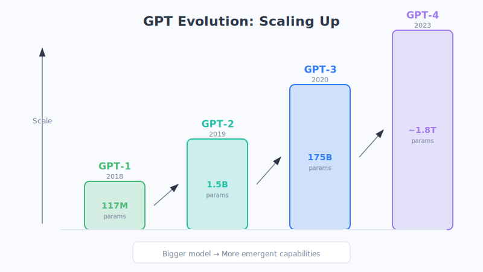

# Chapter 19: From Transformer to GPT

> In the last chapter we took apart the Transformer engine. In this chapter, let's see how taking half of its parts, adding "massive reading" and "constantly getting bigger," turned it into **GPT**—the one that can chat with you, help write your copy, and write your code.

## 1. What Is GPT? Let's Unpack Its Name First

The three letters GPT are actually the initials of three English words, each corresponding to a key idea we've covered earlier:

| Letter | Full Word | In Plain Language | Related Chapter |
| :--- | :--- | :--- | :--- |
| **G** | Generative | Writes content itself, not just multiple choice | This chapter |
| **P** | Pre-trained | Reads through massive text in advance to build a foundation | Chapter 16 |
| **T** | Transformer | Uses exactly the engine from the last chapter | Chapter 18 |

Put together: **a model built with the Transformer, extensively pre-trained, and good at generating content.** The name itself is a perfect review outline.

## 2. GPT Uses Only the "Right Half" of the Transformer

Remember what we said in the last chapter? The Transformer has two departments: the Encoder in charge of "understanding," and the Decoder in charge of "generating."

**GPT made a bold choice: keep only the Decoder, and throw away the entire Encoder.**

Why? Because GPT's goal is utterly pure—**it just wants to "write things," to "generate."** And the Decoder is naturally built for exactly that: popping out one word at a time, looking only at what came before, never peeking at what comes after.

> Analogy: **a dedicated "sentence-finisher."** You say the first half of a sentence, and it finishes the second half; you give it an opening, and it writes the whole piece. It doesn't need to look back and forth like a reading-comprehension task—it just single-mindedly keeps—**continuing on.**

This choice of "use only the Decoder, single-mindedly continue on" is simple, yet surprisingly powerful. How did it become so powerful? The key lies in the term below.

## 3. The Core Mechanism: Autoregression—Writing an Essay Is Just a Word Chain

The way GPT generates content has a technical name: **autoregression**. The name sounds intimidating, but the idea is one you've played since childhood—**it's just a word chain.**

Its workflow is like this: **each time it predicts only the single most likely next word/character, then appends that new word to the end of the sentence, then takes the new sentence to predict the next word… and so on in a loop, until it's done writing.**

Let's watch it in slow motion. Suppose you give GPT the opening "The weather today":

> 1. Input "The weather today" → GPT predicts the next word is most likely "is"
> 2. Input "The weather today is" → predicts the next is "really"
> 3. Input "The weather today is really" → predicts the next is "nice"
> 4. Input "The weather today is really nice" → predicts the next is ","
> 5. …and it keeps going until it decides it should stop.

See it? **It spits out only one word at a time, and after each one it goes back and rereads the whole sentence before deciding on the next word.** When you watch ChatGPT answer and see the words pop out one at a time, it's precisely because it really is "thinking one word at a time, writing one word at a time."

> Analogy: **playing a word chain with a friend.** Each time you only need to come up with the "next" word that connects, and after connecting it you look at the whole chain and think of the next one. When GPT writes a thousand-word article, it's just repeating this small task of "guessing the next word" a thousand times. (This is just an analogy; in reality it predicts a probability for each candidate word and then selects based on that.)

**An astonishing fact:** just this seemingly simple task of "endlessly guessing the next word," as long as the model is big enough and has read enough books, ultimately gives rise to a whole series of abilities—writing, translation, reasoning, coding, and more. Great truths are simple, and this is the ultimate example.

## 4. GPT's Confidence: Reading Through an Entire "Library"

The reason GPT can continue so smoothly and cleverly is thanks to what it did before officially going on the job—**pre-training (the P in its name)**.

Its training method is simple to the point of being almost "dumb": **take nearly all the massive text it can find on the internet (Wikipedia, news, books, forums, code…) and play a giant game of "fill-in-the-blank / word chain"—cover up the next word, let it guess, adjust when it guesses wrong, and repeat trillions of times.**

> Analogy: **a person who has read through every library in the world.** The more they read, the better their sense of language, and the more they know "what usually comes after this sentence." Start any opening for them, and they can continue smoothly, even quoting the classics. GPT is exactly this kind of word-chain player who has "read through trillions of volumes."

Precisely because it has read so much, it has, without even realizing it, quietly "absorbed" the patterns of language, common sense about the world, and even some reasoning routines, all into its own parameters. **It didn't memorize the answers; it trained up a "feel" for them.** (This is just an analogy; the model doesn't truly "understand" the way humans do—what it learned is the statistical patterns between words.)

## 5. Getting Bigger and Bigger: The Expansion History of the GPT Family

GPT's most striking through-line is **"getting big."** Researchers discovered a pattern: **the more parameters a model has, the more data it reads, and the more compute it has, the stronger its abilities.** So GPT grew bigger with each generation, big to a jaw-dropping degree.

Let's get a feel for this "arms race" with a table (the numbers are rough orders of magnitude, to help you build intuition):

| Version | Approx. Year | Parameter Scale (order of magnitude) | Ability Impression |
| :--- | :--- | :--- | :--- |
| GPT-1 | 2018 | ~110 million | First glimpse of promise, proved the approach was viable |
| GPT-2 | 2019 | ~1.5 billion | Could write decent paragraphs, once "too risky to release" |
| GPT-3 | 2020 | ~175 billion | Stunned the world, could chat about almost anything |
| GPT-3.5 | 2022 | (optimized on top of GPT-3) | The engine of ChatGPT, sparked a nationwide craze |
| GPT-4 and beyond | From 2023 | Even larger (undisclosed) | Can read images, reason, and is more reliable |

From GPT-1 to GPT-3, the parameter count grew more than a thousandfold. **This isn't a simple "a bit bigger"—it's a wild leap in order of magnitude.** Here's an analogy:

> If GPT-1 is a **middle-school student who has read a few hundred books**, then GPT-3 is a **polymath who has read through every library in the world**. Not only does it know far more, but even the way it thinks about problems is different.

## 6. Emergent Abilities: The Sudden "Aha" from Quantitative to Qualitative Change

In this "getting big" race, the most magical—and the most exciting to scientists—phenomenon is called **emergent abilities**.

It refers to this: **some abilities simply don't exist when the model is small, and can't be taught no matter what; yet once the model grows past a certain critical point, these abilities suddenly emerge on their own**, as if it "got it" overnight.

For instance, doing multi-step reasoning, understanding complex jokes, grasping "unspoken meaning," doing new tasks it was never taught… These abilities weren't fed in bit by bit; they **appeared all at once, on their own**, once the scale crossed a certain threshold.

> Analogy: **boiling water.** As the water temperature rises from 20°C to 90°C, it's only ever "water getting hotter"—no qualitative change in sight; but the moment it hits 100°C, it suddenly boils, bubbling away and turning into steam—**a fundamental change has occurred.** The emergence of a model's abilities is like the "boiling" brought on by that last degree: the accumulation of quantity reaches a critical point, and abruptly triggers a qualitative leap. (This is just an analogy; the exact mechanism of emergence is still being studied by the scientific community.)

It's precisely "emergence" that turned large models from "pretty decent tools" into things that astonish the whole world by "seeming to genuinely understand." This is also why everyone is so obsessed with making models **bigger**—because you never know what new skill it might "suddenly learn" after crossing the next threshold.

## 7. Chapter Summary

- **GPT = Generative + Pre-trained + Transformer**—the name is a condensed summary of three major ideas.
- It **uses only the Transformer's Decoder (the right half)**, because its mission is purely to "generate / continue on."
- It works through **autoregression**: like a word chain, guessing only the next word at a time, appending it, then guessing the next, looping a thousand times to write a whole piece—this is also why ChatGPT's answers pop out one word at a time.
- It builds its foundation through **pre-training**: reading through massive text and training up a "feel" for language.
- The GPT family **grew wildly bigger and bigger** (GPT-1 → GPT-4, with parameters exploding tens of millions of times over), and as a result, **emergent abilities** appeared—once the scale crosses a critical point, new skills "suddenly bubble up" like water coming to a boil.

With that, Part 4 is complete. You've now walked the full journey from "computers understand only numbers," to "word embeddings," to "attention," to "Transformer," and finally to "GPT"—**this is precisely the complete lineage behind the birth of every large model today.** Congratulations—you've gnawed through the toughest bone in the whole book! In the coming Part 5, we'll move from "principles" to "practice," and talk about how to truly put these large models to good use.

## 8. Questions to Ponder

1. Without looking at the book, try to recount to a friend what each of the letters G, P, and T stands for and which idea each corresponds to.
2. Why does the fact that ChatGPT's answers "pop out one word at a time" precisely confirm the "autoregression" mechanism?
3. How do you understand "emergent abilities"? Besides boiling water, what other examples of "quantitative change to qualitative change, a sudden aha" can you think of in daily life?
4. Some people say "GPT is just guessing the next word, it doesn't really understand at all." Based on this chapter, share your view.
