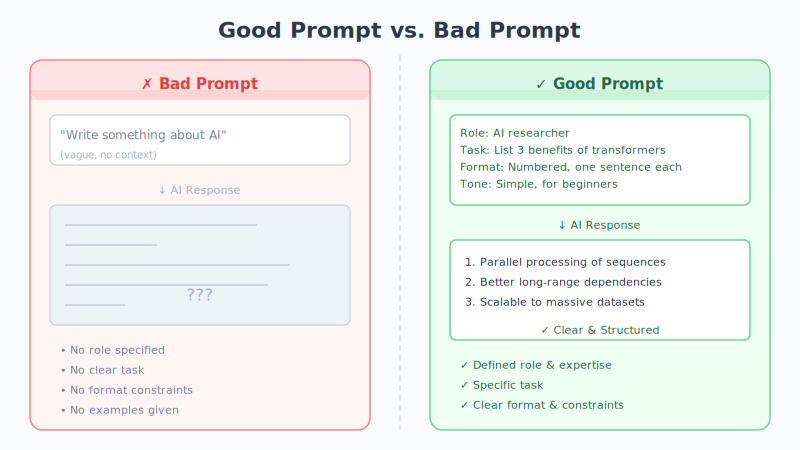

# Chapter 20: Prompt Engineering — How to Communicate Effectively with AI

Given the same AI, one person crafts stunning copy while another gets nothing but gibberish—the difference usually isn't the AI, it's **how you talk to it**.

## An Everyday Analogy

Imagine you've hired an incredibly capable intern who just started **on their very first day**. They're knowledgeable, quick on their feet—but they know absolutely nothing about your situation: who you're writing for, what effect you want, what pitfalls to avoid.

If you toss them a vague "write me something," they can only guess blindly, and nine times out of ten the result won't be what you wanted. But if you spell it out—"who's the audience, what's the topic, what tone, how long, what to avoid"—they can deliver impressive work on the spot.

**Communicating with AI works exactly the same way.** The clearer you make your request, the better it performs. This craft of "saying what you mean clearly" is called **Prompt Engineering**—a "prompt" is simply the message you send to the AI. (This is just an analogy; the reality is more complex.)

## Three Ingredients of a Good Prompt

A well-crafted prompt typically has three characteristics:

- **Clear**: The goal is unambiguous. Don't say "make it better"—say "make the tone more professional and concise."
- **Specific**: Provide enough context and detail. Who's the audience? Where will it be used? How long should it be? Any formatting requirements?
- **Role-assigned**: Tell the AI "who you are right now." For example, "You are an elementary-school language teacher with 10 years of experience"—and it will automatically adjust its vocabulary and perspective.

Remember this mantra: **"Give it a role, give it a task, give it constraints, give it examples."**

## Three Techniques That Work Immediately

### Technique 1: Provide a Few Examples (Few-Shot)

Instead of endlessly explaining what you want, **just show it**. Give the AI one or two "input → output" examples, and it will quickly mimic your format and style.

> For instance, if you want to batch-generate product titles, show it 2 titles you're happy with as references—everything it produces afterward will automatically match that style.

### Technique 2: Ask It to Think Step by Step (Chain-of-Thought)

When facing problems that require reasoning (calculations, analysis, decision-making), add one magic sentence: **"Please think step by step and show your reasoning."**

Just like showing your work on an exam makes you less likely to slip up than blurting out an answer, when AI lays out its thinking process, its accuracy improves noticeably.

### Technique 3: Role-Playing

A single line—"You are a professional nutritionist"—is enough to make the AI switch to the corresponding knowledge base and tone. The more specific the role, the more tailored the response.

## Good Prompts vs. Bad Prompts (Real Comparisons)

| Bad Prompt ❌ | Good Prompt ✅ |
| --- | --- |
| Help me write a leave request | You are an office worker. Write a sick-leave email for 2 days to my direct manager. Tone: polite and professional. Mention it's a cold with fever and that my work has been handed off. Under 200 words. |
| Tell me about fitness | I'm a beginner office worker with only 30 minutes a day. Give me a one-week home workout plan that requires no equipment, in table format, with no more than 4 exercises per day. |
| Is there a problem with this code? | Below is a piece of Python code (code attached). Find the bug, first explain what's wrong, then provide the corrected full code and explain why the fix works. |

See the difference? **A bad prompt dumps the guessing onto the AI; a good prompt feeds it all the information it needs.**



## A Copy-Paste Universal Template

Next time you're stuck, just plug into this framework:

```
[Role] You are a ________ (specific identity/expert).
[Task] Please help me ________ (specific thing to do).
[Constraints] Requirements: tone ________, length ________, format ________, avoid ________.
[Examples] Here's an example for reference: ________ (1–2 samples, optional).
```


## Two Most Common Mistakes

- **Too vague**: Tossing half a sentence and expecting AI to read your mind. It isn't psychic—give it enough information and you'll get good results.
- **Unrealistic expectations**: Expecting a perfect 10,000-word essay on the first try, or asking it to produce data it doesn't have. The right approach is **multi-turn dialogue—refine gradually**. Get a draft first, then ask it to revise piece by piece.

## Chapter Summary

- The core of Prompt Engineering is **making your request crystal clear** so the AI does less guessing and more doing.
- Three ingredients of a good prompt: **clear, specific, role-assigned**.
- Three key techniques: **provide examples (Few-Shot), ask it to think step by step (Chain-of-Thought), role-playing**.
- Remember the universal template: **Role + Task + Constraints + Examples**.
- Don't be afraid to iterate—great results are **polished through multi-turn conversations**.

## Something to Think About

1. Pick something you've recently wanted AI to help with. First, dash off a quick one-line prompt; then rewrite it using the "Role + Task + Constraints + Examples" template. Compare the two results—what changed?
2. Why does "please think step by step" improve AI's accuracy on complex questions? How is it similar to showing your work on a math exam?
3. If AI's first response isn't satisfactory, continuing with follow-up requests in the same conversation often works better than starting fresh—why do you think that is?
