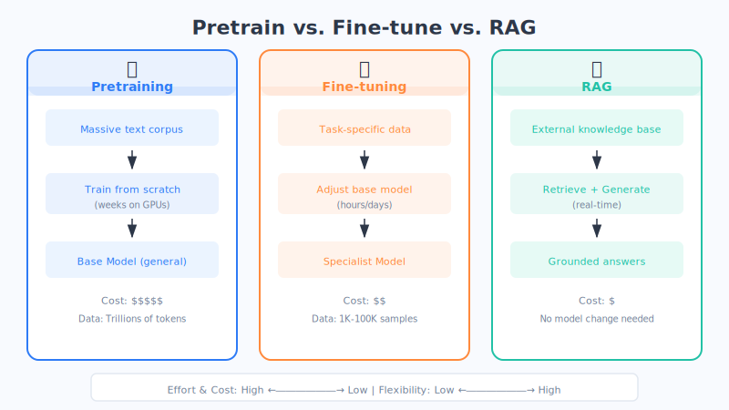

# Chapter 21: Pre-training, Fine-tuning & Transfer Learning

Why can a single AI chat with you casually, help doctors read medical scans, *and* assist lawyers in case research? The secret lies in a two-step process: "learn the basics broadly first, then specialize deeply."

## An Everyday Analogy: From College to Grad School

Imagine a person's educational journey:

- **Step one: Go to college**. They spend several years studying broadly—literature, math, history, science—picking up a bit of everything and building a solid general foundation. In AI, this step is called **pre-training**.
- **Step two: Go to grad school**. After their bachelor's degree, they choose a focus and dive deep—say, cardiovascular medicine. They don't need to relearn how to read; instead, they **build specialized expertise on top of what they already know**. In AI, this step is called **fine-tuning**.

Large models "grow up" the same way: first they're pre-trained on massive volumes of internet text, learning language, common sense, and reasoning; then they're fine-tuned with domain-specific material to become a "legal expert," "medical assistant," or "customer-service ace." (This is just an analogy; the reality is more complex.)

## Step One: Pre-training — Building a Strong General Foundation

**Pre-training** means having the model read an enormous amount of text (books, web pages, encyclopedias…) and in the process learn: how words fit together, how sentences are structured, and what common-sense knowledge about the world looks like.

This step is **expensive and slow**: it requires thousands of GPUs running for months, costing tens of millions of dollars or more. So only a handful of large companies and institutions can afford to pre-train from scratch. The model they produce is called a **foundation model**—think of it as "a well-rounded generalist who has finished college and reads voraciously."

## Step Two: Fine-tuning — Specializing on Top of the Generalist

With a foundation model—our "generalist"—we don't need to train someone from scratch. We just **give it additional specialized training**. That's **fine-tuning**.

The good news: fine-tuning is **fast and cheap**. Because the general foundation is already in place, you only need to feed it a relatively small amount of domain-specific data for it to quickly "enter the field." There are three common approaches, explained in plain language:

| Approach | Plain-Language Explanation | Life Analogy |
| --- | --- | --- |
| **Full-parameter fine-tuning** | Retune the entire model from top to bottom | Have the grad student retake all their college courses too—most thorough but most expensive |
| **Freeze some layers** | Lock most of the already-learned capabilities, only tune the top layers | Leave the fundamentals untouched; do an intensive crash course for the new specialty—fast and economical |
| **Adapters (Adapter/LoRA)** | Don't modify the original model; attach a small external "plugin" to learn new skills | Like swapping a specialty lens on a camera—the body stays the same, but a new lens lets you shoot a different genre |

The most popular approach today is **adapters**—these "lightweight fine-tuning" methods (you may have heard of **LoRA**): the original model stays untouched, and only a tiny add-on module is trained. The cost is minimal, yet the results are excellent—an ordinary person with a single consumer-grade GPU can do it.

## Transfer Learning: Applying Learned Skills to New Tasks

This whole "general first, then specialized" approach has a bigger name behind it: **Transfer Learning**—**taking skills learned on one task and transferring them to a different, new task.**

It's like someone who knows how to drive a sedan learning to drive a truck: they don't need to start from "what's a steering wheel?" Much of their experience transfers directly, and they pick it up quickly. AI works the same way—once it has learned general language abilities, switching to translation, coding, or customer service becomes much easier.

## Why It Matters So Much: Data Efficiency

The greatest value of transfer learning is that it **saves data, saves money, and saves time**.

- Training a model from scratch might require billions of data samples.
- Fine-tuning on top of a foundation model sometimes needs only **a few hundred to a few thousand** high-quality, domain-specific examples.

A counterintuitive but true conclusion: **fine-tuning a good foundation model with a small amount of data often far outperforms training a new model from scratch with massive amounts of data.** Standing on the shoulders of giants is always smarter than building from the ground up.

## Chapter Summary

- **Pre-training**: Like going to college for a broad education—massive data, expensive and slow—producing a "foundation model" generalist.
- **Fine-tuning**: Like going to grad school to specialize—small amounts of domain data, fast and cheap—turning the generalist into an expert.
- Three fine-tuning approaches: **full-parameter fine-tuning, freezing some layers, adapters (LoRA)**—with lightweight adapters being the most economical and popular.
- **Transfer Learning**: Applying skills learned on one task to a new task; its core advantage is **data efficiency**.
- Remember: **Fine-tuning on top of a foundation model beats starting from zero.**

## Something to Think About

1. Why do most companies choose to "fine-tune an existing foundation model" rather than "pre-train one from scratch"? Consider both cost and data perspectives.
2. What are the pros and cons of "freezing some layers" vs. "full-parameter fine-tuning"? If you only had a small amount of specialized data and a single ordinary GPU, which would you choose?
3. Can you think of other examples of "transfer learning" in everyday life? (Hint: think of a time when mastering one skill helped you pick up a related skill much faster.)
