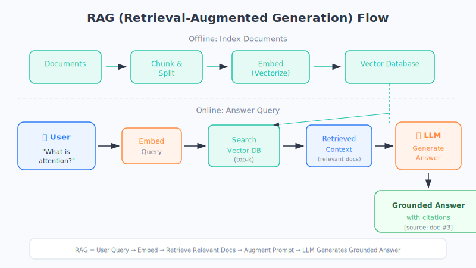
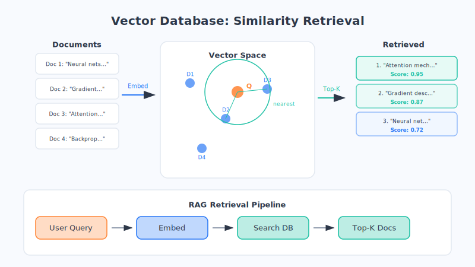

# Chapter 22: RAG — Giving AI "Long-term Memory"

Have you noticed that AI sometimes makes up facts with a perfectly straight face, or draws a blank when you ask about your company's internal processes? RAG is the remedy for both of these problems.

## Why We Need RAG

Large models are smart, but they have two built-in weaknesses:

- **Their knowledge goes stale**. What a model knows is "frozen" at the moment training ended. Ask it about yesterday's news or this year's new regulations, and it's clueless.
- **They make things up (hallucinations)**. When they don't know something, they won't say "I don't know"—instead, they'll confidently fabricate an answer that *looks* real.
- **They don't know your private data**. Your company's product manuals, internal policies, customer files—the model has never seen them, so naturally it can't answer questions about them.

What do we do? We can't retrain the entire model every time there's a new piece of information (that would be way too expensive). So clever people came up with a trick: **before answering, let it look things up first.**

This is **RAG** (Retrieval-Augmented Generation)—**retrieve first, then answer**.

## An Everyday Analogy: An Open-Book Exam

In a closed-book exam, you can only rely on what you've memorized. If your memory is fuzzy, you're likely to guess wrong—that's a regular large model.

RAG is like an **open-book exam**: before answering, you flip through your reference materials, find the relevant pages, and write your answer with the text right in front of you. Naturally, your answers are both accurate and well-supported.

The "reference book you can consult anytime" that RAG gives AI is essentially an **external long-term memory**. The reference materials can be updated at any time, and the AI itself never needs to be retrained. (This is just an analogy; the reality is more complex.)

## How RAG Works

The entire process breaks down into a few simple steps:

1. **Build a knowledge base**: Beforehand, chop your documents (manuals, policies, encyclopedias…) into small chunks and store them in a special database.
2. **Understand the question**: You ask a question, such as "What is our company's return policy timeframe?"
3. **Retrieve relevant materials**: The system searches the knowledge base and finds the chunks **most relevant** to your question.
4. **Combine with the question**: The retrieved materials and your question are stitched together into a "question with references" and fed to the large model.
5. **Answer based on the materials**: The large model **answers while looking at the references**, and can even cite which document the answer came from.

In one sentence: **Retrieve relevant documents → combine with the question → have the model answer based on the references.**

## The Key Player: The Vector Database

How does step 3 above—"find the most relevant materials"—actually work? Through a **vector database**.

Remember the "word vectors" we discussed earlier? Text can be converted into a string of numbers (a vector), and **content with similar meaning produces similar numbers**. RAG converts every chunk of material into such a string of numbers and stores them. When you ask a question, your question is also converted into numbers, and the system looks for the chunks with the **closest numbers**—a process called **similarity search**.

The elegant part: **it searches by meaning, not by exact wording.** If you ask "how do I get my money back," it can find the paragraph about "refund procedures," even if the two phrases don't share a single word.

> 📚 An analogy: A vector database is like a library's **classification and indexing system**. A library doesn't toss books on shelves randomly—it organizes them by topic. Give the librarian a general direction, and they can quickly lead you to the right shelf. (This is just an analogy; the reality is more complex.)

## Where RAG Is Used

RAG is currently one of the **most practical and widespread** ways enterprises deploy AI:

- **Enterprise knowledge-base Q&A**: Employees ask "What's the reimbursement process?" and AI pulls the answer straight from company policies.
- **Intelligent customer service**: Answers based on product manuals—accurate, verifiable, and available 24/7.
- **Legal / medical queries**: Retrieves from vast collections of regulations, case records, and clinical guidelines to help professionals quickly locate supporting evidence.
- **Personal knowledge assistant**: Feed in your own notes, bookmarks, and books to create a personal Q&A library that "knows you best."

Its biggest advantage: **when the materials are updated, the answers update too**—no model retraining needed, and hallucinations are dramatically reduced.

## RAG vs. Fine-tuning: How to Choose?

The two aren't in conflict—they solve different problems:

| | Fine-tuning (Chapter 21) | RAG (This Chapter) |
| --- | --- | --- |
| What it solves | Teaches AI **new skills or a new style** | Lets AI **use new knowledge and private data** |
| Analogy | Sending it to grad school—changes the "brain" | Giving it a reference book it can consult anytime |
| Updating knowledge | Requires retraining—slow | Just update the knowledge base—fast |

A simple rule of thumb: **To change "what it can do," use fine-tuning. To change "what it knows," use RAG.**

## Chapter Summary

- Large models have three major weaknesses: **stale knowledge, hallucinations, and ignorance of your private data**.
- **RAG = retrieve first, then answer**—like turning a closed-book exam into an open-book exam.
- Core workflow: **Retrieve relevant documents → combine with the question → answer based on the references**.
- The **vector database** is responsible for "searching by meaning"—like a library's classification and indexing system.
- RAG is the most practical way for enterprises to deploy AI, widely used in knowledge-base Q&A, customer service, legal and medical applications, and more.
- Remember the rule: **To change "what it can do," use fine-tuning. To change "what it knows," use RAG.**

## Something to Think About

1. Why is RAG effective at reducing the problem of AI "making things up with a straight face"? How does it "find evidence" for its answers?
2. What's the difference between "searching by meaning" and "searching by keywords"? Can you give an example of a search where the wording is different but the meaning is the same?
3. If you wanted to build an AI assistant for your own small shop that "answers common customer questions," what materials would you prepare for its knowledge base?
