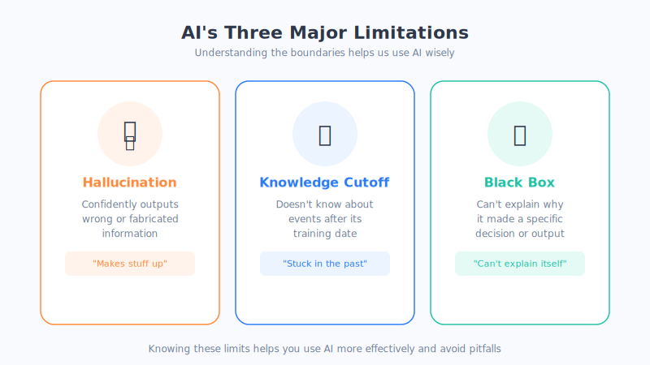
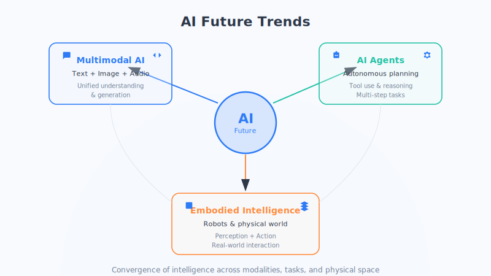

# Chapter 23: AI's Limitations, Ethics & the Future

AI is powerful, but it isn't magic and it isn't a god. Only by seeing its boundaries clearly can we use it wisely and with peace of mind.

## An Everyday Analogy: A Brilliant, Talkative Intern

Think back to that intern: well-read, a great communicator, lightning-fast reflexes—but they also have a flaw: **to avoid an awkward silence, they'll answer confidently even when they don't really know**. Their knowledge is stuck at whatever they read before they started the job. And you can never quite figure out what's actually going on in their head.

Today's AI is much the same: **impressively capable, yet with clear shortcomings.** Before using it, get to know those shortcomings first. (This is just an analogy; the reality is more complex.)

## I. Three Major Limitations of AI

### 1. Hallucinations: Making Things Up with a Straight Face

This is the one to watch out for most. AI sometimes **fabricates facts that simply don't exist**—invented book titles, nonexistent legal statutes, incorrect data—and delivers them with such confidence that they're hard to tell from the real thing.

The reason: at its core, a large language model "predicts the next most plausible word." It optimizes for "sounding smooth and reasonable," **not for "being factually correct."** So: **for anything important, always verify it yourself.**

> When we say "large model" here, we mainly mean text-based **Large Language Models (LLMs)** like ChatGPT. Other large models—vision models, multimodal models—don't all have "predicting the next word" as their objective.

### 2. Knowledge Cutoff: It Doesn't Know "Recently"

A model's knowledge is frozen at the moment training was completed. Anything that happened after that—news, new policies, new prices—it simply doesn't know (unless it has web access or the RAG approach from Chapter 22).

### 3. Black Box: It Can't Explain "Why"

AI gives you an answer, but it **cannot truly explain how it arrived at that answer**. Under the hood, hundreds of billions of numbers are crunching away, and even the developers struggle to fully account for the logic behind every decision. This is what's known as the **"black box" problem and lack of interpretability**—a particularly serious concern in high-stakes fields like medicine and law.

## II. Ethical Issues We Can't Avoid

Technology is neutral, but its uses can be good or harmful. As AI becomes widely adopted, a number of social issues demand honest attention:

- **Privacy**: Training and usage involve massive amounts of personal data—how do we prevent leaks and misuse?
- **Bias**: AI learns from human data, and in doing so **absorbs human biases** (gender, racial, regional discrimination, etc.)—which it may even amplify.
- **Job displacement**: Some repetitive knowledge work may be automated, and society needs time to adapt and transition.
- **Compute monopoly**: Training large models is extremely expensive, which could concentrate technology and influence **in the hands of a few giants**, deepening inequality.

> ⚖️ These questions have no neat answers—they require collective exploration by technologists, lawmakers, and society at large. As an ordinary user, **staying alert, not blindly trusting AI, and protecting your own privacy** is the most practical stance you can take.

## III. Looking Ahead: Where Is AI Going?

Setting aside the hype and the fear, here are a few directions that are broadly agreed upon in the industry:

| Trend | In Plain Language |
| --- | --- |
| **Multimodal AI** | AI will no longer understand only text—it will simultaneously see images, hear audio, and read text, comprehending the world with multiple senses, much like we do |
| **On-device AI** | Models are getting smaller and faster, able to run directly on phones, cars, and home appliances—no need to upload everything to the cloud. Faster and more privacy-friendly |
| **Explainability** | Teaching AI to "explain why it thinks what it thinks," gradually turning the black box transparent |
| **AGI outlook** | Artificial General Intelligence—AI that can handle any task the way humans do—remains a distant vision with a long road ahead |

## A Balanced Perspective: Neither Panic nor Hype

There are two extreme voices in society about AI: one says it will "dominate humanity" any day now; the other says it "can do anything and everything." **Both are wrong.**

A more mature stance: **treat AI as a powerful tool that sometimes makes mistakes.** Just as cars let us travel farther, but you still need to buckle up and obey traffic laws—AI can massively amplify your abilities, as long as you understand its boundaries and keep your own judgment in the driver's seat.

**AI won't replace people—but people who use AI may well replace those who don't.**

## Chapter Summary

- AI's three major limitations: **hallucinations (makes things up), knowledge cutoff (doesn't know recent events), black box (can't explain why)**—always verify important information yourself.
- Four key ethical issues: **privacy, bias, job displacement, compute monopoly**—challenges that require society-wide attention.
- Four future trends: **multimodal AI, on-device AI, explainability, AGI outlook**.
- Core attitude: **rational and balanced**—treat AI as a powerful but fallible tool; neither panic nor over-hype.

## Something to Think About

1. Can you recall a time when AI "fabricated" information for you? How did you discover it was wrong? Going forward, how will you verify AI's answers?
2. Among the four ethical issues—privacy, bias, job displacement, and compute monopoly—which concerns you most? Why?
3. Faced with AI's rapid development, what can an ordinary person do to "use AI" rather than "be left behind by AI"?
