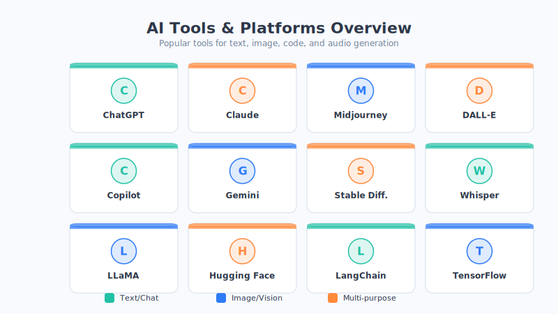

# Appendix C: Recommended Interactive Visualization Tools

Reading "how a neural network learns" a hundred times isn't as intuitive as **dragging a slider yourself and watching it change on the spot.** This section recommends several visualization websites you can open directly in your browser and play with for free—no software to install, no code to write, just click and feel the principles of AI.

> Strongly recommended: pick 1–2 of them and play for 10 minutes while cross-referencing the main text of this book, and many "concepts you couldn't grasp" will instantly become clear.

---

## 1. TensorFlow Playground — Visualizing Neural Network Training

- **What it is:** a little game that lets you "build a neural network and train it on the spot" right in your browser, made by Google.
- **What it helps you understand:** see with your own eyes how a neural network gradually "separates" data step by step; tweak the number of layers, the number of neurons, or the learning rate, and immediately watch the effect change—thoroughly grasping what "overfitting," "hidden layers," and "activation functions" are all about.
- **How to play:** pick a data distribution, click play, and watch the background color (the decision boundary) slowly get learned.
- **URL:** [playground.tensorflow.org](https://playground.tensorflow.org)
- Free ✅ ｜ No registration ✅ ｜ English interface but extremely easy to pick up 👍

## 2. Transformer Explainer — A Big Reveal of a Large Model's Inner Workings

- **What it is:** an interactive web page that "takes apart" the inner workings of Transformer models like GPT-2 to show you.
- **What it helps you understand:** enter a sentence and see how it gets cut into tokens, how attention is computed, and how it "predicts the next word" step by step—the Transformer and attention mechanism covered in Part Four of this book all come to life here.
- **How to play:** enter an English sentence and observe the attention connections and probability distribution at each layer.
- **URL:** [poloclub.github.io/transformer-explainer](https://poloclub.github.io/transformer-explainer/)
- Free ✅ ｜ Works best when read alongside Chapter 18, "The Transformer Architecture" 👍

## 3. Embedding Projector — Word Vector Projection

- **What it is:** a word-vector visualization tool made by Google that projects "the numbers that text becomes" into a 3D space you can see.
- **What it helps you understand:** intuitively see that "words with similar meanings cluster together" (for example, the relationships among king, queen, man, and woman), thoroughly understanding the **word vectors / word embeddings** in Chapter 16 of this book.
- **How to play:** after opening it, search for any English word and see which words are its "neighbors."
- **URL:** [projector.tensorflow.org](https://projector.tensorflow.org)
- Free ✅ ｜ 3D and rotatable, very cool 👍

## 4. CNN Explainer — How a Convolutional Neural Network Reads Images

- **What it is:** a web page that interactively shows how a CNN "understands an image layer by layer."
- **What it helps you understand:** clearly see what each step of convolution and pooling does to an image, understanding **why CNNs excel at image recognition** in Chapter 12 of this book.
- **How to play:** pick an image, click open each layer one by one, and observe what features each layer "sees."
- **URL:** [poloclub.github.io/cnn-explainer](https://poloclub.github.io/cnn-explainer/)
- Free ✅ ｜ Beautiful animation, beginner-friendly 👍

## 5. Netron — A Model Structure Viewer

- **What it is:** a visualization tool that can draw out the "internal structure diagram" of an AI model (web version + desktop version).
- **What it helps you understand:** intuitively see what a real model looks like—how many layers it has and how they're connected—building an overall impression of "model structure."
- **How to play:** upload a model file, and it automatically draws a beautiful structural flowchart.
- **URL:** [netron.app](https://netron.app)
- Free & open-source ✅ ｜ A commonly used tool for advanced players 👍

## 6. 3Blue1Brown Interactive Neural Network Articles

- **What it is:** visual articles paired with the famous animated videos, explaining gradient descent and backpropagation so clearly you "get it at a glance."
- **What it helps you understand:** use animation to build intuition for **backpropagation** in Chapter 10 and **gradient descent** in Chapter 7 of this book.
- **URL:** [3blue1brown.com/topics/neural-networks](https://www.3blue1brown.com/topics/neural-networks)
- Free ✅ ｜ Has a video version with Chinese subtitles 👍

---

## At a Glance: Which Tool Corresponds to Which Chapter

| Tool | Mainly helps you understand | Corresponding chapter | Free | Difficulty |
| --- | --- | --- | --- | --- |
| TensorFlow Playground | Neural network training, overfitting | Chapters 9, 11 | ✅ | ⭐ Very easy |
| Transformer Explainer | Transformer, attention | Chapters 17, 18 | ✅ | ⭐⭐ Easy |
| Embedding Projector | Word vectors | Chapter 16 | ✅ | ⭐ Very easy |
| CNN Explainer | Convolutional neural networks | Chapter 12 | ✅ | ⭐ Very easy |
| Netron | Overall model structure | Chapter 14 | ✅ | ⭐⭐ Easy |
| 3Blue1Brown | Gradient descent, backpropagation | Chapters 7, 10 | ✅ | ⭐ Very easy |

> Tired of playing and want to learn how AI developed all the way to today? Flip to the next section 👉 [Appendix D: AI Development Timeline](04-timeline.md)
