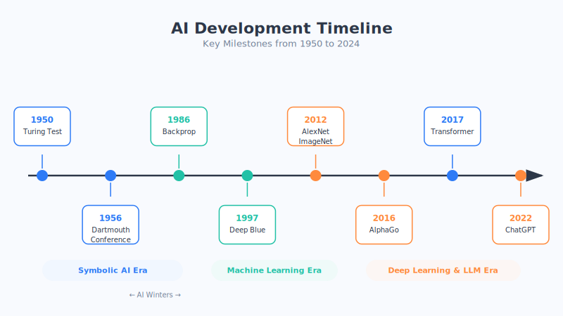

# Appendix D: AI Development Timeline

AI didn't appear overnight; it has traveled about 70 years, with peaks and troughs along the way (the industry calls the troughs "AI winters"). This section uses a timeline to help you string the key milestones together—the point isn't to memorize years, but to understand **why each step matters.**

---

## 1. Birth and Foundations (1950s–1960s)

| Year | Milestone | Why it matters (in one sentence) |
| --- | --- | --- |
| **1950** | Turing proposed the "Turing Test" | For the first time it set a standard for judging "whether a machine can think"—the intellectual starting point of AI. |
| **1956** | The Dartmouth Conference | The term "Artificial Intelligence (AI)" was officially born—the acknowledged starting point of the AI discipline. |
| **1957** | The Perceptron was proposed | The earliest prototype of a "neural network," igniting the first wave of enthusiasm. |
| **1966** | The chatbot program ELIZA | The first program that could "converse," making people feel for the first time that a machine could chat. |

## 2. Ups, Downs, and Accumulation (1970s–1990s)

| Year | Milestone | Why it matters (in one sentence) |
| --- | --- | --- |
| **1970s** | The first "AI winter" | Expectations too high, results too few, and research funding was slashed—a reminder not to mythologize AI. |
| **1986** | Backpropagation was popularized | It made multi-layer neural networks "trainable," planting the seed for deep learning down the road. |
| **1997** | Deep Blue defeated the world chess champion | The first time a machine beat a top human in a highly intellectual game, shocking the world. |

## 3. The Rise of Deep Learning (2006–2016)

| Year | Milestone | Why it matters (in one sentence) |
| --- | --- | --- |
| **2006** | The concept of "deep learning" was proposed | Neural networks were reborn under a new name, sounding the horn of a new era. |
| **2012** | AlexNet won the ImageNet competition | Deep learning made machines' "image-reading" ability soar—the acknowledged ignition point of deep learning. |
| **2014** | Generative Adversarial Networks (GANs) appeared | They taught AI to "create" images—an important origin of AI painting. |
| **2016** | AlphaGo defeated Go world champion Lee Sedol | It conquered Go, considered the hardest game, letting ordinary people worldwide feel the power of AI for the first time. |

## 4. The Era of Large Models (2017–present)

| Year | Milestone | Why it matters (in one sentence) |
| --- | --- | --- |
| **2017** | The Transformer architecture was proposed (the paper *Attention Is All You Need*) | The "engine" of all modern large models; from then on AI took the express lane of large models. |
| **2018** | BERT and GPT-1 were released one after another | The "pre-training + fine-tuning" paradigm was established, and machines' ability to understand language leaped forward. |
| **2020** | GPT-3 was released (175 billion parameters) | The explosion in scale brought "emergent abilities," making people realize the enormous potential of large models. |
| **November 2022** | ChatGPT was released | AI truly entered everyday households, hitting 100 million users in two months and sparking a nationwide AI craze. |
| **2023** | GPT-4 and multimodal large models erupted | AI could understand text and images at the same time, taking its capabilities to another level. |
| **2024 and beyond** | Multimodality, AI agents, and open-source large models flourished | AI moved from "being able to chat" to "being able to do work," rapidly integrating into all industries. |

---

## Three Things You Can Learn from the Timeline

1. **AI has its ups and downs.** There have been several "winters" in history, showing that technological development always spirals upward—don't be led astray by momentary overhype or doom-saying.
2. **Data + compute + algorithms—none can be missing.** Deep learning erupted only in 2012, not because the algorithms were so new, but because **there was enough data and fast enough GPUs**—this is also the answer to "why now."
3. **A single breakthrough triggers a chain reaction.** The single Transformer architecture of 2017 directly gave rise to GPT, ChatGPT, and even the entire large-model wave of today.

> Want to clarify the terms that appear in the timeline (such as Transformer, emergent abilities, multimodality)? Go back 👉 [Appendix A: Quick Reference for Terms](01-terms.md) and look them up.
