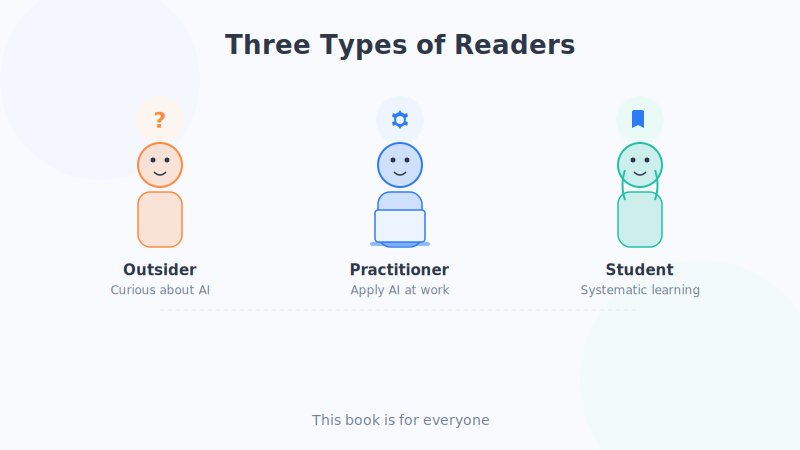

# 这本书适合谁

> 买书前，我们总爱翻翻它到底适不适合自己。这一节，就帮你花三分钟做个"自检"。

## 一、先做个小自测

看看下面这些描述，有没有哪一条像在说你：

- [ ] 我经常听到"AI""大模型""ChatGPT"，但从没真正搞懂它们是什么。
- [ ] 我用过一些 AI 产品，但完全不知道它背后是怎么运作的。
- [ ] 我数学早就还给老师了，一看到公式就头大。
- [ ] 我不是程序员，也不打算学写代码。
- [ ] 我有点担心 AI 会不会抢我的饭碗，又说不清具体该担心什么。
- [ ] 我就是纯粹好奇：这玩意儿到底是怎么"变聪明"的？

**只要你勾中了其中任意一条，这本书就是为你写的。**

## 二、三类读者，对号入座

我们在写作时，脑子里一直装着三位朋友。看看你更像哪一位。

### 读者 A：好奇的"局外人"

你可能是文科生、退休长辈，或者任何和技术不沾边的人。你不关心代码怎么写，只想知道："AI 说白了到底是个啥？它凭什么能听懂我说话、能画画、能写文章？"

**这本书给你**：用买菜、做饭、教孩子这样的日常比喻，把 AI 的来龙去脉讲清楚，让你在饭桌上也能跟人聊两句。

### 读者 B：想用好 AI 的"实干派"

你是上班族、老师、自媒体人、创业者……你已经在用 AI 帮忙写方案、做 PPT、想点子，但总觉得"没用到点子上"，有时它还一本正经地胡说八道。

**这本书给你**：帮你摸清 AI 的"性格"——它擅长什么、会在哪儿翻车、为什么会翻车。懂了原理，你才知道怎么把它使唤得更顺手。

### 读者 C：准备入门的"学生党"

你是中学生、大学生，或者想转行、想给自己充电的人。你打算未来往 AI 方向走，但还缺一个不吓人的起点。

**这本书给你**：一张清晰的"地图"。它不会一上来就丢公式砸你，而是先带你把整片森林看清楚，为你之后钻研更专业的教材、课程打好地基。

## 三、这本书**不**适合谁

诚实一点，也说说它的边界，免得你买错：

- **想马上写 AI 代码、跑模型的工程师**：这里几乎没有代码和公式，你可能会觉得太浅。
- **想找前沿论文解读的研究者**：本书讲的是"打地基"的通识，不追最新论文细节。
- **想要"三天精通、月入过万"速成秘籍的人**：抱歉，这里只有踏实的理解，没有一夜暴富的捷径。

如果你属于上面这几种，可以把本书当成"热身读物"，读完再去啃更硬核的资料，会顺畅很多。

## 四、读之前，你只需要准备三样东西

1. **一颗好奇心**——愿意问"为什么"。
2. **一点耐心**——有些概念要多读一遍才通，很正常。
3. **零基础**——真的不需要任何数学或编程底子。

就这么简单。

## 本章小结

- 只要你对 AI 好奇、又不想被公式劝退，这本书就适合你。
- 我们为三类读者写作：好奇的局外人、想用好 AI 的实干派、准备入门的学生党。
- 它不适合追代码、追论文、追速成的人。
- 读这本书的门槛只有三样：好奇心、耐心、零基础。

## 思考一下

1. 上面三类读者（局外人 / 实干派 / 学生党），你觉得自己最接近哪一类？为什么？
2. 你希望读完这本书后，能跟别人自信地讲清楚哪一个 AI 相关的问题？
