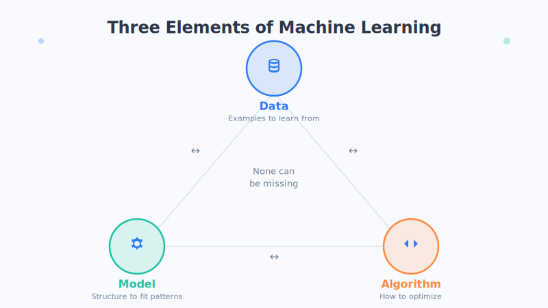

# 第4章 机器学习三大要素

> 想让机器学会一件事，说难也难，说简单也简单——你只需要准备好三样东西：**数据、模型、训练**。缺了任何一样，都学不成。

## 从"做一道菜"说起

我们先不谈机器，先聊聊做饭这件人人都懂的事。

假设你想学会做一道红烧肉，你需要什么？

- 首先，你得有**食材**：五花肉、酱油、糖、葱姜……没有食材，巧妇难为无米之炊。
- 其次，你得有一套**烹饪方法**：先焯水、再上色、加水焖煮多久、火候多大……这套方法决定了你能不能把食材变成好吃的菜。
- 最后，你得**反复尝试**：第一次可能太咸，第二次火候不够，第三次慢慢就找到了感觉。

机器学习几乎是一模一样的道理（这只是类比，实际更复杂）：

| 做红烧肉 | 机器学习 | 通俗理解 |
| --- | --- | --- |
| 食材 | **数据** | 用来学习的原材料 |
| 烹饪方法 | **模型** | 处理数据、得出结果的那套规律 |
| 反复尝试 | **训练** | 一次次纠错、越做越好 |

这就是机器学习的三大要素。下面我们一个一个说清楚。

## 一、数据：机器的"食材"

数据，就是机器用来学习的**例子**。

想教机器认猫，你就得给它看成千上万张猫的照片；想让机器预测房价，你就得给它一大堆"这套房子多大、在哪、卖了多少钱"的记录。

一句话：**机器见过的例子越多、越好，它总结出的规律往往就越靠谱。** 就像一个见多识广的老师傅，比只见过三五个客人的新手更懂行。

数据里的门道很多——数据够不够干净？有没有偏见？标注得对不对？这些我们会在**第5章**专门细讲。这里你只需要记住：**没有数据，机器什么都学不了。**

## 二、模型：机器的"烹饪方法"

模型听起来玄乎，其实可以理解成一套**"输入什么，就输出什么"的规律**。

- 你给它一张照片（输入），它告诉你"这是猫"还是"这是狗"（输出）。
- 你给它房子的面积和位置（输入），它估算出一个价格（输出）。

中间那套"从输入得到输出"的规律，就是模型。它可以很简单（比如"面积越大越贵"这样一条直线规律），也可以复杂到有上千亿个可调节的小旋钮（比如今天的大模型）。

模型到底长什么样、有哪些种类，我们放在**第6章**详谈。这里记住一句话：**模型就是那套把输入变成输出的规律。**

## 三、训练：机器的"反复尝试"

有了食材和方法，菜也不是一次就能做好的——训练，就是机器**一次次尝试、一次次纠错**的过程。

它大概是这样循环的：

1. 机器先用现在的模型**猜一个答案**；
2. 拿猜的答案和**正确答案**比一比，看差多少（错得越离谱，"扣分"越多）；
3. 根据差距，**悄悄调整模型里的旋钮**，让下次猜得更准一点；
4. 重复上面的过程，成千上万次，直到猜得足够准。

这个"不断纠错、越调越准"的过程，就是训练的精髓。它背后有个很形象的名字叫**梯度下降**，我们会在**第7章**用"盲人下山"的故事讲得明明白白。

## 三角形法则：缺一不可

为什么把它们叫"三大要素"？因为它们像一个**三角形的三条边，少了任何一条都撑不起来**：

- **只有数据、没有好模型**：就像有一堆顶级食材，却不会做菜，照样端不出好菜。
- **只有模型、没有好数据**：再好的厨艺，用臭掉的食材，也只能做出难吃的东西。这就是那句名言"**垃圾进，垃圾出**"。
- **有数据有模型、但不训练**：等于食材和菜谱都齐了，却从来不下厨，永远只是纸上谈兵。

所以请记住：**数据、模型、训练，三者相辅相成，缺一不可。** 这是理解机器学习最重要的一张"地图"。

## 顺便认识三种"学习方式"

机器学习并不只有一种"学法"。按照"老师"参与的多少，主要分成三种，我们用生活场景来感受一下（这只是类比，实际更复杂）：

- **监督学习（学会模仿）**：像学生做带标准答案的练习册。每道题都告诉它正确答案，它照着模仿、慢慢学会。前面说的"认猫""估房价"都属于这一类，也是目前用得最多的方式。
- **无监督学习（自我发现）**：像把一堆没贴标签的照片丢给它，让它自己把长得像的归成一堆。没人告诉它对错，它自己发现数据里的"抱团"规律。常用于把顾客分群、找相似内容。
- **强化学习（试错成长）**：像训练小狗，做对了给块肉（奖励），做错了不给（惩罚）。它在一次次试错中，摸索出"怎么做能拿到最多奖励"。下棋的 AlphaGo、很多游戏 AI 都靠它。

这三种方式没有高下之分，只是适合不同的场景。现在有个印象就够了，后面用到时我们还会再提。

## 本章小结

- 机器学习离不开三大要素：**数据（食材）、模型（烹饪方法）、训练（反复尝试）**。
- 三者像三角形一样**缺一不可**："垃圾进，垃圾出"提醒我们数据质量至关重要。
- 训练的本质，是让机器**不断猜答案、对比正确答案、再纠错**的循环过程。
- 按"老师"参与程度，学习方式主要分三种：**监督学习（学会模仿）、无监督学习（自我发现）、强化学习（试错成长）**。

## 思考题

1. 如果让你教机器识别"垃圾邮件"，你会准备哪些"食材"（数据）？你希望它输出什么样的结果？
2. 你生活中学会的某项技能（比如骑车、打字、做菜），更像监督学习、无监督学习，还是强化学习？为什么？

---

三大要素里，最容易被普通人忽视、却又最关键的，其实是**数据**。下一章，我们就来讲讲数据背后那些有趣又重要的故事。
