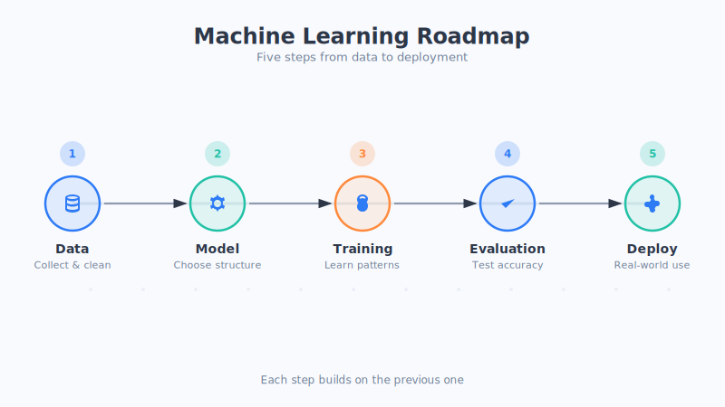

# 第二部分：机器学习基础 · 本部分导读

> 上一部分我们聊了"AI 到底是什么"，知道了它其实是一门让机器变聪明的学问。这一部分，我们就来揭开它最核心的秘密：机器到底是**怎么"学会"东西的**。

## 先说一句大白话

你有没有想过一个问题：为什么手机相册能自动认出你家的猫？为什么导航软件能预测哪条路会堵车？为什么购物网站好像比你自己还懂你想买什么？

这些本领，**没有一个是程序员一行一行手写规则教出来的**。它们几乎都来自同一套方法——**机器学习（Machine Learning）**。

机器学习是今天绝大多数 AI 的"发动机"。你后面会听到的那些高大上的名词，比如神经网络、深度学习、大模型、ChatGPT，说到底都是机器学习这棵大树上长出来的枝叶。所以，**这一部分是全书的地基**。地基打牢了，后面越走越轻松。

## 机器学习，到底"学"的是什么

我们先给一个特别接地气的说法：

**机器学习，就是让机器从大量的例子里，自己总结出规律，然后用这个规律去处理它从没见过的新情况。**

举个例子：你想教小孩认识"猫"。你不会给他一本《猫的定义手册》，而是指着一只只猫说"这是猫、这也是猫"。看多了，小孩自己就能认出街上一只从没见过的猫。机器学习干的，基本就是这件事（这只是类比，实际更复杂）。

## 这一部分你会读到什么

我们会用五章，把机器学习这件事从头到尾讲明白：

| 章节 | 主题 | 一句话概括 |
| --- | --- | --- |
| 第4章 | 机器学习三大要素 | 学习离不开：数据、模型、训练 |
| 第5章 | 数据的故事 | 喂给机器什么，它就长成什么样 |
| 第6章 | 模型是什么 | 模型就是一套"输入→输出"的规律 |
| 第7章 | 训练过程 | 机器靠不断"纠错"变聪明 |
| 第8章 | 怎样判断模型好坏 | 学得好不好，得考一场试才知道 |

## 怎么读这一部分

- **不用怕数学。** 这一部分我们尽量不写公式，实在绕不开的地方，也会先用大白话把道理说清楚，再点一下它的名字。
- **重在理解"感觉"。** 你不需要记住任何计算细节，只要读完能对"机器怎么学习"有一个清晰直观的画面感，这一部分的任务就完成了。
- **比喻只是拐杖。** 书里会用大量生活化的比喻帮你理解，但请记住：真实的技术往往比比喻复杂得多，比喻是帮你入门的拐杖，不是终点。

## 本部分小结

- 机器学习是当今 AI 的核心方法，本书后面的一切都建立在它之上。
- 它的本质，是**让机器从例子中自己总结规律**，再去应对新情况。
- 这一部分围绕**数据、模型、训练、评估**四件事展开，读完你会对"机器如何学习"有完整的直观理解。

## 思考题

1. 回想一下你今天用过的手机 App，有哪些功能你怀疑背后用到了"机器学习"？它们是不是都跟"从数据里找规律"有关？
2. 教一个小孩认字，和教机器认字，你觉得最大的相同点和不同点分别是什么？

---

准备好了吗？我们从最基础的"三大要素"开始，正式踏进机器学习的世界。
