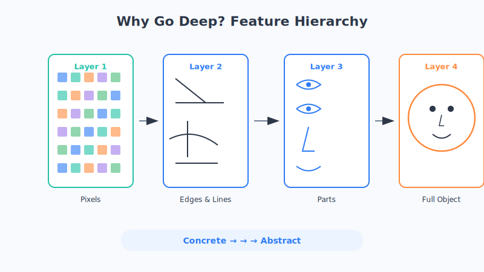

# 第11章 深度学习为什么"深"

你一定经常听到"深度学习"这四个字。可有没有人告诉过你，这个"深"到底深在哪？是深奥难懂的深，还是别的意思？

Jay 今天就把这层窗户纸捅破：这里的"深"，其实特别朴素——就是指神经网络的**层数很多、很深**。而这么多层堆在一起，恰恰藏着 AI 近十年爆发的最大秘密。

## 先讲个生活场景

想象你在认一个人。你的大脑不是"啪"一下就认出来的，而是悄悄经历了好几个阶段：

1. 眼睛先接收到一堆**光点和颜色**；
2. 大脑把它们组合成**线条和边缘**（这里有条轮廓）；
3. 再往上，拼成**局部器官**（这是眼睛、这是鼻子）；
4. 最后，把这些器官组合起来——"哦，这是我妈！"

你看，认人是**从粗到细、层层递进**的：先看到零碎的细节，再一层层组合成越来越完整、越来越有意义的东西。

深度学习的"深"，干的就是这件事：**用很多层，让机器一层一层地把原始数据，从最琐碎的细节，逐步提炼成最抽象的概念。** 层数越多，它能爬的"理解台阶"就越多。

（这只是类比，真实的视觉神经科学更复杂，但"分层、从简单到复杂"这个大方向是相通的。）

## 核心原理拆解

### 1. 层层提取特征：从像素到人脸

我们把一张人脸照片喂给一个很深的网络，看看它内部发生了什么：

- **最底层**：只看得到一个个**像素点**，明暗和颜色而已，毫无意义。
- **往上一层**：把相邻像素组合起来，认出**边缘和线条**——横的、竖的、斜的。
- **再往上**：把线条拼成**局部图案**——一个圆圈像眼睛，两条弧线像嘴巴。
- **更高层**：把这些局部拼成**完整的五官乃至整张脸**。
- **最顶层**：给出结论——"这是张三"。

关键点在于：**越往上，特征越"抽象"、越有意义。** 底层管细节，高层管概念。这种一层管一层、自动逐级提炼的能力，正是深度网络最迷人的地方——我们不需要手把手告诉它"眼睛长什么样"，它自己就能从海量图片里琢磨出来。

### 2. 为什么"浅"的不行，非得"深"

有人会问：我用一层特别宽、神经元特别多的网络，行不行？

理论上勉强能凑合，但**又笨又费劲**。这就像盖楼：你非要把 30 层的内容全塞进 1 层里，那这一层得多挤、多乱？分成 30 层，每层各司其职，反而结构清晰、更省材料。

深度网络的妙处，就是**用"层数"换"效率"**：每一层只干一点简单的活（比如"找边缘"），把结果交给下一层继续加工。分工协作，才能高效地处理猫脸、人声、长文章这种极其复杂的信息。

### 3. 层太多的烦恼：梯度消失

那是不是层越多越好、越深越强？可惜没这么美。层数一多，一个恼人的麻烦就出现了，叫**梯度消失**。

回想上一章的"倒推追责"：误差的责任要从最后一层，一层层往回传给前面的层。可如果层数太深，这个"责任信号"一路往回传，会像回声一样**越传越弱**，等传到最前面几层时，几乎已经听不见了。

结果就是：**靠前的那些层收不到有效的"改进指令"，学不动、几乎不更新。** 前几层是管最基础细节的，它们要是罢工，整个网络的地基就没打好。这曾经是深度学习卡了很多年的大难题。

（这只是类比，"梯度"是数学里的一个量，但"信号越传越弱、传不到前面"的直觉是准确的。）

### 4. 解药：给信号修一条"高速公路"

聪明的研究者想了个绝妙的办法：既然信号一层层传会越来越弱，那我**多修几条捷径**，让信号能"抄近道"直达前面不就行了？

这就是大名鼎鼎的**残差连接**（也叫跳跃连接）。你可以把它想成在拥堵的市区道路旁边，额外修了一条**高速公路**：信息除了走"每层都停一下"的普通路，还能走高速直达远处的层。这样一来，即使网络堆到几百层，责任信号也能顺畅地传回去，前面的层照样学得动。

正是靠着这条"高速公路"，深度网络才敢越堆越深，几十层、上百层地往上摞，性能也随之突飞猛进。后面第14章要讲的 ResNet，靠的就是这一招。

## 本章小结

- 深度学习的"深"，就是指**神经网络的层数多**，没那么玄乎。
- 深网络**层层提取特征**：从像素→边缘→器官→整张脸，越往上越抽象、越有意义。
- 用"多层分工"代替"一层硬扛"，处理复杂信息更高效，这是深比浅强的根本原因。
- 层太多会带来**梯度消失**：改进信号一路往回传会越来越弱，前面的层学不动。
- **残差/跳跃连接**像给信号修了条"高速公路"，让超深网络也能顺利训练。

## 思考题

1. 用"认出一个熟人"的过程，向家人解释深度网络为什么要"分很多层"。
2. "梯度消失"就像一句话在很多人之间口口相传，传到最后就走样甚至没声了。你还能想到生活中哪些"信号越传越弱"的例子？"高速公路"式的捷径又能怎么解决它？
