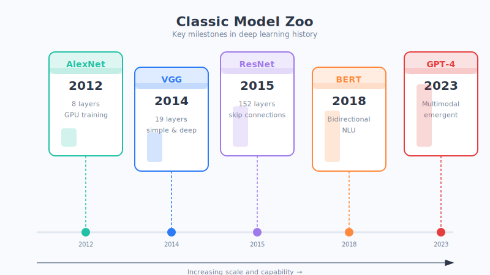

# 第14章 常见深度学习模型速览

学到这里，你已经懂了神经网络的地基（第9、10章）、深度的奥秘（第11章），还认识了看图的 CNN（第12章）和有记性的 RNN（第13章）。恭喜你，基本功已经很扎实了！

这一章轻松一点，Jay 带你逛一逛"名门大派"——那些你在新闻和论文里常听到名字的经典模型。**记不住细节完全没关系**，只要对每个名字有个"哦，原来它是干这个的"的印象就够了。

## 先讲个生活场景

这些模型，就像武侠世界里的各大门派：有的以"内功深厚"著称（网络特别深），有的以"招式精巧"闻名（结构特别巧），有的主打"快准狠"（速度极快）。它们没有绝对的高下，各有各的看家本领和适用的江湖。

（这只是类比，模型之间的差异是技术性的，但"各有所长、各有适用场景"这个理解是对的。）

## 核心原理拆解

### 1. 四位视觉领域的"名门"

下面这几位，都是让机器"看懂图像"的高手，本质上都属于上一章讲的 CNN 家族，只是各有各的独门绝技：

- **VGG**：**"大力出奇迹"的老实人。** 它的结构特别简单规整，就是把小卷积层老老实实地一层层往上堆，堆得又深又整齐。思路朴素、易于理解，是很多人入门的第一课。
- **Inception（GoogLeNet）**：**"多管齐下"的多面手。** 它不纠结用大放大镜还是小放大镜，而是**几种大小的放大镜同时上**，一次把粗细特征都看个遍，再汇总起来。像一个会同时用广角和长焦的摄影师。
- **ResNet（残差网络）**：**"修了高速公路"的深度之王。** 还记得第11章说的"梯度消失"和"高速公路"吗？ResNet 就是那条高速公路的发明者，靠残差连接把网络深度做到上百层依然学得动，是深度学习的里程碑。
- **YOLO**：**"一眼定乾坤"的快枪手。** 全称 "You Only Look Once（你只需看一眼）"。别的模型可能要反复扫描图片，它只**看一眼就能同时找出所有物体的位置和类别**，速度极快，是实时目标检测（如自动驾驶、监控）的当红明星。

### 2. 一张表看懂它们的"看家本领"

| 模型 | 一句话特点 | 生活化比喻 | 最擅长的场景 |
| --- | --- | --- | --- |
| **VGG** | 结构简单，把小卷积层老实堆深 | 老老实实一层层码高的堆积木工人 | 图像分类入门、作为其他任务的基础骨架 |
| **Inception** | 多种大小的"放大镜"并行看 | 同时用广角+长焦的摄影师 | 在有限算力下兼顾精度与效率 |
| **ResNet** | 用"残差高速公路"把网络做得极深 | 修了高速公路、身形超高的巨人 | 需要很深网络的高精度图像任务 |
| **YOLO** | 只看一眼就同时定位+分类所有物体 | 眼疾手快的快枪手 | 实时目标检测：自动驾驶、安防监控 |

> 提示：这张表不用背，需要时回来查一眼即可。真正要记住的是最后一列"擅长的场景"——它决定了什么时候该请哪位出马。

### 3. 没有最好的模型，只有最合适的模型

新手最容易问的一句话是："那到底哪个模型最强？" Jay 的答案是：**这个问题本身就问错了。** 就像问"轿车、越野车、跑车哪个最好"——答案永远是"看你要干嘛"。

选模型，通常要在下面三样之间做权衡：

- **看数据**：你有多少数据、是图片还是文字？数据少可能得选小一点的模型，免得"学过头"（过拟合）。
- **看算力**：你是在超级服务器上跑，还是要塞进一个小小的手机或摄像头里？算力紧张就得选轻快的模型（比如 YOLO 这类）。
- **看需求**：你更看重**精度**（宁可慢点也要准）还是**速度**（要实时响应）？医疗诊断可能优先精度，自动驾驶则必须够快。

**一句话：模型没有绝对的好坏，只有合不合适。** 拿着需求去挑工具，才是高手的思路。

## 本章小结

- 经典视觉模型多属 CNN 家族，各有绝技：**VGG**（简单堆深）、**Inception**（多尺度并行）、**ResNet**（残差高速公路做极深）、**YOLO**（一眼完成实时检测）。
- 记模型不用记细节，**记住"它最擅长什么场景"** 就够用了。
- 选模型要综合权衡三件事：**数据规模、算力条件、精度/速度的需求**。
- 天下没有最强的模型，**只有最适合当前任务的模型**。

## 思考题

1. 如果要给一个**手机 App** 做"拍照实时识别路牌"的功能，你会更倾向于选精度极高但很慢的模型，还是选 YOLO 这类又快又够用的模型？为什么？
2. 用"选车"（轿车/越野车/跑车）的思路，说说你会从哪几个角度来为一个具体任务挑选深度学习模型。
