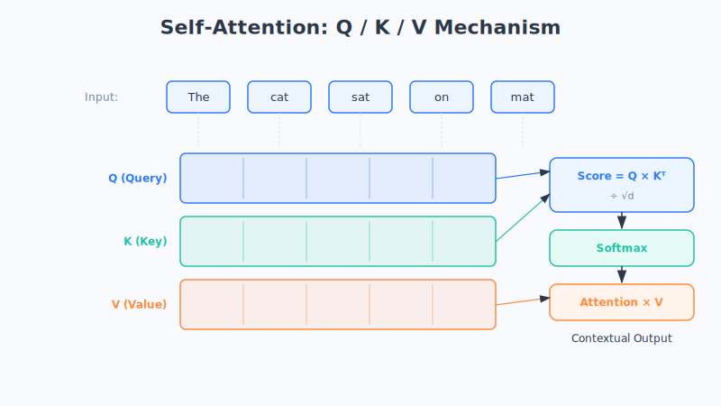

# 第17章 注意力机制：学会聚焦重点

> 你在读这句话的时候，其实并没有平均用力地看每一个字——你的大脑会自动把注意力放在关键词上。这个再自然不过的本能，正是让 AI 脱胎换骨的那把钥匙：**注意力机制**。

## 一、先看看"老办法"卡在哪了

在注意力机制出现之前，处理句子这种"有先后顺序"的信息，主流工具是我们在第13章见过的 **RNN（循环神经网络）**。

RNN 的工作方式很像一个人**一个字一个字地读句子，边读边记**：读到"我"记一下，读到"喜欢"再更新一下记忆，读到"吃"再更新……它把前面读过的内容浓缩成一小团"记忆"，一路传下去。

这个办法处理短句子还行，但一遇到长句子，就暴露了一个大毛病——**它会"遗忘"。**

想象你玩过的"传话游戏"：十个人排成一队，第一个人小声说一句长话，一个接一个往后传，传到最后一个人时，往往已经面目全非了。RNN 处理长句子就是这样：**读到后面，前面的信息早就被冲淡、遗忘了。**

举个例子：

> "我出生在中国一个山清水秀的南方小城，在那里度过了快乐的童年，后来去了很多地方，但我最爱吃的，始终是家乡那口地道的……**（米粉？面条？）**"

要正确接上这句话，模型必须记住开头的"中国""南方"。可对 RNN 来说，开头离结尾太远了，那点记忆早就模糊了。这个"记不住远处信息"的问题，术语叫**长距离依赖难题**。

**科学家们于是想：人类读长句子时，为什么不会忘？** 因为我们会"回头看"——读到"家乡那口地道的"，我们会自动回头去看"南方小城"这个关键信息，而不是死记硬背整段话。

**能不能让 AI 也学会这种"回头看、抓重点"的本事？** 这就是注意力机制的出发点。

## 二、注意力，就是"动态分配你的关注度"

我们先说清楚"注意力"这个词到底在指什么。

请你回想一下读一篇长论文的场景。你不会每个字都用同样的力气去读——你会**在重点段落多停留、反复读几遍，在无关的客套话上一扫而过**。你的"关注度"是动态分配的，哪里重要就往哪里多分一点。

**注意力机制干的就是这件事：让模型在处理每一个词的时候，自动判断"我该给句子里其他哪些词，分配多少关注度"。**

还是上面那个米粉的例子。当模型要预测最后那个词时，注意力机制会让它把大部分关注度分给"南方""家乡"这几个关键词，而不是平均分给每个字。这样，哪怕关键信息在很远的开头，模型也能一把抓住——**因为它是"直接回头看"，而不是"层层传话"。**

这就从根上解决了 RNN 的遗忘问题。用一个比喻说：

> RNN 像**闭卷考试**，全靠脑子一路记下来，记到后面就忘了前面；
> 注意力像**开卷考试**，答每道题时都能翻回书里最相关的那几页去看。（这只是类比，实际机制更复杂。）

## 三、Query、Key、Value：注意力的三兄弟

注意力机制内部，有三个核心角色，名字听起来吓人，但其实特别好懂。它们分别叫 **Query（查询）、Key（键）、Value（值）**，我们一个一个用生活场景来拆解。

### 打个总比方：去图书馆查资料

想象你走进图书馆，想找关于"唐朝历史"的内容：

- **Query（查询）= 你心里想要的东西。** 也就是你的需求："我想找唐朝历史。"
- **Key（键）= 每本书的书脊标签。** 你扫一眼一排书的标签："宋朝经济""唐朝历史""明朝地理"……用你的需求(Query) 去和每个标签(Key) 比对，看哪个最匹配。
- **Value（值）= 书里真正的内容。** 你找到最匹配的那本（"唐朝历史"），翻开它，取出里面真正有用的内容。

一句话总结这个流程：

> **你带着需求（Q），去看有哪些标签（K），根据匹配程度，取出对应的内容（V）。**

### 换个更日常的比方：查字典

- 你想知道"踌躇"什么意思——这个**想查的词**就是 **Query**；
- 字典每一页的**词头**就是 **Key**，你拿"踌躇"去逐页比对；
- 找到那一页后，**词条的解释**就是 **Value**，你把解释读出来。

### 再换个比方：自助餐

- 你饿了，想吃点酸辣口的——这个**口味需求**是 **Query**；
- 餐台上每道菜的**菜名牌**是 **Key**，你扫一遍看哪道对口味；
- 你真正夹到盘子里的**菜**，就是 **Value**。

看出来规律了吗？无论哪个比方，套路都一样：

| 角色 | 含义 | 图书馆 | 查字典 | 自助餐 |
| :--- | :--- | :--- | :--- | :--- |
| **Query（Q）** | 我想要什么 | 我的需求 | 想查的词 | 想吃的口味 |
| **Key（K）** | 有哪些候选、各是什么 | 书脊标签 | 词典词头 | 菜名牌 |
| **Value（V）** | 匹配后取出的真东西 | 书的内容 | 词条解释 | 夹到的菜 |

**注意力机制的完整流程就是：** 用 Query 去和每一个 Key 比对，算出"匹配程度"（也就是关注度权重）；匹配度越高的，就从它的 Value 里取越多的内容；最后把这些内容按权重汇总起来。

如果非要写一句极简的"公式"，那就是：

> **最终结果 = 把每个 Value，按照"它的 Key 和 Query 有多匹配"来加权求和。**

翻译成大白话：**越相关的内容，就越多地被吸收进来。** 就这么简单。

## 四、自注意力：让句子里的每个词，互相"看一看"

前面的比方里，Query 是"你"这个外人。但 Transformer 里用得最多的，是一种特别的玩法，叫 **自注意力（Self-Attention）**——"自"就是"自己对自己"的意思。

它的核心是：**让一句话里的每一个词，都去看看句子里的其他所有词，从而更好地理解自己。** 也就是说，每个词既是提问的 Query，也是被查的 Key，还是被取用的 Value——**大家互相打量、互相参考。**

为什么需要这样？因为**同一个词，在不同句子里意思可能完全不同，必须结合上下文才能确定。** 看这两句：

> 1. 这家银行的**利息**很高。
> 2. 河边的**堤岸**被冲垮了。

（英文里 "bank" 一词兼有"银行"和"河岸"两义，这里用中文场景示意。）再看更直接的中文例子：

> 1. 我今天骑**车**上班。
> 2. 我今天开**车**上班。

同样一个"车"字，靠前面的"骑"还是"开"，我们才知道是自行车还是汽车。**自注意力就是让"车"这个词，主动回头看一眼"骑"或"开"，从而搞清楚自己此刻到底指什么。**

再看一个更能体现威力的例子——代词指代：

> "**小明**把书递给**小红**，因为**他**读完了。"

这里的"他"指谁？我们一看就知道是小明。自注意力就能让"他"这个词，把大部分关注度分配给"小明"，从而正确理解指代关系。**句子里每个词，都通过这种"互相看"，把上下文的信息吸收进了自己的理解里。**

**这，就是 Transformer 的灵魂。** 那篇开创时代的论文标题《Attention Is All You Need》（你只需要注意力），说的正是：把注意力用到极致，别的花哨结构都可以不要。下一章，我们就来看看研究者是怎么用注意力，搭出 Transformer 这台"发动机"的。

## 五、本章小结

- RNN 像"传话游戏"和"闭卷考试"，处理长句子会**遗忘远处的信息**，这叫**长距离依赖难题**。
- **注意力机制**让模型在处理每个词时，**动态地把关注度分配给最相关的词**，像"开卷考试"一样能直接回头看重点，从根上解决了遗忘问题。
- 注意力的三兄弟 **Query（我想要什么）、Key（有哪些候选）、Value（取出的真内容）**，套路就是"带着需求 Q，看标签 K，取内容 V，按匹配度加权汇总"。
- **自注意力**让句子里每个词互相打量，从而结合上下文理解自己的准确含义（比如"车"是自行车还是汽车、"他"指的是谁）。它是 Transformer 的灵魂。

## 六、思考题

1. 用"开卷考试 vs 闭卷考试"的比喻，向朋友解释注意力机制比 RNN 强在哪里。
2. 在"我把苹果给了弟弟，因为它熟透了"这句话里，"它"指的是什么？如果让自注意力来处理，你觉得"它"应该把关注度重点分给哪个词？
3. 试着用"点外卖"这个场景，自己编一套 Query / Key / Value 的对应关系。
