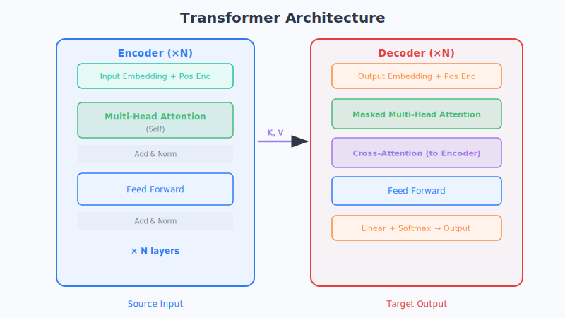
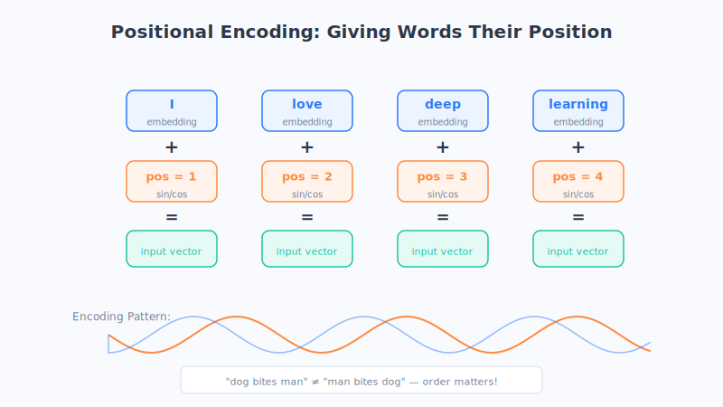
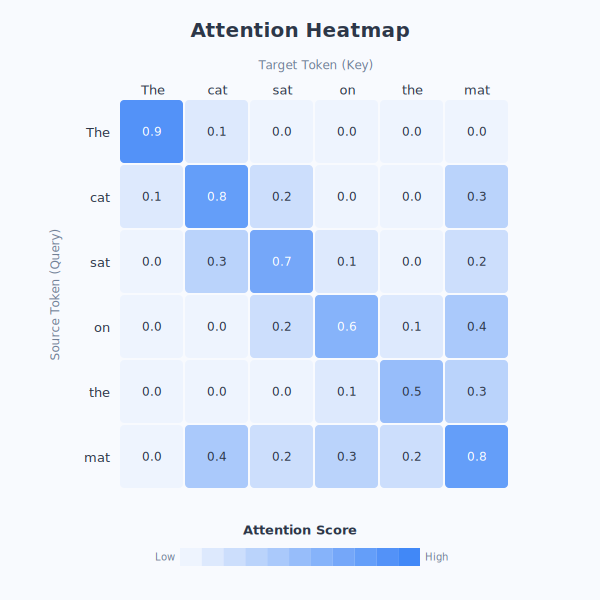

# 第18章 Transformer 架构详解（重点）

> 这是全书的招牌章节。如果你只想彻底搞懂一个东西，那就是它——**Transformer**。今天你听说的每一个大模型，GPT、文心、通义、DeepSeek……骨子里全是它。这一章我们会慢一点、细一点，带你把这台"发动机"从外壳到内脏拆个明白。建议读两遍：第一遍看全景，第二遍抠细节。

## 一、一句话导入：一场"抛弃记忆、全靠回头看"的革命

上一章我们讲到，RNN 处理句子像"传话游戏"，读到后面就忘了前面。2017 年，谷歌那篇《Attention Is All You Need》干了一件很大胆的事：

> **它把 RNN 那套"一个字一个字往下传"的老办法，彻底扔掉了，改成——整句话一次性铺开，让每个词直接用注意力去看其他所有词。**

这就是 Transformer。它的名字你不用纠结中文翻译（"变换器"），记住它是**大模型的发动机**就够了。

## 二、生活化比喻：从"流水线传话"到"圆桌会议"

我们先建立一个整体的画面感。

**RNN 像一条流水线上的传话：** 工人排成一排，第一个人处理完把结果递给第二个，第二个递给第三个……一个接一个，必须**严格按顺序**，急不得。而且传到后面，最初的信息早就走样了。

**Transformer 像一场圆桌会议：** 一句话里所有的词，同时围坐在一张圆桌旁。主持人一声令下，**每个人同时开口，同时听取其他所有人的发言**，然后各自更新自己的理解。没有先后，一拥而上，一轮就沟通完毕。

这个比喻藏着 Transformer 两个最大的优势，请先记住：

1. **可以并行（大家同时开会，不用排队）** —— 所以训练起来**快得多**，能吃下海量数据。
2. **任意两个词都能直接对话（圆桌上谁都能直接跟谁说话）** —— 所以再远的词也不会"失联"，彻底治好了 RNN 的健忘症。

（这只是类比，实际的计算流程更复杂。）

## 三、核心原理拆解：六大组件逐个击破

Transformer 这台发动机，是由六个关键零件拼起来的。别急，我们一个一个来，每个都配一个生活比喻。你会发现，拆开看，每个零件都不难。

### 组件① 词向量编码：先把词翻译成"坐标点"

万事开头。一句话进来，第一步就是把每个词变成一串数字——**这正是第16章讲的词向量**。

> 比喻：**入场先换筹码。** 就像进赌场（抱歉，换个健康的：进游乐场）要先把现金换成园区专用的代币，Transformer 也要先把"文字"换成它内部唯一认得的"数字筹码"（词向量），后面所有运算才玩得转。

这一步的产出，是句子里每个词对应的一个向量（坐标点）。

### 组件② 位置编码：给每个词发一个"座位号"

这里有个大问题。刚才说 Transformer 是"圆桌会议、所有词同时处理"，可这样一来——**它就不知道词的先后顺序了！**

而顺序对语言太重要了：

> "**狗咬人**" 和 "**人咬狗**"，用的字一模一样，意思天差地别。

RNN 天生知道顺序（因为它就是一个一个按顺序读的），但 Transformer 一次性把词全摊开，顺序信息就丢了。怎么办？

**办法很妙：给每个词额外贴一个"位置标签"，告诉模型它排在第几个。** 这就是**位置编码（Positional Encoding）**。

> 比喻：**电影院的座位号。** 观众（词）可以同时入场、同时就座，但每个人手里的票上都印着"3 排 5 座"。这样哪怕大家一拥而入，检票员也清清楚楚知道谁在前、谁在后。位置编码就是给每个词发的这张"座位号"，把顺序信息重新加了回去。（这只是类比，实际的位置编码是一组按规律生成的数字，加到词向量上，而非简单编号。）

### 组件③ 多头注意力：8 个人从不同角度一起理解一句话

这是 Transformer 的**心脏**，请重点看。

上一章我们讲了自注意力：每个词都回头看句子里其他所有词。而 Transformer 把它升级成了**多头注意力（Multi-Head Attention）**。

"多头"是什么意思？就是**不止用一套注意力，而是同时用好几套（原论文用了 8 套），让它们从不同的角度去理解同一句话，最后把大家的理解汇总起来。**

> 比喻：**8 位专家会诊。** 一句话摆在面前，请来 8 位视角不同的专家同时分析：
> - 专家 A 专门盯**语法**（谁是主语、谁是宾语）；
> - 专家 B 专门盯**指代**（"他"到底指谁）；
> - 专家 C 专门盯**情感**（这句话是夸还是骂）；
> - 专家 D 专门盯**时间地点**……
>
> 每位专家都给出自己那一版理解，最后主持人把 8 份报告**汇总成一份完整、立体的理解**。这样得到的认识，远比单个人看得全面。（这只是类比，实际每个"头"关注什么是模型自己学出来的，未必对应这么清晰的分工。）

为什么要搞这么多"头"？因为语言太丰富了，一句话里同时藏着语法、语义、情感、指代等好多层信息。**一套注意力顾得了这头顾不了那头，多套一起上，才能把一句话嚼透。**

我们还可以把每个"头"关注的重点，画成一张**注意力热力图**——颜色越深，代表两个词之间的关注度越高，非常直观。

### 组件④ 前馈网络：让每个词自己"消化吸收"

经过多头注意力，每个词都从别的词那里"听"了一圈信息。接下来，需要一个环节让它**独自把这些信息好好加工、消化一下**。这个环节就是**前馈网络（Feed-Forward Network）**，本质就是我们前面章节讲过的普通神经网络。

> 比喻：**开完会回工位独立思考。** 圆桌会议上大家七嘴八舌交流完（多头注意力），每个人回到自己的工位，安安静静把刚才听到的东西梳理、加工成自己的结论（前馈网络）。一个负责"交流"，一个负责"消化"，一动一静，配合默契。

### 组件⑤ 残差连接：爬楼时留一条"抄近道"的楼梯

Transformer 会把上面这些组件**叠很多层**（比如叠 12 层、96 层），一层套一层，让模型越来越"深"、理解越来越到位。

但深了会出新麻烦：**信息经过太多层的加工，容易被"改得面目全非"，甚至把原本有用的内容弄丢了。** 这就像一句话被反复转述十几遍，最后全变味了。

**残差连接（Residual Connection）** 就是来救场的。它的做法特别简单：**在每一层，除了让信息老老实实走完加工流程，还额外拉一条"近道"，把这一层的原始输入直接叠加到输出上。**

> 比喻：**爬楼时旁边留一部电梯。** 你可以一层层爬楼梯（经过层层加工），但每层楼都有一部直达电梯（近道），保证你就算爬晕了，原始的自己也能"原样"上到上一层，不会在半路丢了。这样一来，**有用的原始信息永远不会丢**，模型想叠多深都不怕。

这条"近道"是深度网络能训练成功的大功臣，请记住它的作用：**保证信息在很深的网络里不丢失、不走样。**

### 组件⑥ 层标准化：让每一层的数据都"稳得住"

最后一个零件，叫**层标准化（Layer Normalization）**。它的作用比较技术，但可以很直观地理解。

模型一层层算下去，中间产生的数字有时会变得**忽大忽小、乱蹦乱跳**，一旦失控，训练就会变得很不稳定，甚至彻底崩掉。层标准化就是在每一层，把这些数字**重新拉回到一个平稳、合理的范围**。

> 比喻：**给音响装一个自动音量平衡器。** 不管输入的声音一会儿巨响、一会儿极小，平衡器都会自动把音量调到舒适稳定的水平，你的耳朵（后续的计算）才不会一会儿被震聋、一会儿听不见。层标准化就是给数据装的这个"稳定器"，让训练过程平平稳稳地进行。

**六大组件小结**，用一张表帮你串起来：

| 组件 | 一句话作用 | 生活比喻 |
| :--- | :--- | :--- |
| ① 词向量编码 | 把词变成数字坐标 | 入场先换代币 |
| ② 位置编码 | 告诉模型词的先后顺序 | 电影院座位号 |
| ③ 多头注意力 | 从多个角度理解词与词的关系 | 8 位专家会诊 |
| ④ 前馈网络 | 每个词独立消化吸收信息 | 开完会回工位思考 |
| ⑤ 残差连接 | 保证深层网络里信息不丢失 | 爬楼旁边有电梯抄近道 |
| ⑥ 层标准化 | 让数据稳定、训练不崩 | 音响的自动音量平衡器 |

## 四、Encoder 与 Decoder：两种"工作模式"

把上面这些组件按不同方式组装，就得到 Transformer 的两大"部门"：**Encoder（编码器）** 和 **Decoder（解码器）**。原始的 Transformer 论文里，它俩是搭配着用的（用于翻译）。理解它们的分工，是看懂后面 GPT、BERT 的关键。

### Encoder：双向理解，读懂整句

**Encoder 的任务是"理解"。** 它读一句话时，允许**每个词同时看到左边和右边的所有词**，也就是**双向**地、通盘地理解整句话的含义。

> 比喻：**做阅读理解题。** 你会把整篇文章从头到尾、来回看好几遍，前后文都能参考，才能透彻理解。Encoder 就是这种"上帝视角"的全局阅读者。

（后来大名鼎鼎的 **BERT**，就是只用 Encoder 搭出来的，特别擅长"理解类"任务，比如判断一句话的情感、做搜索匹配。）

### Decoder：单向生成，逐字往外蹦

**Decoder 的任务是"生成"。** 它像写文章一样，**一个字一个字地往外写**。而且有个关键规矩：写第 N 个字时，**它只能看到前面已经写出来的字，绝不能偷看后面还没写的字**（因为后面的字还不存在呢）。这叫**单向**。

> 比喻：**闭卷写作文。** 你写下一个字，只能依据前面已经写好的内容来构思，绝不可能参考自己还没写出来的后半篇。Decoder 就是这样"蒙着后文、逐字往下写"。

为了强制它"不许偷看后文"，Decoder 里用了一种特殊的注意力，叫 **Masked（带遮挡的）注意力**——相当于**用一张纸把后面的答案盖住**，只让它看前文。

（我们下一章的主角 **GPT**，正是只用 Decoder 搭出来的，天生就是个"写作接龙高手"。）

### Encoder-Decoder：合体做翻译

把两者合起来，就是原版 Transformer 的完整形态，最适合做**翻译**这类"先理解、再生成"的任务：

> **翻译"我爱北京"→"I love Beijing"：**
> - **Encoder** 先把中文整句吃透（双向理解"我爱北京"到底啥意思）；
> - **Decoder** 再据此一个词一个词地生成英文（先写 I，再写 love，再写 Beijing）；
> - 中间有一座桥梁叫 **Cross-Attention（交叉注意力）**，让正在生成英文的 Decoder，能随时"回头看"Encoder 理解好的那份中文，确保不译错、不漏译。

三种模式，一张表看清：

| 模式 | 代表模型 | 擅长 | 打个比方 |
| :--- | :--- | :--- | :--- |
| 只用 Encoder | BERT | 理解（双向） | 做阅读理解题 |
| 只用 Decoder | **GPT** | 生成（单向） | 闭卷写作文接龙 |
| Encoder + Decoder | 原版 Transformer | 翻译（先懂再写） | 先读懂中文再写英文 |

## 五、为什么 Transformer 这么厉害？

拆完零件、看完模式，我们回过头总结：为什么就是它，掀起了整个大模型时代？三个原因：

1. **能并行，所以训练快、能吃海量数据。** RNN 必须一个一个按顺序算，Transformer 一整句同时算（圆桌会议）。这让它能在短时间里"读遍全网"，规模越堆越大。**这是它能变"大"的前提。**
2. **能处理长距离依赖，再远也不失联。** 圆桌上任意两个词都能直接对话，第 1 个词和第 1000 个词一样能瞬间"搭上话"，彻底告别 RNN 的健忘。
3. **能叠得很深，越深越聪明。** 靠着残差连接（电梯抄近道）和层标准化（音量平衡器）保驾护航，它可以放心地叠几十上百层，理解能力层层递进、越来越强。

> **一句话记住 Transformer：** 它用"注意力"取代了"记忆传递"，让整句话开一场人人平等、可以同时发言的圆桌会议——**又快、又不健忘、又能越做越深**。这三点，正是通往"大"模型的三级火箭。

## 六、本章小结

- Transformer 是一场革命：**抛弃了 RNN 的顺序记忆，改用注意力，让整句话像圆桌会议一样并行处理**——训练快、不健忘。
- 它由**六大组件**拼成：①词向量编码（换代币）②位置编码（座位号）③多头注意力（8 位专家会诊，心脏）④前馈网络（回工位消化）⑤残差连接（电梯抄近道，防信息丢失）⑥层标准化（音量平衡器，稳训练）。
- 组装方式有三种：**Encoder 双向理解**（像 BERT，做阅读理解）、**Decoder 单向生成**（像 GPT，闭卷写作文）、**Encoder-Decoder 合体翻译**（先懂再写，中间靠交叉注意力搭桥）。
- 它之所以称霸，靠三点：**能并行（可做大）、能处理长距离依赖（不失联）、能叠得很深（越深越强）**。

下一章，我们就顺着"只用 Decoder"这条线，看看 Transformer 是怎么一步步长成会聊天、会写作、会编程的 **GPT** 的。

## 七、思考题

1. 用"圆桌会议 vs 流水线传话"，向家人解释 Transformer 和 RNN 最大的不同。
2. 为什么 Transformer 需要"位置编码"，而按顺序读的 RNN 不需要？请用"狗咬人 / 人咬狗"举例说明顺序为什么重要。
3. "残差连接"这条近道解决了什么问题？如果没有它，网络叠得很深会发生什么？
4. GPT 只用了 Decoder，而 BERT 只用了 Encoder。结合"单向生成"和"双向理解"的区别，你觉得写小说更适合用哪个？判断一条评论是好评还是差评又更适合用哪个？
