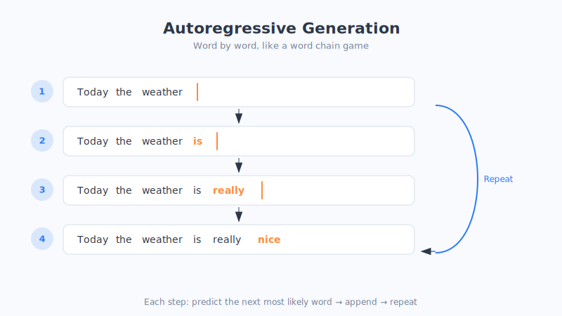

# 第19章 从 Transformer 到 GPT

> 上一章我们拆解了 Transformer 这台发动机。这一章，我们来看看：把它的一半零件拿出来，加上"海量阅读"和"不断变大"，是怎么变成那个能陪你聊天、帮你写文案、替你写代码的 **GPT** 的。

## 一、GPT 是什么？先拆开它的名字

GPT 这三个字母，其实是三个英文单词的缩写，每一个都对应我们前面讲过的一个关键思想：

| 字母 | 全称 | 大白话 | 对应章节 |
| :--- | :--- | :--- | :--- |
| **G** | Generative（生成式） | 会自己"写"内容，不只是做选择题 | 本章 |
| **P** | Pre-trained（预训练） | 提前读遍海量文本、打好底子 | 第16章 |
| **T** | Transformer | 用的正是上一章那台发动机 | 第18章 |

连起来就是：**一个用 Transformer 搭建、经过海量预训练、擅长生成内容的模型。** 名字本身就是一份完美的复习提纲。

## 二、GPT 只用了 Transformer 的"右半边"

还记得上一章说的吗？Transformer 有两个部门：负责"理解"的 Encoder，和负责"生成"的 Decoder。

**GPT 做了一个大胆的选择：只要 Decoder，把 Encoder 整个扔掉。**

为什么？因为 GPT 的目标非常纯粹——**它就是要"写东西"、要"生成"。** 而 Decoder 天生就是干这个的：一个字一个字往外蹦，还只看前文、不偷看后文。

> 比喻：**一个专职的"接话高手"。** 你说上半句，它接下半句；你给个开头，它写出整篇。它不需要像做阅读理解那样瞻前顾后，它只需要一门心思地——**往下接**。

这个"只用 Decoder、一门心思往下接"的选择，简单，却出奇地强大。它是怎么强大起来的？关键就在下面这个词。

## 三、核心机制：自回归——写文章就像文字接龙

GPT 生成内容的方式，有个术语叫**自回归（Autoregressive）**。名字唬人，但道理你从小玩到大——**就是文字接龙。**

它的工作流程是这样的：**每次只预测下一个最可能的字/词，然后把这个新字接到句子末尾，再拿新的句子去预测下一个字……如此循环，直到写完。**

我们来慢镜头看一遍。假设你给 GPT 一个开头"今天天气"：

> 1. 输入"今天天气" → GPT 预测下一个字最可能是"真"
> 2. 输入"今天天气真" → 预测下一个是"好"
> 3. 输入"今天天气真好" → 预测下一个是"，"
> 4. 输入"今天天气真好，" → 预测下一个是"适"
> 5. ……一直接到它认为该结束为止。

看到了吗？**它一次只吐一个字，每吐一个就回过头把整句重读一遍，再决定下一个字。** 你看到 ChatGPT 回答时字是一个一个蹦出来的，正是因为它真的在"一个字一个字地想、一个字一个字地写"。

> 比喻：**你和朋友玩成语接龙。** 每次你只需想出"下一个"接得上的词，接完再看整条链，想再下一个。GPT 写一篇上千字的文章，就是这样把"猜下一个字"这件小事，重复了上千次。（这只是类比，实际它预测的是每个候选字的概率，再据此挑选。）

**一个惊人的事实：** 就是"不断猜下一个字"这么一件看似简单的事，只要模型够大、读的书够多，最后竟然催生出了写作、翻译、推理、编程等一系列能力。大道至简，莫过于此。

## 四、GPT 的底气：读遍一座"图书馆"

GPT 之所以能接得又顺又聪明，靠的是它在正式上岗前，做的那件事——**预训练（就是名字里的 P）**。

它的训练方式简单到有点"笨"：**把互联网上能找到的海量文本（维基百科、新闻、书籍、论坛、代码……）几乎全都拿来，玩一个巨大的"完形填空 / 文字接龙"游戏——遮住下一个字，让它猜，猜错了就调整，反复几万亿次。**

> 比喻：**一个把全世界图书馆都读了一遍的人。** 读得越多，语感越好，越知道"这句话后面通常会接什么"。你随便起个头，他都能顺畅地接下去，还能引经据典。GPT 就是这样一个"读书破万亿卷"的接龙选手。

正因为读得实在太多，它在不知不觉中，把语言的规律、世界的常识、甚至一些推理的套路，全都悄悄"吸收"进了自己的参数里。**它不是背下了答案，而是练出了"感觉"。**（这只是类比，模型并不像人那样真正"理解"，它学到的是文字之间的统计规律。）

## 五、越变越大：GPT 家族的膨胀史

GPT 最震撼的一条主线，就是**"变大"**。研究者发现一个规律：**模型参数越多、读的数据越多、算力越强，能力就越强。** 于是 GPT 一代比一代大，大得让人瞠目结舌。

我们用一张表感受一下这场"军备竞赛"（数字为大致量级，帮你建立直观感受）：

| 版本 | 大致年份 | 参数规模（量级） | 能力印象 |
| :--- | :--- | :--- | :--- |
| GPT-1 | 2018 | 约 1.1 亿 | 初露锋芒，证明思路可行 |
| GPT-2 | 2019 | 约 15 亿 | 能写出像样的段落，一度"不敢公开" |
| GPT-3 | 2020 | 约 1750 亿 | 惊艳世界，几乎啥都能聊两句 |
| GPT-3.5 | 2022 | （在 GPT-3 基础上优化） | ChatGPT 的引擎，掀起全民热潮 |
| GPT-4 及以后 | 2023 起 | 更庞大（未公开） | 能看图、会推理、更靠谱 |

从 GPT-1 到 GPT-3，参数量涨了一千多倍。**这不是简单的"大一点"，而是量级的疯狂跃升。** 打个比方：

> 如果 GPT-1 是一个**读了几百本书的中学生**，那 GPT-3 就是一个**读遍了全世界图书馆的博学者**。不只是知道得多，连思考问题的方式都不一样了。

## 六、涌现能力：量变到质变的"突然开窍"

这场"变大"竞赛里，最神奇、也最让科学家兴奋的现象，叫做**涌现能力（Emergent Ability）**。

它指的是：**有些能力，在模型小的时候压根没有、怎么教都不会；可当模型大到某个临界点后，这些能力会突然、自己冒出来**，仿佛一夜之间"开了窍"。

比如做多步推理、理解复杂笑话、看懂"言外之意"、做没教过的新任务……这些能力不是被一点点"喂"进去的，而是在规模跨过某道门槛后，**哗一下自己出现的**。

> 比喻：**烧水。** 水温从 20 度升到 90 度，一直只是"变热的水"，看不出质变；可一旦到了 100 度，它突然"咕嘟咕嘟"沸腾、变成水蒸气——**发生了根本性的改变。** 模型的能力涌现，就像这最后一度带来的"沸腾"：量的积累到了临界点，猛地引发质的飞跃。（这只是类比，涌现的确切机理科学界仍在研究。）

正是"涌现"，让大模型从"还不错的工具"变成了让全世界惊叹的"仿佛真的懂了"。这也是为什么大家如此痴迷于把模型**做得更大**——因为你永远不知道，跨过下一道门槛后，它又会"突然学会"什么新本事。

## 七、本章小结

- **GPT = Generative（生成）+ Pre-trained（预训练）+ Transformer**，名字就是三大思想的浓缩。
- 它**只用了 Transformer 的 Decoder（右半边）**，因为它的使命就是纯粹地"生成/往下接"。
- 它靠**自回归**工作：像文字接龙一样，一次只猜下一个字，接上去，再猜下一个，循环上千次写出整篇——这也是 ChatGPT 回答时字一个个蹦出来的原因。
- 它靠**预训练**打底：读遍海量文本，练出对语言的"感觉"。
- GPT 家族一路**疯狂变大**（GPT-1 → GPT-4，参数暴涨千万倍），并因此出现了**涌现能力**——规模跨过临界点后，新本领像水烧开一样"突然冒出来"。

至此，第四部分就全部讲完了。你已经完整地走过了从"计算机只懂数字"，到"词向量"，到"注意力"，到"Transformer"，再到"GPT"的全过程——**这正是当今每一个大模型诞生的完整脉络。** 恭喜你，啃下了全书最硬的一块骨头！接下来的第五部分，我们就从"原理"走向"实战"，聊聊怎么真正用好这些大模型。

## 八、思考题

1. 不看书，试着把 G、P、T 三个字母各自代表什么、对应哪个思想，向朋友复述一遍。
2. 为什么说 ChatGPT 回答时"一个字一个字往外蹦"，恰恰印证了"自回归"这个机制？
3. 你怎么理解"涌现能力"？除了烧水，你还能想到生活中哪些"量变到质变、突然开窍"的例子？
4. 有人说"GPT 只是在猜下一个字，根本不算真的理解"。结合本章内容，谈谈你的看法。
