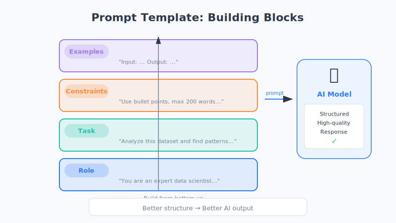

# 第20章 提示词工程：如何与 AI 有效沟通

同样一个 AI，有人用它写出惊艳的文案，有人却只得到一堆废话——差别往往不在 AI，而在**你怎么跟它说话**。

## 一个生活化的比喻

想象你请了一位能力超强、但**刚到岗第一天**的实习生。他知识渊博、反应飞快，可他完全不了解你的情况：不知道你要给谁看、想达到什么效果、有什么忌讳。

如果你只丢一句"帮我写点东西"，他只能凭空瞎猜，结果十有八九不合你意。但如果你说清楚"给谁写、写什么、什么风格、多长、要注意什么"，他立刻就能交出漂亮的成果。

**和 AI 沟通就是这样。** 你把需求说得越清楚，它做得就越好。这门"把话说清楚"的手艺，就叫**提示词工程（Prompt Engineering）**——"提示词"（Prompt）就是你发给 AI 的那段话。（这只是类比，实际更复杂。）

## 好提示词的三要素

一个好提示词，往往具备三个特征：

- **清晰**：目标明确，不含糊。别说"写好一点"，要说"语气更专业、更简洁"。
- **具体**：给足背景和细节。对象是谁？用在哪？多长？有什么格式要求？
- **给角色**：告诉 AI "你现在是谁"。比如"你是一位有 10 年经验的小学语文老师"，它就会自动调整用词和视角。

记住一句口诀：**"给它身份，给它任务，给它约束，给它例子。"**

## 三个立竿见影的实用技巧

### 技巧一：给几个例子（Few-Shot 少样本）

与其反复解释你想要什么，不如**直接示范**。给 AI 一两个"输入—输出"的样例，它会飞快模仿你的格式和风格。

> 比如你想批量生成商品标题，就先给它 2 个你满意的标题当范例，它后面产出的风格就会自动对齐。

### 技巧二：让它一步步想（思维链 Chain-of-Thought）

遇到需要推理的问题（算账、分析、做决策），加一句魔法般的话：**"请一步步思考，把推理过程写出来。"**

就像考试时"写出解题步骤"比"直接报答案"更不容易出错，AI 把思考过程摊开后，答案的准确率会明显提高。

### 技巧三：角色扮演

一句"你是一位专业的营养师"，就能让 AI 切换到对应的知识视角和语气。角色越具体，回答越贴合。

## 好提示词 vs 差提示词（真实对照）

| 差提示词 ❌ | 好提示词 ✅ |
| --- | --- |
| 帮我写个请假条 | 你是公司职员。帮我写一封请病假 2 天的邮件，发给直属领导，语气礼貌正式，说明是感冒发烧、工作已交接，200 字以内。 |
| 介绍一下健身 | 我是刚入门的上班族，每天只有 30 分钟。请给我一份适合在家、不用器械的一周健身计划，用表格列出，每天动作不超过 4 个。 |
| 这段代码有问题吗 | 下面是一段 Python 代码（附代码）。请找出 bug，先说明错在哪，再给出修改后的完整代码，并解释为什么这样改。 |

看出区别了吗？**差提示词把猜测的活儿丢给 AI，好提示词把信息喂饱 AI。**


## 一个可复制的万能模板

下次不知道怎么写，就套这个框架：

```
【角色】你是一位________（具体身份/专家）。
【任务】请帮我________（要做的具体事情）。
【约束】要求：语气________、篇幅________、格式________、避免________。
【示例】参考这个例子：________（给1-2个范例，可选）。
```



## 两个最常见的误区

- **太模糊**：只给半句话就指望 AI 读心。它不是你肚子里的蛔虫，信息给够才有好结果。
- **期望不现实**：指望它一次就写出完美的万字长文，或者算出它没有的数据。正确姿势是**多轮对话、逐步打磨**——先出草稿，再一句句让它改。

## 本章小结

- 提示词工程的核心，就是**把需求说清楚**，让 AI 少猜多做。
- 好提示词三要素：**清晰、具体、给角色**。
- 三大技巧：**给例子（Few-Shot）、让它一步步想（思维链）、角色扮演**。
- 记住万能模板：**角色 + 任务 + 约束 + 示例**。
- 别怕改，好结果都是**多轮对话磨出来**的。

## 思考题

1. 挑一件你最近想让 AI 帮忙的事，先随手写一句提示词，再用"角色+任务+约束+示例"模板重写一遍，对比两次结果有什么不同。
2. 为什么"请一步步思考"能提高 AI 回答复杂问题的准确率？它和我们做数学题写步骤有什么相似之处？
3. 如果 AI 第一次的回答不满意，比起重新开一个提问，"在原对话里继续追加要求"往往效果更好——你觉得这是为什么？
