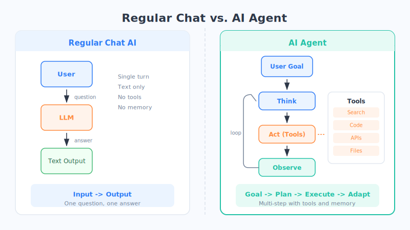
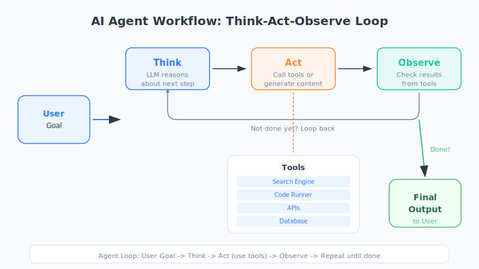

# 专题1 AI Agent：让 AI 学会使用工具

> 如果大语言模型是一颗超级大脑，那 AI Agent 就是给这颗大脑装上了手、脚和眼睛——它不再只是"说"，还能**真的去做事**。

## 一个生活化的比喻

想象你有一个超级聪明的朋友，他读过所有百科全书，上知天文下知地理。但他有一个问题：他**只能坐在椅子上跟你聊天**。

你问他"今天天气怎么样"，他只能凭记忆瞎猜（而且可能猜错）。你让他"帮我订张机票"，他只能告诉你步骤，没法真的去操作。

**AI Agent 的出现改变了这一切。** 它就像是给这个聪明的朋友配上了电脑、手机和各种工具——他现在可以打开天气 App 查实时天气，登录携程帮你订票，甚至帮你发邮件通知同事行程变更。

**一句话概括：Agent = 大模型 + 自主规划 + 工具调用。**

## 什么是 AI Agent？

Agent（智能体）这个词来自英文，意思是"能自主行动的代理人"。在 AI 领域，它特指：

> **一个以大语言模型（LLM）为"大脑"，能自主规划步骤、调用外部工具、根据反馈调整行动的智能系统。**

和普通的 AI 对话（ChatGPT 式的一问一答）相比，Agent 最大的区别在于：

| | 普通对话 AI | AI Agent |
| --- | --- | --- |
| 交互模式 | 你问一句，它答一句 | 你给个目标，它自己拆解执行 |
| 能力边界 | 只能生成文字 | 能调用工具、搜索网页、执行代码 |
| 思维方式 | 单轮反应 | 多步规划 → 执行 → 观察 → 调整 |
| 记忆 | 只记得当前对话 | 可以有长期记忆和工作记忆 |



## Agent 的三大核心能力

一个合格的 Agent，通常具备三项关键能力：

### 1. 规划（Planning）——学会拆解任务

就像一个靠谱的项目经理，Agent 拿到一个复杂任务后，不会一股脑冲上去干，而是先**把大任务拆成小步骤**。

比如你说"帮我写一篇关于特斯拉最新财报的分析文章"，Agent 会在"脑中"规划：

1. 先搜索特斯拉最新财报数据
2. 整理关键数字（营收、利润、交付量）
3. 和上季度对比，找到变化趋势
4. 撰写分析文章
5. 检查事实准确性

这个"先想后做"的过程，技术上叫 **ReAct**（Reasoning + Acting，推理与行动交替进行）。

### 2. 工具调用（Tool Use）——连接真实世界

Agent 最革命性的能力是**使用工具**。就像人类用计算器算数、用搜索引擎查资料，Agent 可以调用各种外部工具：

- **搜索引擎**：获取实时信息
- **代码执行器**：运行 Python 做计算或画图
- **API 接口**：查天气、订机票、发邮件
- **数据库**：检索企业内部知识
- **文件系统**：读写文档

> 这就是为什么 Agent 能做到普通聊天 AI 做不到的事——它不是在"编"答案，而是**真的去查、去算、去操作**。

### 3. 记忆（Memory）——不再是金鱼脑

普通对话 AI 的记忆力像金鱼——聊完就忘。而 Agent 拥有两种记忆：

- **短期记忆（工作记忆）**：当前任务中已经做了哪些步骤、得到了什么结果。就像你桌上摊开的便签纸。
- **长期记忆**：过去的经验、用户偏好、历史对话总结。就像你的笔记本。

有了记忆，Agent 就能"越用越聪明"——它记住你喜欢什么风格，上次搜索过什么，避免重复劳动。

## Agent 的工作流程

我们把 Agent 完成一个任务的过程画出来，就像一个循环：



整个流程可以概括为四个字：**思考-行动-观察-重复**。

```
用户给出目标
    ↓
┌─→ [思考] LLM 分析当前状况，决定下一步
│       ↓
│   [行动] 调用工具或生成内容
│       ↓
│   [观察] 查看工具返回结果
│       ↓
│   判断：任务完成了吗？
│       ↓
└── 没完成 → 回到"思考"
        ↓
    完成 → 输出最终结果给用户
```

这个循环可能跑一次就结束（简单任务），也可能跑十几次（复杂任务）。关键在于：**Agent 会根据每一步的结果，灵活调整后续计划**——就像一个真正在做事的人，遇到路不通就换条路走。

## 典型应用场景

Agent 不是遥远的未来，很多产品已经在用了：

| 场景 | 做什么 | 举例 |
| --- | --- | --- |
| 编程助手 | 自动写代码、跑测试、修 bug | GitHub Copilot Agent、Cursor |
| 数据分析 | 读取表格、做统计、画图表 | Code Interpreter |
| 个人助理 | 管日程、发邮件、预订服务 | 各大厂商的 AI 助手 |
| 客服系统 | 查订单、处理退款、转人工 | 企业智能客服 |
| 研究助手 | 搜论文、总结文献、写综述 | Perplexity、学术 AI 工具 |

## Agent 的局限性

Agent 很强大，但远非完美。当前 Agent 面临几个关键挑战：

- **容易"跑偏"**：规划出错后，后续步骤全部跟着错，像推倒的多米诺骨牌。LLM 本身的"幻觉"问题在 Agent 中会被放大——因为错误会层层传递。
- **效率问题**：每一步都要调用大模型思考，复杂任务可能需要几十次 LLM 调用，耗时又费钱。
- **安全顾虑**：让 AI 自主操作工具，万一它误删了文件、发了错误的邮件怎么办？目前大多数 Agent 还需要人类在关键节点做确认。
- **能力天花板**：Agent 的上限取决于底层 LLM 的能力。模型推理能力不够强时，Agent 的规划就容易出问题。

> 可以这样理解：Agent 就像一个能力很强但工作经验还不多的新人——大多数时候很靠谱，但偶尔会犯低级错误，所以目前还需要"老板"（人类）时不时确认一下。

## 本章小结

- **AI Agent = 大模型 + 自主规划 + 工具调用 + 记忆**，是让 AI 从"只会说"变成"能做事"的关键进化。
- Agent 的三大核心能力：**规划**（拆解任务）、**工具调用**（连接真实世界）、**记忆**（积累经验）。
- 工作流程是一个循环：**思考 → 行动 → 观察 → 判断 → 继续或结束**。
- Agent 已经在编程、数据分析、个人助理等场景大量落地。
- 当前的局限：规划可能出错、效率待提升、安全需把关。

## 思考题

1. 你日常工作中有哪些任务是"给个目标就能拆解执行"的？想想如果交给 Agent，它需要调用哪些工具？
2. 为什么 Agent 需要"观察"这个步骤？如果跳过观察，直接一口气执行所有步骤，可能会出什么问题？
3. 假设你要设计一个"旅行规划 Agent"，它需要具备哪些工具？记忆中应该存什么信息？
