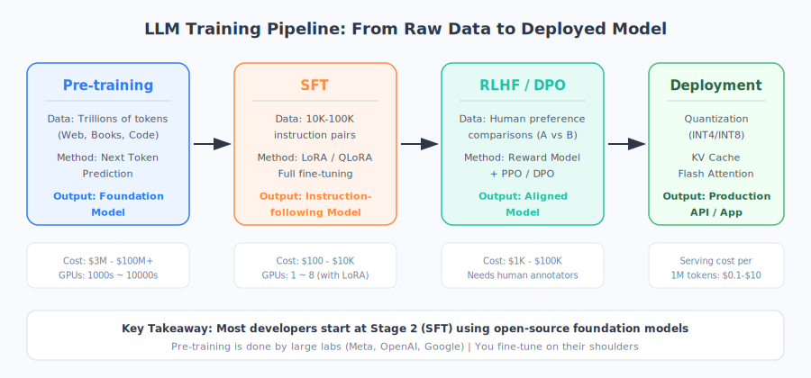
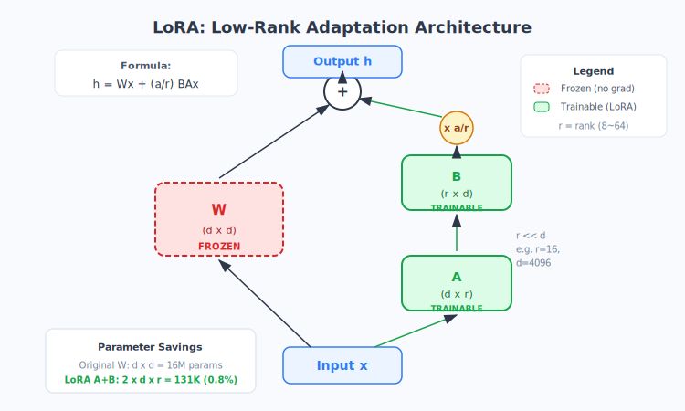

# 专题2 大模型训练与微调：从预训练到 RLHF 全流程拆解

> 如果说基础模型像一块未经雕琢的璞玉，那"训练全流程"就是一套完整的玉雕工艺——从选料（数据）、粗雕（预训练）、细琢（SFT）、抛光（RLHF），到最终上架展示（部署优化），每一步都有讲究。

在第21章，我们用"大学→研究生"的比喻介绍了预训练和微调的基本概念。这篇专题将带你深入车间，看看每一道工序的**具体操作、关键参数和工程细节**。

## 一、预训练（Pre-training）：打造通才大脑

预训练是整个大模型的基石——用海量文本让模型"读遍人间书"，获得通用的语言理解和世界知识。

### 1.1 训练数据：万亿 Token 从哪来？

大模型的"教材"规模惊人。以 Llama 3 为例，预训练使用了约 **15 万亿（15T）Token**。这些数据从哪来？

| 数据来源 | 占比（典型） | 内容 | 质量处理 |
| --- | --- | --- | --- |
| Common Crawl | 60-70% | 互联网网页爬取 | 去重、去噪、毒性过滤 |
| Books | 10-15% | 电子书、学术著作 | 高质量长文本，帮助模型学习连贯推理 |
| Code | 5-10% | GitHub 代码 | 提升逻辑推理和代码能力 |
| Wikipedia | 3-5% | 百科全书 | 事实性知识的重要来源 |
| 学术论文 | 3-5% | ArXiv、PubMed | 科学知识和专业术语 |
| 对话数据 | 2-5% | Reddit、论坛 | 帮助模型理解对话模式 |

> **关键洞察：数据质量比数量更重要。** Google 的研究表明，在清洗过的高质量子集上多训练几个 epoch，效果往往优于在更大但质量差的数据上只跑一遍。

**数据清洗流水线通常包括：**
1. **去重（Deduplication）**：用 MinHash 等算法去除近似重复内容，减少记忆而非理解
2. **质量过滤**：用分类器打分（如用 Wikipedia 文章做正样本训练），过滤低质量网页
3. **毒性过滤**：移除有害、色情、极端内容
4. **隐私清洗**：移除个人身份信息（PII）
5. **语言识别与分流**：按语种分桶，控制多语言配比

### 1.2 训练目标：下一个词预测

大模型的核心训练目标出奇地简单：

> **给定前面的所有词，预测下一个词是什么。**（Next Token Prediction）

这就是所谓的**因果语言模型（Causal LM）**——模型只能"向前看"，不能偷看后面的内容。GPT 系列、Llama、Qwen 都属于这一类。

与之对比的是**掩码语言模型（Masked LM）**，如 BERT：随机盖住一些词，让模型猜被盖住的是什么。适合做理解任务，但不适合生成。

| | 因果语言模型（GPT 类） | 掩码语言模型（BERT 类） |
| --- | --- | --- |
| 训练方式 | 预测下一个 Token | 预测被遮盖的 Token |
| 擅长 | 文本生成、对话 | 文本理解、分类 |
| 代表 | GPT-4、Llama、Qwen | BERT、RoBERTa |
| 当前主流 | ✅ 大模型主流选择 | 主要用于嵌入模型 |

### 1.3 Scaling Law：多大才算"大"？

2022 年 DeepMind 发表的 **Chinchilla 论文**给出了一个重要结论：

> **最优训练配比：Token 数 ≈ 参数量 × 20**

也就是说，一个 70B（700 亿参数）的模型，最优训练数据量大约是 1.4T Token。训练数据太少（"吃不饱"）或模型太大（"消化不了"），都不是最优解。

**Scaling Law 的三要素：**

| 要素 | 含义 | 典型数量级 |
| --- | --- | --- |
| 参数量（N） | 模型有多少可学习参数 | 7B → 70B → 405B |
| 数据量（D） | 训练用了多少 Token | 1T → 15T |
| 计算量（C） | 用了多少算力（FLOPs） | 10²³ → 10²⁵ |

三者关系近似：`C ≈ 6 × N × D`（每个 Token 经过模型前向+反向约需 6N 次浮点运算）

### 1.4 训练基础设施：GPU 集群与分布式策略

训练一个大模型不是一块 GPU 能搞定的事。以 Llama 3 405B 为例，Meta 使用了 **16,384 块 H100 GPU**。

**分布式训练的三种并行策略：**

| 并行方式 | 原理 | 比喻 |
| --- | --- | --- |
| **数据并行（DP）** | 每块 GPU 拿到完整模型，各自处理不同数据 | 多台复印机同时工作 |
| **张量并行（TP）** | 把一个层的矩阵切分到多块 GPU | 一道菜分给多个厨师同时做 |
| **流水线并行（PP）** | 把不同层分到不同 GPU | 流水线工厂，每人负责一道工序 |

实际训练中通常**三者混合使用**。例如 Llama 3 采用 TP=8（8 卡做张量并行）× PP=16（16 级流水线）× DP=128（128 组数据并行）= 16,384 GPU。

### 1.5 训练成本：多少钱？

给你一些具体数字感：

| 模型 | 参数量 | GPU | 训练时间 | 估算成本 |
| --- | --- | --- | --- | --- |
| Llama 2 70B | 70B | 2,048×A100 | ~34 天 | ~$300 万 |
| Llama 3 405B | 405B | 16,384×H100 | ~54 天 | ~$6,000 万 |
| GPT-4（估计） | ~1.8T MoE | ~25,000×A100 | ~90 天 | ~$1 亿+ |

> **普通人能不能做预训练？** 基本不可能。但好消息是：你不需要。开源社区（Meta、阿里、Mistral）已经替你完成了最贵的这一步，你只需要在他们的基础模型上微调。



## 二、监督微调（SFT）：从"补全机器"到"听话助手"

预训练完成的模型是一个"超级补全器"——你给它开头，它接着写。但它不会"听指令"。SFT 的目的就是教会模型理解并遵循人类指令。

### 2.1 为什么预训练后还不够？

| 行为 | 预训练模型 | SFT 后模型 |
| --- | --- | --- |
| 你说"翻译成英文：今天天气好" | 可能接着写更多中文句子 | 输出"The weather is nice today" |
| 你说"用三句话总结这篇文章" | 可能继续写一篇新文章 | 给出三句话的摘要 |
| 你说"写一首诗" | 可能从网页格式继续生成 | 输出一首格式规整的诗 |

### 2.2 SFT 数据格式

SFT 使用 **instruction-input-output 三元组**：

```json
{
  "instruction": "将以下中文翻译成英文",
  "input": "机器学习是人工智能的一个分支",
  "output": "Machine learning is a branch of artificial intelligence"
}
```

高质量 SFT 数据集通常包含 **1 万 ~ 10 万条**精心标注的示例，覆盖多种任务类型（翻译、摘要、问答、代码、数学等）。

### 2.3 全参数微调 vs 参数高效微调（PEFT）

| | 全参数微调 | PEFT（如 LoRA） |
| --- | --- | --- |
| 修改范围 | 模型所有参数 | 仅额外添加的少量参数（<1%） |
| 显存需求 | 极高（70B 需 ~280GB） | 低很多（70B 可降到 ~40GB） |
| 训练速度 | 慢 | 快 |
| 效果 | 理论上限最高 | 接近全参数，性价比极高 |
| 适用场景 | 大公司、充足算力 | 大多数实际场景 |

### 2.4 LoRA 详解：低秩分解的魔法

**LoRA（Low-Rank Adaptation）** 是当前最流行的 PEFT 方法。它的核心思想非常优雅：

> 微调时权重的变化量 ΔW 是"低秩"的——也就是说，看起来虽然是个巨大的矩阵，但实际有效信息可以用两个小矩阵相乘来表示。

**具体操作：**

对于原始权重矩阵 W（维度 d×d），LoRA 不直接修改 W，而是在旁边加一条"旁路"：

```
输出 = W·x + (α/r) · B·A·x
```

其中：
- **A** 是 d×r 的矩阵（r 远小于 d，通常 r=8~64）
- **B** 是 r×d 的矩阵
- **W 被冻结**（不参与训练），只训练 A 和 B
- **r** 是"秩"（rank），控制旁路容量
- **α** 是缩放系数（通常设为 r 的 1~2 倍）



**参数对比：** 原始 W 有 d² 个参数（如 4096² = 1600 万），而 LoRA 只需训练 2×d×r 个参数（如 2×4096×16 = 13 万），**仅为原来的 0.8%**。

### 2.5 QLoRA：让消费级显卡也能微调大模型

**QLoRA = 4-bit 量化 + LoRA**，是 2023 年的重要突破：

1. 把原始模型权重量化到 **4-bit**（NF4 格式），显存占用直降 4 倍
2. 在 4-bit 模型基础上应用 LoRA，训练时用 BF16 精度
3. 使用分页优化器（Paged Optimizer）处理显存尖峰

**实际效果：** 一块 24GB 显存的 RTX 4090 就能微调 70B 参数的模型！

### 2.6 实操建议

| 参数 | 推荐值 | 说明 |
| --- | --- | --- |
| 学习率 | 1e-4 ~ 2e-4 | LoRA 可适当调高 |
| Epoch | 2~3 | 过多容易过拟合 |
| Batch Size | 4~8（gradient accumulation） | 受显存限制 |
| LoRA r | 16~64 | 任务越复杂，r 越大 |
| LoRA alpha | 16~128（通常=2r） | 与 r 配合使用 |
| LoRA 目标层 | q_proj, v_proj（最低），全部 linear（最佳） | 更多层=更好效果但更多显存 |
| 数据量 | 1K~100K 条 | 质量远比数量重要 |
| 显存估算 | 约 模型参数GB × 1.2（QLoRA） | 70B 模型约需 24-48GB |

## 三、RLHF：让模型不只正确，还要"好用"

SFT 让模型学会了遵循指令，但它可能给出**正确但不够好**的回答——比如回答太啰嗦、语气不友好、逻辑顺序不佳。RLHF 解决的是"对齐"问题：让模型的输出更符合人类偏好。

### 3.1 为什么 SFT 还不够？

SFT 只能教模型"正确答案长什么样"，但很多问题**没有唯一正确答案**——有的回答虽然正确，但就是让人感觉更舒服、更有帮助。

> ChatGPT 为什么比 GPT-3 好用那么多？核心差距不在知识量，而在 RLHF 带来的"对齐"——它学会了用人类喜欢的方式说话。

### 3.2 RLHF 三步走

**Step 1：收集人类偏好数据**

给模型同一个问题，让它生成两个不同回答（A 和 B），然后让人类标注员选择"哪个更好"。收集数万对这样的对比数据。

**Step 2：训练奖励模型（Reward Model）**

用偏好数据训练一个"打分器"——输入一个 (问题, 回答) 对，输出一个分数，分数越高表示越符合人类偏好。

**Step 3：用 PPO 优化策略**

把语言模型当作"强化学习中的 Agent"：
- **状态**：当前的对话上下文
- **动作**：生成下一个 Token
- **奖励**：奖励模型给出的分数

用 PPO（Proximal Policy Optimization）算法调整模型，让它倾向于生成得分更高的回答。同时用 KL 散度惩罚防止模型跑偏太远。

### 3.3 DPO：更简单的替代方案

PPO 实现复杂、训练不稳定。2023 年提出的 **DPO（Direct Preference Optimization）** 提供了一个数学上等价但工程上简单得多的方法：

| | PPO（传统 RLHF） | DPO |
| --- | --- | --- |
| 是否需要奖励模型 | 需要单独训练 | 不需要 |
| 训练复杂度 | 高（4 个模型同时在显存） | 低（类似 SFT 的训练流程） |
| 稳定性 | 容易不稳定 | 相对稳定 |
| 效果 | 经过验证的标杆 | 效果接近，部分场景更优 |
| 实现难度 | 需要 RL 工程经验 | SFT 经验即可上手 |

DPO 的核心洞察：偏好优化可以直接转化为一个分类损失函数，不需要显式训练奖励模型。

### 3.4 RLHF 的效果

RLHF 前后的对比非常明显：

- **安全性**：模型学会拒绝有害请求
- **有帮助性**：回答更详细、更结构化
- **诚实性**：不确定时会说"我不确定"而非编造
- **语气风格**：更友好、更专业

## 四、部署优化：让模型跑得快、跑得省

训练好的模型通常很大。部署时需要做一系列优化，才能在可接受的成本内提供服务。

### 4.1 量化（Quantization）

把模型权重从高精度"压缩"到低精度：

| 精度 | 每参数占用 | 70B 模型大小 | 推理速度 | 质量损失 |
| --- | --- | --- | --- | --- |
| FP32 | 4 字节 | 280 GB | 基准 | 无 |
| FP16/BF16 | 2 字节 | 140 GB | ~2× | 极小 |
| INT8 | 1 字节 | 70 GB | ~3× | 很小 |
| INT4 | 0.5 字节 | 35 GB | ~4× | 小到中 |

> 目前主流方案是 **4-bit 量化**（GPTQ、AWQ 格式），让 70B 模型可以在单张 48GB 的 GPU 上运行推理。

### 4.2 推理优化技术

| 技术 | 解决什么问题 | 效果 |
| --- | --- | --- |
| **KV Cache** | 避免重复计算已生成 Token 的注意力 | 推理速度提升数十倍 |
| **Flash Attention** | 优化注意力计算的显存访问模式 | 速度提升 2-4×，支持更长上下文 |
| **Continuous Batching** | 动态批处理请求 | 吞吐量提升数倍 |
| **Speculative Decoding** | 用小模型"打草稿"，大模型验证 | 速度提升 2-3× |
| **PagedAttention** | 虚拟内存式管理 KV Cache | 更高并发、更省显存 |

### 4.3 实用工具链

| 工具 | 定位 | 适合场景 |
| --- | --- | --- |
| **Hugging Face Transformers** | 全能框架 | 研究、原型开发 |
| **vLLM** | 高性能推理引擎 | 生产部署、高并发 |
| **Ollama** | 本地一键运行 | 个人体验、开发调试 |
| **llama.cpp** | CPU/混合推理 | 低资源、边缘设备 |
| **TGI** | Hugging Face 推理服务 | 云端 API 部署 |
| **TRL** | RLHF/DPO 训练框架 | SFT + 对齐训练 |

## 五、动手实践路线

如果你想亲手微调一个模型，以下是推荐路线：

### Step 1：选择基础模型

| 模型 | 参数量 | 特点 | 推荐场景 |
| --- | --- | --- | --- |
| Qwen 2.5 | 0.5B~72B | 中文能力强 | 中文场景首选 |
| Llama 3.1 | 8B~405B | 社区生态最好 | 通用英文场景 |
| Mistral/Mixtral | 7B~8x22B | 高性价比 MoE | 多任务、长上下文 |

### Step 2：准备数据

- 格式：Alpaca 格式（instruction/input/output）或 ShareGPT 格式（多轮对话）
- 数量：入门 1,000 条即可看到效果，生产级建议 10K~100K
- 质量：**一条高质量数据胜过一百条低质量数据**

### Step 3：选择训练工具

推荐 **Unsloth**（速度最快）或 **LLaMA-Factory**（功能最全）：

```bash
# 使用 Unsloth 快速微调示例
pip install unsloth
# 支持 Llama、Qwen、Mistral 等主流模型
# 4-bit QLoRA 在 16GB 显卡上即可运行
```

### Step 4：训练与评估

- 用 **Weights & Biases** 或 TensorBoard 监控 loss 曲线
- 准备一组人工测试问题，每训练一段时间检查输出质量
- loss 下降平稳后及时停止，避免过拟合

### Step 5：部署使用

- 本地体验：Ollama（一行命令运行）
- API 服务：vLLM + FastAPI
- 云端：Hugging Face Inference Endpoints

## 本章小结

- **预训练**是最贵的一步：万亿 Token、数万 GPU、数千万美元，产出通用基础模型。Scaling Law 告诉我们参数、数据、算力要平衡配比。
- **SFT（监督微调）**让模型学会遵循指令。LoRA/QLoRA 是性价比之王，让消费级显卡也能参与。
- **RLHF/DPO** 解决"对齐"问题，让模型不只正确还好用。DPO 是更简单的替代方案。
- **部署优化**（量化、KV Cache、Flash Attention）让大模型变得实用。
- **普通开发者的最佳路径**：选开源模型 → 准备高质量数据 → QLoRA 微调 → 量化部署。

## 思考题

1. 为什么 Scaling Law 建议"Token 数 ≈ 参数量 × 20"？如果你只有 1T Token 的数据预算，应该训练多大的模型？
2. LoRA 的秩 r 越大，微调效果一定越好吗？从"过拟合"的角度想想看。
3. RLHF 和 DPO 的核心区别是什么？如果你是一个小团队，只有有限的 GPU，你会选哪个方案？
4. 假设你要给一家法律公司微调一个专属模型，你会怎么设计数据收集方案？SFT 数据应该包含哪些任务类型？
